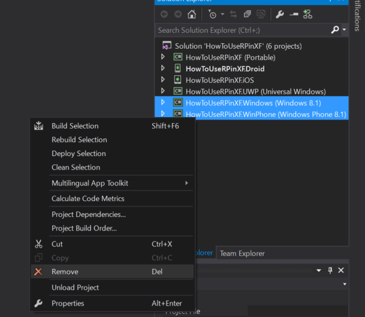
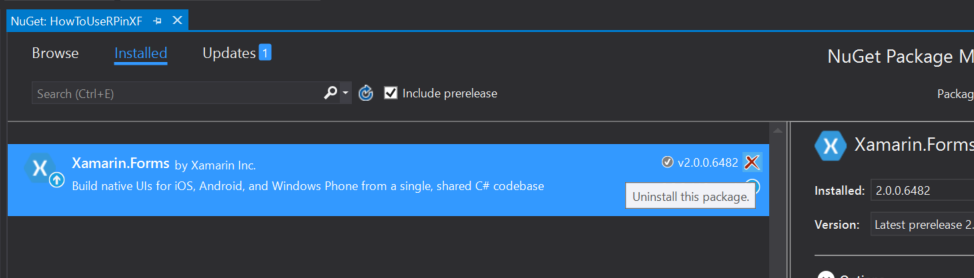
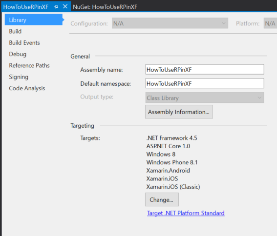
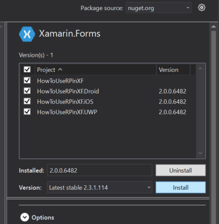

# Xamarin.FormsにReactivePropertyをインストールする方法

## 手順1. プロジェクトの作成
Blank App (Xamarin.Forms Portable)を作成します.

## 手順2. WindowsとWinPhoneプロジェクトの削除
ReactiveProeprty 3.0はWindows 8.1とWindows Phone 8.1をサポートしません。
WindowsとWinPhoneプロジェクトをソリューションから削除します。



## 手順3. .NET Standardへのアップグレード
ポータブルクラスライブラリのプロジェクトからすべてのnugetパッケージを削除します。



## .NET Standard(しなくても平気)
ポータブルクラスライブラリのプロジェクトのプロパティページを開きます。
そして、`ライブラリ`タブの`Target .NET Platform Standard`をクリックします。



そして、.NET Standard 1.2に変更します。

project.jsonにimprotsを追加します。

```javascript
{
  "supports": {},
  "dependencies": {
    "Microsoft.NETCore.Portable.Compatibility": "1.0.1",
    "NETStandard.Library": "1.6.0"
  },
  "frameworks": {
    "netstandard1.2": {
      "imports": "portable-uap+net45"
    }
  }
}
```
## 手順4. Micfosoft.NETCore.UniversalWindowsPlatformの更新

ソリューションのNuGetパッケージマネージャーを開いてMicrosoft.NETCore.UniversalWindowsPlatformパッケージをv5.2.2(もしくはそれ以上)に更新します。

## 手順5. Xamarin.Formsの更新

すべてのプロジェクトのXamarin.Formsを最新の安定版に更新します。



## 手順6. すべてのプロジェクトにReactivePropertyをインストール

ReactiveProeprty v3.xをNuGetからインストールします。


## 手順7. Droidプロジェクトから参照を削除

`System.Runtime.InteropService.WindowsRuntime`の参照をDroidプロジェクトから削除します。（重要）

## 手順8. コードを書きましょう

インストールが完了したので、ReactivePropertyを使ったコードを書きましょう！