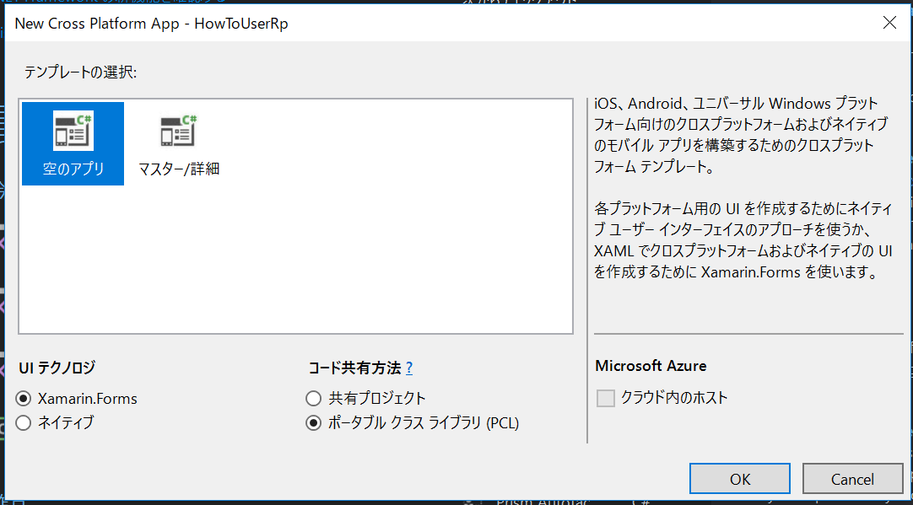

# Xamarin.FormsにReactivePropertyをインストールする方法

## 手順1. プロジェクトの作成
Cross Platform App (Xamarin)を新規作成します。
ここでは、Xamarin.FormsでPCLの空のアプリを作成します。プロジェクト名はHowToUseRpという名前で作成しました。



## 手順2. .NET Standard プロジェクトの作成

.NET Standard のクラスライブラリプロジェクトを作成します。
ここでは、HowToUseRp.NetStandardという名前で作成しました。

HowToUseRp.NetStandardプロジェクトのプロパティを開いて規定の名前空間をHowToUseRpに変更します。
ターゲットフレームワークが.NETStandard 1.3以上になっていることを確認してください。

## 手順3. 参照の追加

Xamarin.Formsを追加出来るようにプロジェクトファイルを変更します。
HowToUseRp.NetStandardプロジェクトを右クリックして「HowToUseRp.NetStandard.csproj を編集する」を選択します。

そして、PackageTargetFallbackタグを追加します。

```xml
<Project Sdk="Microsoft.NET.Sdk">

  <PropertyGroup>
    <TargetFramework>netstandard1.4</TargetFramework>
    <RootNamespace>HowToUseRp</RootNamespace>
    <PackageTargetFallback>portable-net46+uap</PackageTargetFallback>
  </PropertyGroup>

</Project>
```

HowToUseRp.NetStandardプロジェクトに以下の参照を追加します。

- Xamarin.Forms

全てのプロジェクトのXamarin.Formsを最新の安定板に更新します。

HowToUseRp.NetStandardプロジェクトとHowToUseRp.AndroidプロジェクトとHowToUseRp.iOSプロジェクトとHowToUseRp.UWPプロジェクトにReactivePropertyの最新版(v4.0.0以降)を追加します。

## 手順4. PCLから.NET Standardプロジェクトへコードの移動

HowToUseRp.NetStandardプロジェクトのClass1.csを削除して、HowToUseRpプロジェクトのソースを全てHowToUseRp.NetStandardプロジェクトにコピーします。
移動するコードは以下のものになります。

- App.xaml
- App.xaml.cs
- MainPage.xaml
- MainPage.xaml.cs

HowToUseRpプロジェクトを削除して、HowToUseRp.NetStandardプロジェクトを以下のプロジェクトの参照に追加します。

- HowToUseRp.Android
- HowToUseRp.iOS
- HowToUseRp.UWP

## 手順5. 実行して動作確認

各プロジェクトが起動するか確認します。

## 手順6. コードを書きましょう

インストールが完了したので、ReactivePropertyを使ったコードを書きましょう！
