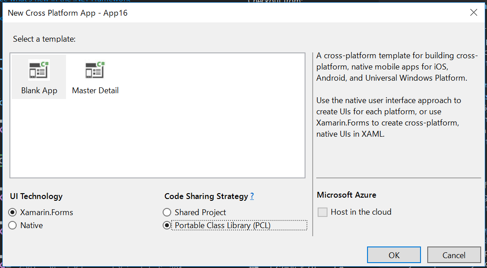

# How to use ReactiveProeprty in Xamarin.Forms

## Step 1. Create project

Create `Cross Platform App (Xamarin)` project.
I use 'HowToUseRp' project name here.



## Step 2. Create .NET Standard project

Create .NET Standard class library project.
I use `HowToUseRp.NetStandard` project name.

Open project property then change Default namespace to `HowToUseRp`.
And see higher than 1.3 to target framework version.

## Step 3. Add reference

Edit project file. Right click at HowToUseRp.NetStandard project then click `Edit HowToUseRp.NetStandard.csproj`,

Add `PackageTargetFallback` tag.

```xml
<Project Sdk="Microsoft.NET.Sdk">

  <PropertyGroup>
    <TargetFramework>netstandard1.4</TargetFramework>
    <RootNamespace>HowToUseRp</RootNamespace>
    <PackageTargetFallback>portable-net46+uap</PackageTargetFallback>
  </PropertyGroup>

</Project>
```

Add reference to HowToUseRp.NetStandard follows.

- Xamarin.Forms

Update Xamarin.Forms library version in all projects.

Add ReactiveProperty(higher v4.0.0) reference from NuGet package to HowToUseRp.NetStandard, HowToUseRp.Android, HowToUseRp.iOS and HowToUseRp.UWP projects.

## Step 4. Move code files from PCL to .NET Standard project.

Remove Class1.cs from HowToUseRp.NetStandard project.
Move source code files from HowToUseRp project to HowToUseRp.NetStandard project.
Target files is follows:

- App.xaml
- App.xaml.cs
- MainPage.xaml
- MainPage.xaml.cs

Remove HowToUseRp project then add project reference to these projects.

- HowToUseRp.Android
- HowToUseRp.iOS
- HowToUseRp.UWP

## Step 5. Run

Run to projects.

## Step 6. Write your code

Write your code!!
