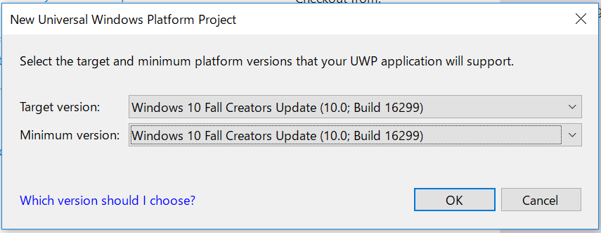

## Create a project
- Create a Blank App (Universal Windows) project.
    - Set the `Minimum version` item to Windows 10 Fall Creators Update (1.0.: Build 16299).

      

- Install ReactiveProperty package from NuGet.

## Edit codes
- Create a MainPageViewModel.cs file.
- Edit files like following.

MainPageViewModel.cs
```cs
using Reactive.Bindings;
using System;
using System.Linq;
using System.Reactive.Linq;

namespace GettingStartedUWP
{
    public class MainPageViewModel
    {
        public ReactiveProperty<string> Input { get; }
        public ReadOnlyReactiveProperty<string> Output { get; }

        public MainPageViewModel()
        {
            Input = new ReactiveProperty<string>("");
            Output = Input
                .Delay(TimeSpan.FromSeconds(1))
                .Select(x => x.ToUpper())
                .ToReadOnlyReactiveProperty();
        }
    }
}
```

MainPage.xaml.cs
```cs
using Windows.UI.Xaml.Controls;

// The Blank Page item template is documented at https://go.microsoft.com/fwlink/?LinkId=402352&clcid=0x409

namespace GettingStartedUWP
{
    /// <summary>
    /// An empty page that can be used on its own or navigated to within a Frame.
    /// </summary>
    public sealed partial class MainPage : Page
    {
        private MainPageViewModel ViewModel { get; } = new MainPageViewModel();
        public MainPage()
        {
            this.InitializeComponent();
        }
    }
}
```

MainPage.xaml
```xml
<Page x:Class="GettingStartedUWP.MainPage"
    xmlns="http://schemas.microsoft.com/winfx/2006/xaml/presentation"
    xmlns:x="http://schemas.microsoft.com/winfx/2006/xaml"
    xmlns:local="using:GettingStartedUWP"
    xmlns:d="http://schemas.microsoft.com/expression/blend/2008"
    xmlns:mc="http://schemas.openxmlformats.org/markup-compatibility/2006"
    mc:Ignorable="d">

    <StackPanel Background="{ThemeResource ApplicationPageBackgroundThemeBrush}">
        <TextBlock Text="Input"
                Style="{StaticResource CaptionTextBlockStyle}" />
        <TextBox Text="{x:Bind ViewModel.Input.Value, Mode=TwoWay, UpdateSourceTrigger=PropertyChanged}"
                Margin="5" />
        <TextBlock Text="Output"
                Style="{StaticResource CaptionTextBlockStyle}" />
        <TextBlock Text="{x:Bind ViewModel.Output.Value, Mode=OneWay}"
                Style="{StaticResource BodyTextBlockStyle}"
                Margin="5" />
    </StackPanel>
</Page>
```

## Launch the application

After launch the app, You can see the below window.
The output value was displayed to upper case, after 1sec from the input.


