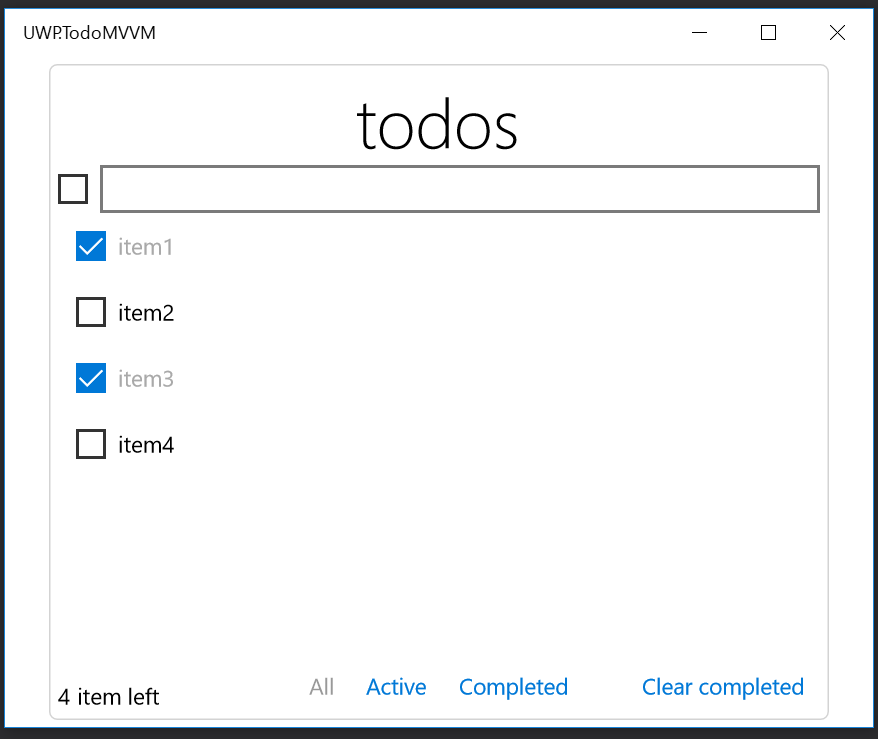

[English](README.md)

ReactiveProperty
================

ReactivePropertyは、Reactive ExtensionsをMVVMパターンと非同期用に拡張したものです。

## リリースノート

[リリースノート](ReleaseNote-ja.md)

## ReactivePropertyの機能

以下のBlog記事を参照してください。

[ReactivePropertyオーバービュー](http://blog.okazuki.jp/entry/2015/12/05/221154)

## サンプル

UWPTodoMVVMプロジェクトという[TodoMVC](http://todomvc.com/)ライクなTodoアプリのサンプルがSampleフォルダにあります。

## コミッターの情報

Yoshifumi Kawai a.k.a. neuecc is software developer in Tokyo, Japan.
Awarded Microsoft MVP for Visual Studio and Development Technorogies since April, 2011.

Takaaki Suzuki a.k.a. xin9le software devleoper in Tokyo, Japan.
Awarded Microsoft MVP for Visual Studio and Development Technorogies July, 2012.

Kazuki Ota a.k.a. okazuki software developer in Tokyo, Japan.
Awarded Microsoft MVP for Windows Development since July, 2011.
