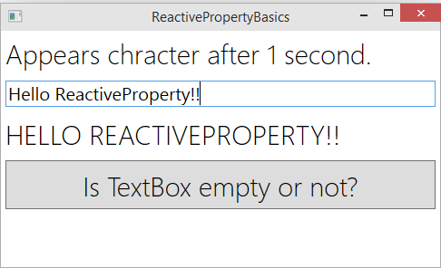
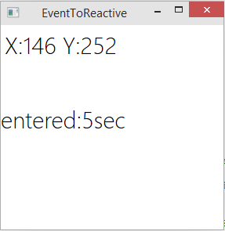
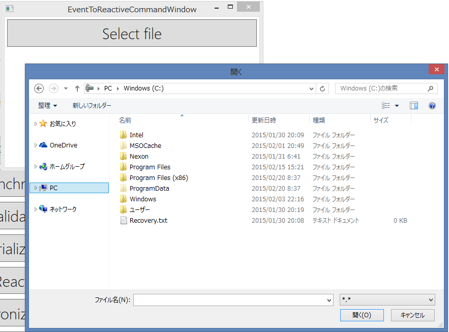
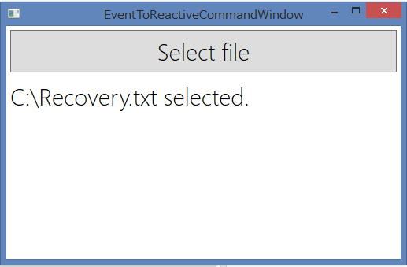
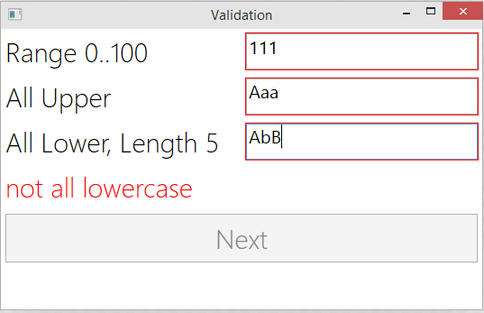

[English](README.md)

ReactiveProperty
================


ReactivePropertyは、Reactive ExtensionsをMVVMパターンと非同期用に拡張したものです。
動作環境は、以下の通りです。

- .NET 4.0 Client Profile/.NET 4.5
- Windows Phone 8.0/8.1
- Windows ストアアプリ 8.0/8.1
- Xamarin.iOS, Xamarin.Android

## リリースノート

[リリースノート](ReleaseNote-ja.md)

## ReactivePropertyの機能

- ReactiveProperty - ViewからViewModel、ViewModelからViewの双方向バインド可能なIObservable。
- ReadOnlyReactiveProperty - ViewModelからViewの単方向バインド可能なIObservable。
- ReactiveCommand - IObservable&lt;bool&gt;のシーケンスをICommandに変換できます。
- タイプセーフな変換機能 - INotifyPropertyChangedインターフェースを実装したクラスをReactivePropertyに変換できます。
- イベントをReactivePropertyへ伝搬可能なBlendのTriggerがあります。(EventToReactiveProperty)
- イベントをReactiveCommandへ伝搬可能なBlendのTriggerがあります。(EventToReactiveCommand)
- 非同期に、リアクティブにView -> ViewModel -> Model -> ViewModel -> Viewを接続可能です。
- 沢山の便利な拡張メソッドがあります。
- NuGetによるインストールができます。
    - PM > Install-Package ReactiveProperty
- <b>ReactivePropertyは、ViewModelに対して基本クラスが不要です。継承関係をクリーンに保てます。</b>

> ノート: ReactivePropertyは、他のMVVMフレームワークを置き換えるものではありません。
> ReactivePropertyは、ViewModelの基本クラスやメッセンジャーなどを提供しません。
> 他のMVVMライブラリと共に利用することをお勧めします。

## インストール方法

NuGetを使ってインストールします。

```
PM > Install-Package ReactiveProperty
```

## ReactivePropertyとReactiveCommandの基本的な使い方



```xml
<StackPanel>
    <TextBlock>Appears chracter after 1 second.</TextBlock>
    <!-- ReactiveProperty binding ".Value" -->
    <TextBox Text="{Binding InputText.Value, Mode=TwoWay, UpdateSourceTrigger=PropertyChanged}" />
    <TextBlock Text="{Binding DisplayText.Value}" />
    <Button Command="{Binding ReplaceTextCommand}">Is TextBox empty or not?</Button>
</StackPanel>
```

```cs
// ReactiveProperty and ReactiveCommand simple example.
public class ReactivePropertyBasicsViewModel
{
    public ReactiveProperty<string> InputText { get; private set; } // two way
    public ReadOnlyReactiveProperty<string> DisplayText { get; private set; } // one way
    public ReactiveCommand ReplaceTextCommand { get; private set; }

    public ReactivePropertyBasicsViewModel()
    {
        // mode is Flags. (default is all)
        // DistinctUntilChanged is no push value if next value is same as current
        // RaiseLatestValueOnSubscribe is push value when subscribed
        var allMode = ReactivePropertyMode.DistinctUntilChanged | ReactivePropertyMode.RaiseLatestValueOnSubscribe;

        // binding value from UI Control
        // if no set initialValue then initialValue is default(T). int:0, string:null...
        InputText = new ReactiveProperty<string>(initialValue: "", mode: allMode);

        // send value to UI Control
        DisplayText = InputText
            .Select(s => s.ToUpper())       // rx query1
            .Delay(TimeSpan.FromSeconds(1)) // rx query2
            .ToReadOnlyReactiveProperty();  // convert to ReactiveProperty

        ReplaceTextCommand = InputText
            .Select(s => !string.IsNullOrEmpty(s))   // condition sequence of CanExecute
            .ToReactiveCommand(); // convert to ReactiveCommand

        // ReactiveCommand's Subscribe is set ICommand's Execute
        // ReactiveProperty.Value set is push(& set) value
        ReplaceTextCommand.Subscribe(_ => InputText.Value = "Hello, ReactiveProperty!");
    }
}
```

ReactivePropertyは、とても簡単に直感的にバインド出来ます。


## イベントをReactivePropertyに設定する



```xml
<Grid>
	<!-- Use Blend SDK's Interaction Trigger -->
	<!-- Event binding to ReactiveProperty -->
	<i:Interaction.Triggers>
		<i:EventTrigger EventName="MouseMove">
			<!-- ConvertBack function is Func<object, object>-->
            <r:EventToReactiveProperty ReactiveProperty="{Binding MouseMove}">
                <vm:MouseEventToPointConverter/>
            </r:EventToReactiveProperty>
        </i:EventTrigger>
		<i:EventTrigger EventName="MouseDown">
			<!-- direct event bind -->
			<r:EventToReactiveProperty ReactiveProperty="{Binding MouseDown}" IgnoreEventArgs="True" />
		</i:EventTrigger>
		<i:EventTrigger EventName="MouseEnter">
			<!-- IgnoreEventArgs = true send Unit -->
			<r:EventToReactiveProperty ReactiveProperty="{Binding MouseEnter}" IgnoreEventArgs="true" />
		</i:EventTrigger>
	</i:Interaction.Triggers>
	<TextBlock Text="{Binding CurrentPoint.Value}" />
	<TextBlock Text="{Binding Entered.Value}" Margin="0,100,0,0" />
</Grid>
```

```cs
public class EventToReactiveViewModel
{
    // binding from UI, event direct bind
    public ReactiveProperty<Unit> MouseDown { get; private set; }
    // binding from UI, event with converter
    public ReactiveProperty<Tuple<int, int>> MouseMove { get; private set; }
    // binding from UI, IgnoreEventArgs = true
    public ReactiveProperty<Unit> MouseEnter { get; private set; }

    public ReactiveProperty<string> CurrentPoint { get; private set; }
    public ReactiveProperty<string> Entered { get; private set; }

    public ReactiveProperty<string> AlertMessage { get; private set; }

    public EventToReactiveViewModel()
    {
        // mode off RaiseLatestValueOnSubscribe, because initialValue is null.
        // mode off DistinctUntilChanged, because if Unit no send any values.
        var none = ReactivePropertyMode.None;

        MouseMove = new ReactiveProperty<Tuple<int, int>>(mode: none);
        MouseDown = new ReactiveProperty<Unit>(mode: none);
        MouseEnter = new ReactiveProperty<Unit>(mode: none);

        CurrentPoint = MouseMove
            .Select(p => string.Format("X:{0} Y:{1}", p.Item1, p.Item2))
            .ToReactiveProperty();

        Entered = MouseEnter
            .Select(_ => Observable.Timer(TimeSpan.Zero, TimeSpan.FromSeconds(1)))
            .Switch()
            .Select(x => "entered:" + x + "sec")
            .ToReactiveProperty();

        this.AlertMessage = MouseDown.Select(_ => "MouseDown!").ToReactiveProperty(mode: none);
    }
}

// EventToReactiveProperty converter.
// Converter/IgnoreEventArgs is useful for unit testings.
// For example, MouseMovoe.Value = new Point(10, 10) is simulate MouseMove
// MouseEnter.Value = new Unit() is simulate raise MouseEnter event.
public class MouseEventToPointConverter : ReactiveConverter<dynamic, Tuple<int, int>>
{
    protected override IObservable<Tuple<int, int>> OnConvert(IObservable<dynamic> source)
    {
        return source
            .Select(x => x.GetPosition(null))
            .Select(x => Tuple.Create((int)x.X, (int)x.Y));
    }
}
```

## イベントをReactiveCommandにつなげる




```cs
// Converter
public class OpenFileDialogConverter : ReactiveConverter<EventArgs, string>
{

    protected override IObservable<string> OnConvert(IObservable<EventArgs> source)
    {
        var dlg = new OpenFileDialog();
        dlg.Filter = "*.*|*.*";

        return source
            .Select(_ => dlg)
            .Where(x => x.ShowDialog() == true) // Show dialog
            .Select(x => x.FileName); // convert to string
    }
}
```

```xml
<Window.DataContext>
    <ViewModels:EventToReactiveCommandViewModel/>
</Window.DataContext>
<StackPanel>
	<Button Content="Select file">

		<i:Interaction.Triggers>
			<i:EventTrigger EventName="Click">
                <!-- set the command, called after the converter -->
                <Interactivity:EventToReactiveCommand Command="{Binding SelectFileCommand, Mode=OneWay}">
                    <Views:OpenFileDialogConverter/>
                </Interactivity:EventToReactiveCommand>
            </i:EventTrigger>
		</i:Interaction.Triggers>

	</Button>
	<TextBlock Text="{Binding Message.Value}" />
</StackPanel>
```

```cs
public class EventToReactiveCommandViewModel
{
    public ReactiveCommand<string> SelectFileCommand { get; private set; }

    public ReactiveProperty<string> Message { get; private set; }

    public EventToReactiveCommandViewModel()
    {
        // command called, after converter
        this.SelectFileCommand = new ReactiveCommand<string>();
        // create ReactiveProperty from ReactiveCommand
        this.Message = this.SelectFileCommand
            .Select(x => x + " selected.")
            .ToReactiveProperty();
    }
}
```

もし、Windows Runtimeを使用している場合は、以下のようにConverterを書くこともできます。

```cs
public class SelectFileConverter : ReactiveConverter<RoutedEventArgs, string>
{
    protected override IObservable<string> Convert(IObservable<RoutedEventArgs> source)
    {
        return source
            .Select(_ => new FileOpenPicker()) // create picker
            .Do(x => x.FileTypeFilter.Add(".txt")) // set extensions
            .SelectMany(x => x.PickSingleFileAsync().AsTask().ToObservable()) // convert task to iobservable
            .Where(x => x != null) // filter
            .Select(x => x.Path); // convert
    }
}
```


## Validation



```cs
public class ValidationViewModel
{
    [Required(ErrorMessage = "Required")]
    [Range(0, 100, ErrorMessage = "Range 0...100")]
    public ReactiveProperty<string> ValidationAttr { get; private set; }
    public ReactiveProperty<string> ValidationData { get; private set; }
    [StringLength(5, ErrorMessage = "Length < 5")]
    public ReactiveProperty<string> ValidationBoth { get; private set; }
    public ReactiveProperty<string> ErrorInfo { get; private set; }
    public ReactiveCommand NextCommand { get; private set; }
    public ReactiveProperty<string> AlertMessage { get; private set; }

    public ValidationViewModel()
    {
        // DataAnnotation Attribute, call SetValidateAttribute and select self property
        // Note:error result dispatch to IDataErrorInfo, not exception.
        //      therefore, XAML is ValidatesOnDataErrors=True
        ValidationAttr = new ReactiveProperty<string>()
            .SetValidateAttribute(() => ValidationAttr);

        // null is success(have no error), string is error message
        ValidationData = new ReactiveProperty<string>()
            .SetValidateNotifyError((string s) => 
                string.IsNullOrEmpty(s) ? 
                    "required" :
                    s.Cast<char>().All(Char.IsUpper) ? 
                        null : 
                        "not all uppercase");

        // Can set both validation
        ValidationBoth = new ReactiveProperty<string>()
            .SetValidateAttribute(() => ValidationBoth)
            .SetValidateNotifyError(s => string.IsNullOrEmpty(s) ?
                "required" :
                s.Cast<char>().All(Char.IsLower) ?
                    null :
                    "not all lowercase")
            .SetValidateNotifyError(async x =>
            {
                await Task.Delay(2000);
                if (x == null)          return null;
                if (x.Contains("a"))    return "'a' shouldn't be contained";
                return null;
            })
            .SetValidateNotifyError(xs =>
            {
                return xs
				    .Throttle(TimeSpan.FromMilliseconds(500))
                    .Select(x =>
                    {
                        if (x == null)          return null;
                        if (x.Contains("b"))    return "'b' shouldn't be contained";
                        return null;
                    });
            });


        // Validation result is pushed to ObserveErrors
        var errors = new[]
            {
                ValidationData.ObserveErrorChanged,
                ValidationBoth.ObserveErrorChanged,
                ValidationAttr.ObserveErrorChanged
            }
            .CombineLatest(x =>
            {
                var result = x.Where(y => y != null)
                    .Select(y => y.OfType<string>())
                    .Where(y => y.Any())
                    .FirstOrDefault();
                return result == null ? null : result.FirstOrDefault();
            });

        // Use OfType, choose error source
        ErrorInfo = errors.ToReactiveProperty();

        // Validation is view initialized not run in default.
        // If want to validate on view initialize,
        // use ReactivePropertyMode.RaiseLatestValueOnSubscribe to ReactiveProperty
        // that mode is validate values on initialize.
        NextCommand =
            new[]
            {
                ValidationData.ObserveHasError,
                ValidationBoth.ObserveHasError,
                ValidationAttr.ObserveHasError
            }
            .CombineLatestValuesAreAllFalse()
            .ToReactiveCommand();
        this.AlertMessage = this.NextCommand.Select(_ => "Can go to next!")
            .ToReactiveProperty(mode: ReactivePropertyMode.None);
    }
}
```

```xml
<Grid>
	<StackPanel>
		<Grid>
			<Grid.ColumnDefinitions>
				<ColumnDefinition />
				<ColumnDefinition />
			</Grid.ColumnDefinitions>
			<Grid.RowDefinitions>
				<RowDefinition />
				<RowDefinition />
				<RowDefinition />
			</Grid.RowDefinitions>
			<!-- all validation set ValidatesOnDataErrors=True -->
			<TextBlock Grid.Column="0" Grid.Row="0"><Run Text="Range 0..100"/></TextBlock>
			<TextBox  Grid.Column="1" Grid.Row="0"
				Text="{Binding ValidationAttr.Value, ValidatesOnDataErrors=True}"/>
			<TextBlock Grid.Column="0" Grid.Row="1"><Run Text="All Upper"/></TextBlock>
			<TextBox  Grid.Column="1" Grid.Row="1"
				Text="{Binding ValidationData.Value, ValidatesOnDataErrors=True}"/>
			<TextBlock Grid.Column="0" Grid.Row="2"><Run Text="All Lower, Length 5"/></TextBlock>
			<TextBox  Grid.Column="1" Grid.Row="2"
				Text="{Binding ValidationBoth.Value, ValidatesOnDataErrors=True, UpdateSourceTrigger=PropertyChanged}"/>
		</Grid>
		<TextBlock Text="{Binding ErrorInfo.Value}" Foreground="Red" />
		<Button Command="{Binding NextCommand}" Content="Next"/>
	</StackPanel>
	<Border x:Name="border" BorderBrush="Black" BorderThickness="1" Background="#FFF9A4A4" Visibility="Hidden">
		<TextBlock Margin="0" TextWrapping="Wrap" Text="{Binding AlertMessage.Value}" HorizontalAlignment="Center" VerticalAlignment="Center"/>
	</Border>
</Grid>
```

3通りのValidationの方法をサポートしています。詳細はSample/Validationを参照してください。

## 既存のModelとの同期

以下のようなModelがあるとします。
```cs
public class ObservableObject : INotifyPropertyChanged
{
    private string name;
    public string Name
    {
        get { return name; }
        set
        {
            name = value;
            PropertyChanged(this, new PropertyChangedEventArgs("Name"));
        }
    }

    public event PropertyChangedEventHandler PropertyChanged = (_, __) => { };
}

public class PlainObject
{
    public string Name { get; set; }
}
```

以下のようにViewModelと同期をとります。
```cs
// Synchroinize exsiting models.
public class SynchronizeObjectViewModel
{
    public ReactiveProperty<string> TwoWay { get; private set; }
    public ReactiveProperty<string> OneWay { get; private set; }
    public ReactiveProperty<string> OneWayToSource { get; private set; }
    public ReactiveCommand CheckCommand { get; private set; }
    public ReactiveProperty<string> AlertMessage { get; private set; }

    public SynchronizeObjectViewModel()
    {
        var inpc = new ObservableObject { Name = "Bill" };
        var poco = new PlainObject { Name = "Steve" };

        // TwoWay synchronize
        TwoWay = inpc.ToReactivePropertyAsSynchronized(x => x.Name);

        // OneWay synchronize
        OneWay = inpc.ObserveProperty(x => x.Name).ToReactiveProperty();

        // OneWayToSource synchronize
        OneWayToSource = ReactiveProperty.FromObject(poco, x => x.Name);

        // synchronization check
        CheckCommand = new ReactiveCommand();
        this.AlertMessage = CheckCommand.Select(_ => 
            "INPC Name:" + inpc.Name + Environment.NewLine
          + "POCO Name:" + poco.Name)
          .ToReactiveProperty(mode: ReactivePropertyMode.None);
    }
}
```

既存のMVVMフレームワークと共に使用したり、自動生成されたモデルと使用したりできます。
詳細は、Sample/SynchronizeObjectを参照してください。

## Serialization

```cs
// a ViewModel
public class SerializationViewModel
{
    // no attribute, simply serialize/deserialize
    public ReactiveProperty<bool> IsChecked { get; private set; }
    [IgnoreDataMember] // ignore serialize target
    public ReactiveProperty<int> SelectedIndex { get; private set; }
    [DataMember(Order = 3)] // deserialize order
    public ReactiveProperty<int> SliderPosition { get; private set; }
}

// case Windows Phone 7 TombStone
private SerializationViewModel viewmodel = new SerializationViewModel();
private string viewmodelData = null;

protected override void OnNavigatingFrom(System.Windows.Navigation.NavigationEventArgs e)
{
    viewmodelData = SerializeHelper.PackReactivePropertyValue(viewmodel);
}

protected override void OnNavigatedTo(System.Windows.Navigation.NavigationEventArgs e)
{
    SerializeHelper.UnpackReactivePropertyValue(viewmodel, viewmodelData);
}
```

DataAnnotationsを使ってIgnoreやシリアライズの順番を制御することができます。
詳細は、Sample/Serializationを参照してください。

## コミッターの情報

Yoshifumi Kawai a.k.a. neuecc is software developer in Tokyo, Japan.
Awarded Microsoft MVP for Visual C# since April, 2011.

Takaaki Suzuki a.k.a. xin9le software devleoper in Fukui, Japan.
Awarded Microsoft MVP for Visual C# since July, 2012.

Kazuki Ota a.k.a. okazuki software developer in Tokyo, Japan.
Awarded Microsoft MVP for Windows Platform Developer since July, 2011.
