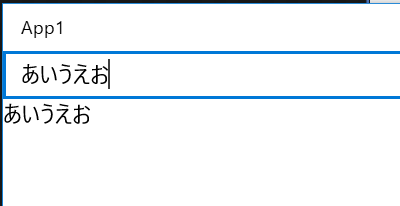
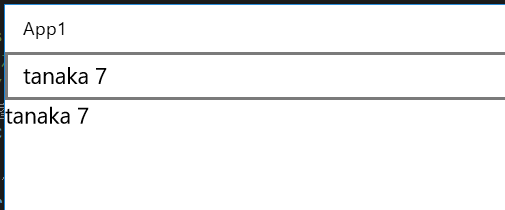
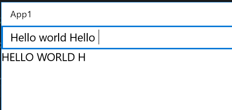
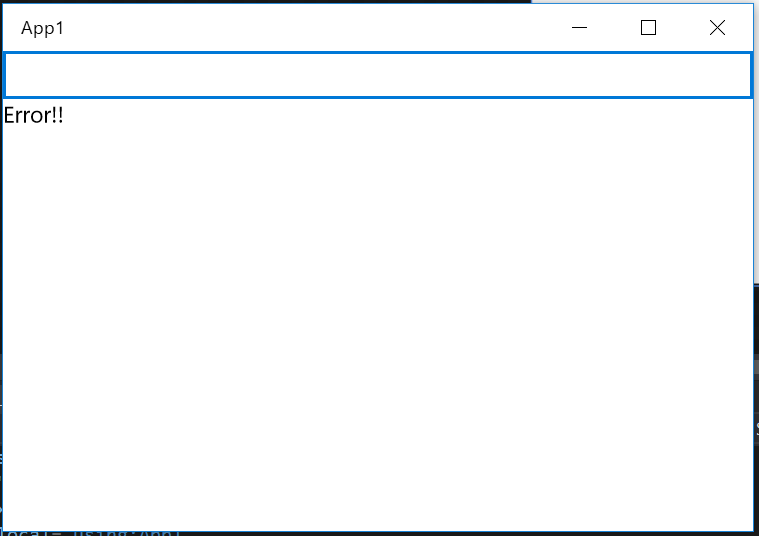
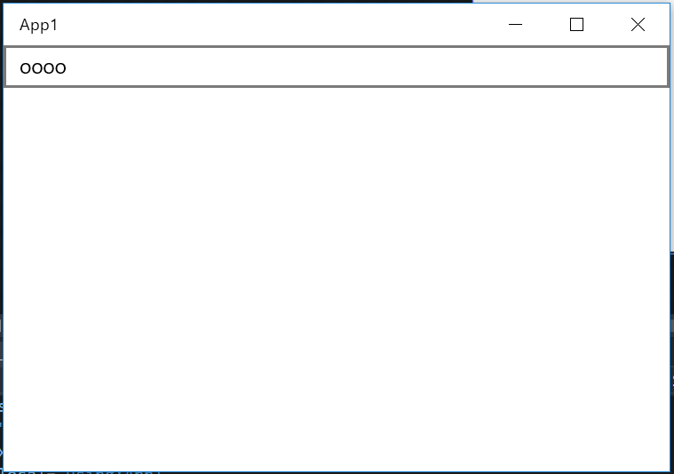
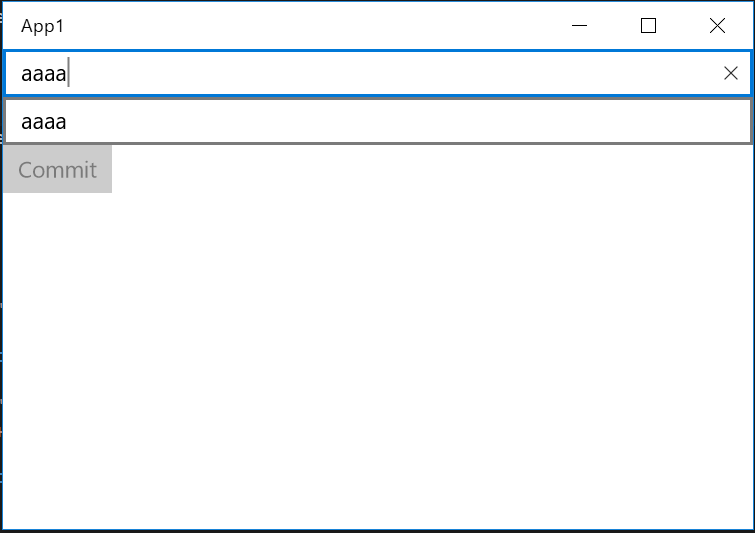
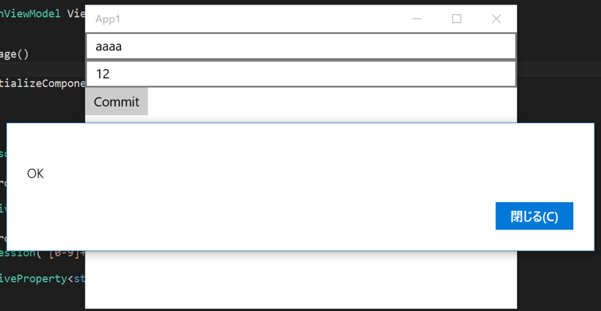

[Japanese](README-ja.md)

ReactiveProperty
================


ReactiveProperty provides MVVM and asynchronous support features under Reactive Extensions.
Target framework is .NET 4.0 and .NET 4.5, .NET 4.6, Windows Phone 8.0/8.1, Windows store app 8.1, UWP, Xamarin.iOS, Xamarin.Android.

## Release note

[Release note](ReleaseNote.md)

## API Reference

[API Reference](Docs/ReactiveProperty.chm)

Please download and unblock.

## Features

- `ReactiveProeprty` class.
- `ReactiveCommand` class.
- `ReactiveCollection` class.
- `ReadOnlyReactiveCollection` class.
- Convert to IObservable&lt;T&gt; from `INotifyPropertyChanged`/`INotifyCollectionChanged`.
- Lots of useful IObservable&lt;T&gt; factory methods.
- Notifier classes.
- `IFilteredReadOnlyObservableCollection` interface.
- etc...

## How to install

Install from NuGet.

```
> Install-Package ReactiveProperty
```

## ReactiveProperty class.
This is core class in this library. You can define property which has `INotifyPropertyChanged` feature easily.
When you use this class, data binding path description is longer than normal one. However, just only add `.Value` property.

For example, when you wanna define `Name` property in ViewModel, ViewModel is written like following.

```cs
public class PersonViewModel
{
    public ReactiveProperty<string> Name { get; } = new ReactiveProperty<string>();
}
```

You can set and get value using `.Value` property with `ReactiveProperty` class, `ReactivePeoperty` class implements `INotifyPropertyChanged` interface. You can use it like below.

```cs
// Must set Scheduler in Console Application
ReactivePropertyScheduler.SetDefault(CurrentThreadScheduler.Default);

var vm = new PersonViewModel();
vm.Name.PropertyChanged += (_, __) => Console.WriteLine($"Name changed {vm.Name.Value}");

vm.Name.Value = "tanaka";
Console.ReadKey();
vm.Name.Value = "kimura";
Console.ReadKey();
```

Following is its output.

```
Name changed tanaka
Name changed kimura
```

## How to use XAML platform

ReactiveProperty can use XAML platform application (ex. UWP / WPF / Xamarin).
This article explains how to use this library on UWP.

Bind above `PersonViewModel` to `MainPage` like following.

```cs
public sealed partial class MainPage : Page
{
    public PersonViewModel ViewModel { get; } = new PersonViewModel();

    public MainPage()
    {
        this.InitializeComponent();
    }
}
```

MUST use `Value` property in BindingPath.

```xml
<Page x:Class="App1.MainPage"
      xmlns="http://schemas.microsoft.com/winfx/2006/xaml/presentation"
      xmlns:x="http://schemas.microsoft.com/winfx/2006/xaml"
      xmlns:local="using:App1"
      xmlns:d="http://schemas.microsoft.com/expression/blend/2008"
      xmlns:mc="http://schemas.openxmlformats.org/markup-compatibility/2006"
      mc:Ignorable="d">

    <StackPanel Background="{ThemeResource ApplicationPageBackgroundThemeBrush}">
        <TextBox Text="{x:Bind ViewModel.Name.Value, Mode=TwoWay}" />
        <TextBlock Text="{x:Bind ViewModel.Name.Value, Mode=OneWay}" />
    </StackPanel>
</Page>
```

When execute this program, synchronize `TextBox` and `TextBlock`.



## ReactiveProperty can generate from IObservable

`ReactiveProperty` provides easy way to notify property changed. It doesn't extend `ViewModelBase` class.
In addition, `ReactiveProperty` can be created from `IObservable` interface.

Call `ToReactiveProperty` extension method to IObservable interface.
ReactiveProperty will store value when pushed value from IObservable.

For example follows.

```cs
public class PersonViewModel
{
    public ReactiveProperty<string> Name { get; } = Observable.Interval(TimeSpan.FromSeconds(1))
        .Select(x => $"tanaka {x}")
        .ToReactiveProperty();
}
```

Update the value at one-second intervals.



## ReactiveProperty is IObservable

You understand that ReactiveProperty can generate from IObservable.
Otherwise ReactiveProperty is IObservable.
ReactiveProperty can generate from ReactiveProperty.


For example follows.

```cs
public class PersonViewModel
{
    public ReactiveProperty<string> Input { get; } = new ReactiveProperty<string>("");

    public ReactiveProperty<string> Output { get; }

    public PersonViewModel()
    {
        this.Output = this.Input
            .Delay(TimeSpan.FromSeconds(1))
            .Select(x => x.ToUpper())
            .ToReactiveProperty();
    }
}
```

XAML is fllows.

```xml
<Page x:Class="App1.MainPage"
      xmlns="http://schemas.microsoft.com/winfx/2006/xaml/presentation"
      xmlns:x="http://schemas.microsoft.com/winfx/2006/xaml"
      xmlns:local="using:App1"
      xmlns:d="http://schemas.microsoft.com/expression/blend/2008"
      xmlns:mc="http://schemas.openxmlformats.org/markup-compatibility/2006"
      x:Name="Page"
      mc:Ignorable="d">

    <StackPanel Background="{ThemeResource ApplicationPageBackgroundThemeBrush}">
        <TextBox Text="{Binding ViewModel.Input.Value, ElementName=Page, Mode=TwoWay, UpdateSourceTrigger=PropertyChanged}" />
        <TextBlock Text="{x:Bind ViewModel.Output.Value, Mode=OneWay}" />
    </StackPanel>
</Page>
```

It will appear uppercase characters at delay one-second.



## ReadOnlyReactiveProperty

There is also a case where it is preferred not set a value in the Value of ReactiveProperty as Output property of the previous example.
This case is use ToReadOnlyReactiveProperty extension method.
This method create ReadOnlyReactiveProperty. This class can not write Value property.

```cs
public class PersonViewModel
{
    public ReactiveProperty<string> Input { get; } = new ReactiveProperty<string>("");

    public ReadOnlyReactiveProperty<string> Output { get; }

    public PersonViewModel()
    {
        this.Output = this.Input
            .Delay(TimeSpan.FromSeconds(1))
            .Select(x => x.ToUpper())
            .ToReadOnlyReactiveProperty();
    }
}
```

## Mode of ReactiveProperty

ReactiveProperty can set mode when called ToReactiveProperty extension method.
Mode define follows.

```cs
[Flags]
public enum ReactivePropertyMode
{
    None = 0,
    DistinctUntilChanged = 1,
    RaiseLatestValueOnSubscribe = 2
}
```

DistinctUntilChanged does't call OnNext/PropertyChanged when set same values.
RaiseLatestValueOnSubscribe push value when subscribed.

Default mode is here.

```cs
mode = ReactivePropertyMode.DistinctUntilChanged | ReactivePropertyMode.RaiseLatestValueSubscribe;
```

## Connect to exist models

ReactiveProperty will use ViewModel of MVVM pattern.(But you can use model layer.)
Therefore, ReactiveProperty have useful methods to synchronized plane models.

### Create ReactiveProperty from model that implement INotifyPropertyChanged

For example, that is class of implements INotifyPropertyChanged.
Follows.

```cs
public class Person : INotifyPropertyChanged
{
    public event PropertyChangedEventHandler PropertyChanged;

    private static readonly PropertyChangedEventArgs NamePropertyChangedEventArgs = new PropertyChangedEventArgs(nameof(Name));

    private string name;

    public string Name
    {
        get { return this.name; }
        set
        {
            if (this.name == value) { return; }
            this.name = value;
            this.PropertyChanged?.Invoke(this, NamePropertyChangedEventArgs);
        }
    }

}
```

ViewModel class that observe name property is follows.


```cs
public class PersonViewModel : IDisposable
{
    private Person Model { get; set; }
    public ReactiveProperty<string> Name { get; } = new ReactiveProperty<string>();

    public PersonViewModel(Person model)
    {
        this.Model = model;
        model.PropertyChanged += this.Model_PropertyChanged;
    }

    private void Model_PropertyChanged(object sender, PropertyChangedEventArgs e)
    {
        switch (e.PropertyName)
        {
            case nameof(Person.Name):
                this.Name.Value = ((Person)sender).Name;
                break;
        }
    }

    public void Dispose()
    {
        this.Model.PropertyChanged -= this.Model_PropertyChanged;
        this.Model = null;
    }
}
```

If Person class have many property...very troublesome.

ReactiveProperty have ObserveProperty extension method.
This extension method create from IObservable from INotifyPropertyChanged.
ReactiveProperty can create from IObservable. Because...

```cs
public class PersonViewModel : IDisposable
{
    private CompositeDisposable Disposable { get; } = new CompositeDisposable();
    public ReactiveProperty<string> Name { get; }

    public PersonViewModel(Person model)
    {
        this.Name = model.ObserveProperty(x => x.Name)
            .ToReactiveProperty()
            .AddTo(this.Disposable);
    }

    public void Dispose()
    {
        this.Disposable.Dispose();
    }
}
```

Very shortry. ReactiveProperty stop subscribe when dispose method called.
If there is a lot of property in the Model, it is useful to collect ReactiveProperty to CompositeDisposable.

And use select extension method. Then can convert model value to ViewModel.

```cs
public PersonViewModel(Person model)
{
    this.Name = model.ObserveProperty(x => x.Name)
        .Select(x => $"{x}-san")
        .ToReactiveProperty()
        .AddTo(this.Disposable);
}
```

## TwoWay synchronize

Previous example is onw way synchronize model to viewmodel.
ReactiveProperty provide two way synchronize model to viewmodel.
ToReactivePropertyAsSynchronized extension method provide two way synchronize model(It must implements INotifyPropertyChanged) to viewmodel.

Follows.

```cs
public PersonViewModel(Person model)
{
    this.Name = model.ToReactivePropertyAsSynchronized(x => x.Name)
        .AddTo(this.Disposable);
}
```

The arguments convert and convertBack can setting custom convert logic.

```cs
public PersonViewModel(Person model)
{
    this.Name = model.ToReactivePropertyAsSynchronized(x => x.Name,
        convert: x => $"{x}-san",
        convertBack: x => x.Replace("-san", ""))
        .AddTo(this.Disposable);
}
```

# Connect to model what doesn't implement INotifyPropertyChanged

Get initial value from model to ReactiveProperty, 
Then, to set the value to the Model when it changed the value of the ReactiveProperty.

ReactiveProperty.FromObject method provide that function.

Follows.

```cs
public PersonViewModel(Person model)
{
    this.Name = ReactiveProperty.FromObject(model, x => x.Name);
}
```

FromObject method have convert and convertBack arguments, same to ToReactivePropertyAsSynchronized.


## Validation

ReactiveProperty provide validation. Most simple way, After create to ReactiveProperty, call SetValidateNotifyError method.
For example, required value follows.

```cs
public class PersonViewModel
{
    public ReactiveProperty<string> Name { get; }

    public PersonViewModel()
    {
        this.Name = new ReactiveProperty<string>()
            .SetValidateNotifyError(x => string.IsNullOrWhiteSpace(x) ? "Error!!" : null);
    }

}
```

ReactiveProperty implements INotifyDataErrorInfo. That means can use WPF validation error message function.
UWP case use ObserveErrorChanged property.

Follows.

```cs
public class PersonViewModel
{
    public ReactiveProperty<string> Name { get; }

    public ReadOnlyReactiveProperty<string> NameErrorMessage { get; }

    public PersonViewModel()
    {
        this.Name = new ReactiveProperty<string>()
            .SetValidateNotifyError(x => string.IsNullOrWhiteSpace(x) ? "Error!!" : null);
        this.NameErrorMessage = this.Name
            .ObserveErrorChanged
            .Select(x => x?.Cast<string>()?.FirstOrDefault())
            .ToReadOnlyReactiveProperty();
    }

}
```

Bind this ViewModel to View.


```xml
<Page x:Class="App1.MainPage"
      xmlns="http://schemas.microsoft.com/winfx/2006/xaml/presentation"
      xmlns:x="http://schemas.microsoft.com/winfx/2006/xaml"
      xmlns:local="using:App1"
      xmlns:d="http://schemas.microsoft.com/expression/blend/2008"
      xmlns:mc="http://schemas.openxmlformats.org/markup-compatibility/2006"
      mc:Ignorable="d">

    <StackPanel Background="{ThemeResource ApplicationPageBackgroundThemeBrush}">
        <TextBox Text="{x:Bind ViewModel.Name.Value, Mode=TwoWay}" />
        <TextBlock Text="{x:Bind ViewModel.NameErrorMessage.Value, Mode=OneWay}" />
    </StackPanel>
</Page>
```

When you run will be as follows.





If the platform support DataAnnotatio then you can use SetValidationAttribute method.

Follows.

```cs
public class PersonViewModel
{
    [Required(ErrorMessage = "Error!!")]
    public ReactiveProperty<string> Name { get; }

    public ReadOnlyReactiveProperty<string> NameErrorMessage { get; }

    public PersonViewModel()
    {
        this.Name = new ReactiveProperty<string>()
            .SetValidateAttribute(() => this.Name);
        this.NameErrorMessage = this.Name
            .ObserveErrorChanged
            .Select(x => x?.Cast<string>()?.FirstOrDefault())
            .ToReadOnlyReactiveProperty();
    }

}
```

## Validation and model synchronization

ToReactivePropertyAsSynchronized method and FromObject method have an ignoreValidationErrorValue arguments.
Set to true this argument when ignore validation error value.

Set to ViewModel to Model when passed required validation. 
Follows.
 
 ```cs
 public class PersonViewModel
{
    [Required(ErrorMessage = "Error!!")]
    public ReactiveProperty<string> Name { get; }

    public ReadOnlyReactiveProperty<string> NameErrorMessage { get; }

    public PersonViewModel(Person model)
    {
        this.Name = model.ToReactivePropertyAsSynchronized(x => x.Name,
            ignoreValidationErrorValue: true)
            .SetValidateAttribute(() => this.Name);
        this.NameErrorMessage = this.Name
            .ObserveErrorChanged
            .Select(x => x?.Cast<string>()?.FirstOrDefault())
            .ToReadOnlyReactiveProperty();
    }

}
```

## Observe validation error

ReactiveProperty provide ObserveHasErrors property.
You observe this property. It means that you can observe validation error status.

Follows.

```cs
public class PersonViewModel
{
    [Required(ErrorMessage = "Error!!")]
    public ReactiveProperty<string> Name { get; }

    [Required(ErrorMessage = "Error!!")]
    [RegularExpression("[0-9]+", ErrorMessage = "Error!!")]
    public ReactiveProperty<string> Age { get; }

    public PersonViewModel(Person model)
    {
        this.Name = new ReactiveProperty<string>()
            .SetValidateAttribute(() => this.Name);
        this.Age = new ReactiveProperty<string>()
            .SetValidateAttribute(() => this.Age);

        new[]
            {
                this.Name.ObserveHasErrors,
                this.Age.ObserveHasErrors
            }
            .CombineLatest(x => x.All(y => !y))
            .Where(x => x)
            .Subscribe(_ =>
            {
                Debug.WriteLine("No error!!");
            });

    }

}
```

# ReactiveCommand

ReactiveProperty provide ReactiveCommand. That is implementation of ICommand interface.
ReactiveCommand can create from IObservable&lt;bool&gt;.
ToReactiveCommand extension method can call IObservable&lt;bool&gt;.
it mean can execute ReactiveCommand when push true value from IObservable&lt;bool&gt;.

Process to subscribe method when executed command.

For example, if all ReactiveProperty doesn't have validation error then it can execute command.
Follows.

```cs

public class PersonViewModel
{
    [Required(ErrorMessage = "Error!!")]
    public ReactiveProperty<string> Name { get; }

    [Required(ErrorMessage = "Error!!")]
    [RegularExpression("[0-9]+", ErrorMessage = "Error!!")]
    public ReactiveProperty<string> Age { get; }

    public ReactiveCommand CommitCommand { get; }

    public PersonViewModel()
    {
        this.Name = new ReactiveProperty<string>()
            .SetValidateAttribute(() => this.Name);
        this.Age = new ReactiveProperty<string>()
            .SetValidateAttribute(() => this.Age);

        this.CommitCommand = new[]
            {
                this.Name.ObserveHasErrors,
                this.Age.ObserveHasErrors
            }
            .CombineLatest(x => x.All(y => !y))
            .ToReactiveCommand();
        this.CommitCommand.Subscribe(async _ => await new MessageDialog("OK").ShowAsync());

    }

}
```

Bind to View.

```xml
<Page x:Class="App1.MainPage"
      xmlns="http://schemas.microsoft.com/winfx/2006/xaml/presentation"
      xmlns:x="http://schemas.microsoft.com/winfx/2006/xaml"
      xmlns:local="using:App1"
      xmlns:d="http://schemas.microsoft.com/expression/blend/2008"
      xmlns:mc="http://schemas.openxmlformats.org/markup-compatibility/2006"
      mc:Ignorable="d">

    <StackPanel Background="{ThemeResource ApplicationPageBackgroundThemeBrush}">
        <TextBox Text="{x:Bind ViewModel.Name.Value, Mode=TwoWay}" />
        <TextBox Text="{x:Bind ViewModel.Age.Value, Mode=TwoWay}" />
        <Button Content="Commit"
                Command="{x:Bind ViewModel.CommitCommand}" />
    </StackPanel>
</Page>
```

Can't push button when validation error.



Can push button when no validation error.



ReactiveCommand have ReactiveCommand&lt;T&gt; version. It can use command parameter.

## AsyncReactiveCommand

Async version ReactiveCommand. Create from IObservable&lt;bool&gt;, IReactiveProperty&lt;bool&gt; and default constructor.

Subscribe method can accept Func&lt;T, Task&gt;.
While executing task return false at CanExecute method.

```cs
class TestViewModel
{
    public AsyncReactiveCommand TestCommand { get; }

    public TestViewModel()
    {
        var reactiveCommand = new AsyncReactiveCommand();

        reactiveCommand.Subscribe(async _ =>
        {
            await Task.Delay(TimeSpan.FromSeconds(3)); // heavy work...
        });
    }
}

class TestViewModel2
{
    public IReadOnlyReactiveProperty<bool> IsBusy { get; }
    public AsyncReactiveCommand TestCommand1 { get; }
    public AsyncReactiveCommand TestCommand2 { get; }

    public TestViewModel2()
    {
        var isBusy = new ReactiveProperty<bool>(false);
        IsBusy = isBusy;

        // shared busy source.
        TestCommand1 = isBusy.ToAsyncReactiveCommand();
        TestCommand1.Subscribe(async _ =>
        {
            await Task.Delay(TimeSpan.FromSeconds(3)); // heavy work1...
        });

        TestCommand2 = isBusy.ToAsyncReactiveCommand();
        TestCommand2.Subscribe(async _ =>
        {
            await Task.Delay(TimeSpan.FromSeconds(3)); // heavy work2...
        });
    }
}
```


# ReactiveCollection

ReactiveCollection provide to run process on scheduler.(Default is UI thread.)
And ReactiveCollection extends ObservableCollection.

ToReactiveCollection extension method create ReactiveCollection from IObservable.
For example, that code add to collection at interval one-second.

```cs
public class PersonViewModel
{
    public ReactiveCollection<long> TimerCollection { get; } = Observable
        .Interval(TimeSpan.FromSeconds(1))
        .ToReactiveCollection();
}
```

And also AddOnScheduler, RemoveOnScheduler etc... like ***OnScheduler methods can run process on scheduler.

```cs
public class PersonViewModel
{
    public ReactiveCollection<long> SampleCollection { get; } = new ReactiveCollection<long>();

    private Random Random { get; } = new Random();

    public ReactiveCommand AddCommand { get; } = new ReactiveCommand();

    public PersonViewModel()
    {
        this.AddCommand.Subscribe(async _ => await Task.Run(() => 
        {
            // You can run on UI thread.
            this.SampleCollection.AddOnScheduler(this.Random.Next());
        }));
    }
}
```

You can switch scheduler to the constructor argument.


# ReadOnlyReactiveCollection

This class is read-only collection and can synchronize to ObservableCollection and ReactiveCollection.
ToReadOnlyReactiveCollection extension method can create ReadOnlyReactiveCollection from ObservableCollection and ReactiveCollection.
Then pass convert logic(Func&lt;T, U&gt;) at argument, you can get converted type collection.
When item removed then dispose method called automatically.

Follows.

```cs
public class MainPageViewModel
{
    private PeopleManager Model { get; } = new PeopleManager();
    public ReadOnlyReactiveCollection<PersonViewModel> People { get; }

    public MainPageViewModel()
    {
        // convert Person collection to PersonViewModel collection.
        this.People = this.Model.People.ToReadOnlyReactiveCollection(x => new PersonViewModel(x));
    }
}

public class PersonViewModel : IDisposable
{
    public PersonViewModel(Person model)
    {
	    // connect model to viewmodel
    }

	public void Dispose()
	{
	    // cleanup logic
	}
}

public class PeopleManager
{
    public ObservableCollection<Person> People { get; } = new ObservableCollection<Person>();

    // some logic
}

public class Person : INotifyPropertyChanged
{
    public event PropertyChangedEventHandler PropertyChanged;

    // properties
}
```

# Convert method to IObservable from many classes

ReactiveProperty provide many extension method, convert to IObservable from many classes.
Because ReactiveProperty can create from IObservable.

## Convert from INotifyPropertyChanged

PropertyChangedAsObservable extension method can create IObservable&lt;NotifyPropertyChangedEventArgs&gt;.

```cs
var p = new Person();
p.PropertyChangedAsObservable()
    .Subscribe(x => Debug.WriteLine($"{x.PropertyName} changed"));
```

Otherwise specific version one property. That is ObserveProperty method.

```cs
var p = new Person();
p.ObserveProperty(x => x.Name) // overve name property
    .Subscribe(x => Debug.WriteLine($"changed value is {x}"));
```

## Convert from INotifyCollectionChanged

Observe CollectionChanged event like PropertyChanged event.

```cs
var col = new ObservableCollection<Person>();
col.CollectionChangedAsObservable()
    .Subscribe(x => Debug.WriteLine($"{x.Action} executed!!"));
```

Otherwise specific version add, remove, etc... That is ObserveXXXChanged method.

```cs
var col = new ObservableCollection<Person>();
col.ObserveAddChanged()
    .Subscribe(x => Debug.WriteLine($"{x.Name} added"));
```

## Observe PropertyChanged in collection

ObserveElementPropertyChanged extension method can observe element PropertyChanged event.

```cs
var col = new ObservableCollection<Person>();
// observe some propertychanged
col.ObserveElementPropertyChanged()
    .Subscribe(x => Debug.WriteLine($"{x.EventArgs} {x.Sender}"));
// observe specific propertychanged
col.ObserveElementProperty(x => x.Name)
    .Subscribe(x => Debug.WriteLine($"{x.Instance} {x.Property} {x.Value}"));
```

If element property type is ReactiveProperty. This case can use to ObserveElementObservableProperty extension method.

## ObserveEveryValueChanged(WPF only)

You can observe all properties that is not implements  INotifyPropertyChanged.

```cs
public class MyClass
{
    public int MyProperty { get; set; }
}


public partial class MainWindow : Window
{
    MyClass model;
    IReadOnlyReactiveProperty<int> MyClassMyProperty { get; }

    public MainWindow()
    {
        InitializeComponent();

        model = new MyClass();
        this.MyClassMyProperty = mc.ObserveEveryValueChanged(x => x.MyProperty).ToReadOnlyReactiveProperty();
    }
}
```

## Other

ReactiveProperty provide many extension methods in Reactive.Bindings.Extensions namespace.
Please see this namespace.

# Notifier classes

ReactiveProperty provide useful classes, that is Notifier classes in Reactive.Bindings.Notifiers namespace.

## BooleanNotifier

It's simplify class. It is IObservable&lt;bool&gt; and it can switch true/false.

```cs
var n = new BooleanNotifier();
n.Subscribe(x => Debug.WriteLine(x));

n.TurnOn(); // true
n.TurnOff(); // false
n.Value = true; // true
n.Value = false; // false
```

It can use to source of ReactiveCommand.

## CountNotifier

CountNotifier is counter.
It provide Increment and Decrement methods.
That method return IDisposable interface. 
When dispose method called that reverted value.

CountNotifier is IObservable&lt;CountChangedStatus&gt;.
CountChanangedStatus enum is follows.

```cs
/// <summary>Event kind of CountNotifier.</summary>
public enum CountChangedStatus
{
    /// <summary>Count incremented.</summary>
    Increment,
    /// <summary>Count decremented.</summary>
    Decrement,
    /// <summary>Count is zero.</summary>
    Empty,
    /// <summary>Count arrived max.</summary>
    Max
}
```

It can use that.

```cs
var c = new CountNotifier();
// output status.
c.Subscribe(x => Debug.WriteLine(x));
// output current value.
c.Select(_ => c.Count).Subscribe(x => Debug.WriteLine(x));
// increment
var d = c.Increment(10);
// revert increment
d.Dispose();
// increment and decrement
c.Increment(10);
c.Decrement(5);
// output current value.
Debug.WriteLine(c.Count);
```

Output is follows.

```cs
Increment
10
Decrement
0
Empty
0
Increment
10
Decrement
5
5
```

You can set max value of CountNotifier from constructor argument.

## ScheduledNotifier

ScheduledNotifier only notify value after seted timespan on scheduler(Default scheduler is current thread.)

```cs
var n = new ScheduledNotifier<string>();
n.Subscribe(x => Debug.WriteLine(x));
// execute now
n.Report("Hello world");
// after 2 second.
n.Report("After 2 second.", TimeSpan.FromSeconds(2));
```

## BusyNotifier

BusyNotifyer class is very useful to defence of double click.
IsBusy property can get current status is busy?
ProcessStart method start process and return value is IDsposable interface.
When Dispose method call that is exit process.

```cs
private BusyNotifier Busy { get; } = new BusyNotifier();

// when heavy process
using (this.Busy.ProcessStart())
{
    // some heavy process
}
```

BusyNotifyer cal use to ReactivePropertys source.

```cs
// when create isbusy and isidle property that is define properties.
private BusyNotifyer BusyNotifier { get; } = new BusyNotifier();
public ReadOnlyReactiveProperty<bool> IsBusy { get; }
public ReadOnlyReactiveProperty<bool> IsIdle { get; }

// constructor code
this.IsBusy = this.BusyNotifyer.ToReadOnlyReactiveProperty();
this.IsIdle = this.BusyNotifier.Inverse().ToReadOnlyReactiveProperty(); // Inverse extension methods in Extensions namespace.
```

## MessageBroker

I suggest new notifier called  MessageBroker , in-memory pubsub.
 This is Rx and async friendly  EventAggregator  or  MessageBus  or etc.
 We can use this for messenger pattern.

If reviewer accept this code, please add to all platforms.

Sample Code:

```cs
using Reactive.Bindings.Notifiers;
using System;
using System.Reactive.Linq;
using System.Threading.Tasks;

public class MyClass
{
    public int MyProperty { get; set; }

    public override string ToString()
    {
        return "MP:" + MyProperty;
    }
}
class Program
{
    static void RunMessageBroker()
    {
        // global scope pub-sub messaging
        MessageBroker.Default.Subscribe<MyClass>(x =>
        {
            Console.WriteLine("A:" + x);
        });

        var d = MessageBroker.Default.Subscribe<MyClass>(x =>
        {
            Console.WriteLine("B:" + x);
        });

        // support convert to IObservable<T>
        MessageBroker.Default.ToObservable<MyClass>().Subscribe(x =>
        {
            Console.WriteLine("C:" + x);
        });

        MessageBroker.Default.Publish(new MyClass { MyProperty = 100 });
        MessageBroker.Default.Publish(new MyClass { MyProperty = 200 });
        MessageBroker.Default.Publish(new MyClass { MyProperty = 300 });

        d.Dispose(); // unsubscribe
        MessageBroker.Default.Publish(new MyClass { MyProperty = 400 });
    }

    static async Task RunAsyncMessageBroker()
    {
        // asynchronous message pub-sub
        AsyncMessageBroker.Default.Subscribe<MyClass>(async x =>
        {
            Console.WriteLine("A:" + x);
            await Task.Delay(TimeSpan.FromSeconds(1));
        });

        var d = AsyncMessageBroker.Default.Subscribe<MyClass>(async x =>
        {
            Console.WriteLine("B:" + x);
            await Task.Delay(TimeSpan.FromSeconds(2));
        });

        // await all subscriber complete
        await AsyncMessageBroker.Default.PublishAsync(new MyClass { MyProperty = 100 });
        await AsyncMessageBroker.Default.PublishAsync(new MyClass { MyProperty = 200 });
        await AsyncMessageBroker.Default.PublishAsync(new MyClass { MyProperty = 300 });

        d.Dispose(); // unsubscribe
        await AsyncMessageBroker.Default.PublishAsync(new MyClass { MyProperty = 400 });
    }

    static void Main(string[] args)
    {
        Console.WriteLine("MessageBroker");
        RunMessageBroker();

        Console.WriteLine("AsyncMessageBroker");
        RunAsyncMessageBroker().Wait();
    }
}
```
messenger pattern's multi thread dispatch can handle easily by Rx.

```cs
MessageBroker.Default.ToObservable<MyClass>()
    .ObserveOn(Dispatcher) // Rx Magic!
    .Subscribe(x =>
    {
        Console.WriteLine(x);
    });
```

# Event transfer View to viewmodel

EventToReactiveProperty and EventToReactiveCommand classes transfer event to ReactiveProperty and ReactiveCommand.
It implements Behaviors `Action`.
It use EventTrigger together.

It can use ReactiveConverter&lt;T, U&gt;. It is convert event to some object.
It is very powerful. Because it can buffering, throttle and many Rx methods.

```cs
using System;
using System.Linq;
using System.Reactive.Linq;
using Windows.Storage.Pickers;
using Windows.UI.Xaml;

namespace App1
{
    public class FileOpenReactiveConverter : ReactiveConverter<RoutedEventArgs, string>
    {
        protected override IObservable<string> OnConvert(IObservable<RoutedEventArgs> source)
        {
            return source.SelectMany(async _ =>
            {
                var picker = new FileOpenPicker();
                picker.FileTypeFilter.Add(".snippet");
                var f = await picker.PickSingleFileAsync();
                return f?.Path;
            })
            .Where(x => x != null);

        }
    }
}
```

You can use this converter, and binding event to ReactiveCommand.

```cs
<Page xmlns="http://schemas.microsoft.com/winfx/2006/xaml/presentation"
      xmlns:x="http://schemas.microsoft.com/winfx/2006/xaml"
      xmlns:local="using:App1"
      xmlns:d="http://schemas.microsoft.com/expression/blend/2008"
      xmlns:mc="http://schemas.openxmlformats.org/markup-compatibility/2006"
      xmlns:Interactivity="using:Microsoft.Xaml.Interactivity"
      xmlns:Core="using:Microsoft.Xaml.Interactions.Core"
      xmlns:Interactivity1="using:Reactive.Bindings.Interactivity"
      x:Class="App1.MainPage"
      mc:Ignorable="d">

    <StackPanel Background="{ThemeResource ApplicationPageBackgroundThemeBrush}">
        <Button Content="OpenFile...">
            <Interactivity:Interaction.Behaviors>
                <Core:EventTriggerBehavior EventName="Click">
                    <Interactivity1:EventToReactiveCommand Command="{x:Bind ViewModel.SelectFileCommand}">
                        <local:FileOpenReactiveConverter />
                    </Interactivity1:EventToReactiveCommand>
                </Core:EventTriggerBehavior>
            </Interactivity:Interaction.Behaviors>
        </Button>
        <TextBlock Text="{x:Bind ViewModel.FileName.Value, Mode=OneWay}" />
    </StackPanel>
</Page>
```

Code behind and ViewModel is follows.

```cs
using Reactive.Bindings;
using Windows.UI.Xaml.Controls;

namespace App1
{
    public sealed partial class MainPage : Page
    {
        public MainPageViewModel ViewModel { get; } = new MainPageViewModel();

        public MainPage()
        {
            this.InitializeComponent();
        }
    }

    public class MainPageViewModel
    {
        public ReactiveCommand<string> SelectFileCommand { get; }
        public ReadOnlyReactiveProperty<string> FileName { get; }

        public MainPageViewModel()
        {
            this.SelectFileCommand = new ReactiveCommand<string>();
            this.FileName = this.SelectFileCommand.ToReadOnlyReactiveProperty();
        }
    }

}
```

It can select file and shown file name.
EventToReactiveProperty is deferent to can set ReactiveCommand or ReactiveProperty.

Omit EventToReactiveProperty.


# IFilteredReadOnlyObservableCollection interface

This provide realtime filtering collection.
ToFilteredReadOnlyObservableCollection extension method can create IFilteredReadOnlyObservableCollection from collection.
Argument is filter condition.

```cs
var collection = new ObservableCollection<Person>();
// ignore tanaka
var filtered = collection.ToFilteredReadOnlyObservableCollection(x => x.Name.IndexOf("tanaka") == -1);

collection.Add(new Person { Name = "okazuki1" });
collection.Add(new Person { Name = "okazuki2" });
collection.Add(new Person { Name = "okazuki3" });
collection.Add(new Person { Name = "tanaka1" });

// okazuki1, okazuki2, okazuki3
Console.WriteLine("---");
foreach (var p in filtered)
{
    Console.WriteLine(p.Name);
}

collection[1].Name = "tanaka2";

// okazuki1, okazuki3
Console.WriteLine("---");
foreach (var p in filtered)
{
    Console.WriteLine(p.Name);
}
```

# Change to default scheduler

ReactiveProperty use the ReactivePropertyScheduler.Default by default.
ReactivePropertyScheduler.Default return UIDispatcherScheduler.Default.
Therefore ReactiveProperty raise event on UI thread.

ReactivePropertyScheduler.SetDefault method can change default scheduler.
It usecase is UnitTest and ConsoleApplication(ConsoleApplication doesn't have UI thread.)

## Sample program 1

- [MVVM pattern and Reactive programming sample](https://code.msdn.microsoft.com/MVVM-pattern-and-Reactive-2f71560a)

## Sample program 2

UWPTodoMVVM project in Sample folder is like [TodoMVC](http://todomvc.com/) todo application.


## Author info

Yoshifumi Kawai a.k.a. neuecc is software developer in Tokyo, Japan.
Awarded Microsoft MVP for Visual Studio and Development Technorogies since April, 2011.

Takaaki Suzuki a.k.a. xin9le software devleoper in Tokyo, Japan.
Awarded Microsoft MVP for Visual Studio and Development Technorogies July, 2012.

Kazuki Ota a.k.a. okazuki software developer in Tokyo, Japan.
Awarded Microsoft MVP for Windows Development since July, 2011.
