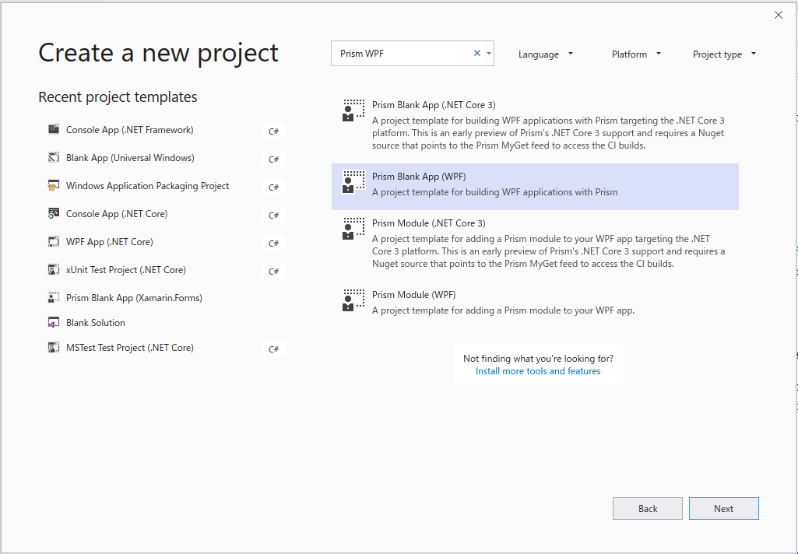
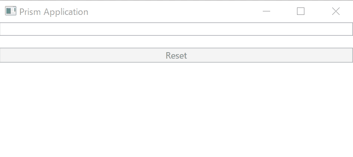

# 他の MVVM フレームワークと連携する

ReactiveProperty は ViewModel やその他のレイヤー向けの基底クラスを提供しません。
つまり、Prism、MVVM Light Toolkit などの他の MVVM フレームワークと一緒に ReactiveProperty を使用できます。

このセクションでは、ReactiveProperty を Prism と一緒に使う方法を説明します。

始めましょう！

## Prism プロジェクトを作成する

Prism は Visual Studio 向けに Prism Template Pack 拡張機能を提供しています。
拡張機能をインストールすると、プロジェクト テンプレートからアプリを作成できます。



ReactiveProperty を Prism と一緒に使用する場合、`DelegateCommand` を `ReactiveCommand` に置き換えられます。また、その他すべての ReactiveProperty 機能も Prism と一緒に使用できます。

この例では、PrismSampleApp という名前の Prism Blank App (WPF) と、PrismSampleModule という名前の Prism Module (WPF) を作成します。
PrismSampleApp に PrismSampleModule への参照を追加し、次に以下のように App.xaml.cs を編集してモジュールを追加します:

```csharp
public partial class App
{
    protected override Window CreateShell()
    {
        return Container.Resolve<MainWindow>();
    }

    protected override void RegisterTypes(IContainerRegistry containerRegistry)
    {

    }

    protected override void ConfigureModuleCatalog(IModuleCatalog moduleCatalog)
    {
        moduleCatalog.AddModule<PrismSampleModuleModule>();
    }
}
```

次に、PrismSampleModuleModule.cs を編集してナビゲーション用のビューを追加し、ViewA をシェルに登録します。

```csharp
using PrismSampleModule.Views;
using Prism.Ioc;
using Prism.Modularity;
using Prism.Regions;

namespace PrismSampleModule
{
    public class PrismSampleModuleModule : IModule
    {
        private readonly IRegionManager _regionManager;

        public PrismSampleModuleModule(IRegionManager regionManager)
        {
            _regionManager = regionManager;
        }

        public void OnInitialized(IContainerProvider containerProvider)
        {
            _regionManager.RequestNavigate("ContentRegion", "ViewA");
        }

        public void RegisterTypes(IContainerRegistry containerRegistry)
        {
            containerRegistry.RegisterForNavigation<ViewA>();
        }
    }
}
```

## ReactiveProperty を使用する

NuGet を使用して、すべてのプロジェクトに ReactiveProperty 参照を追加します。ReactiveProperty の任意のクラスを自由に使用できます。

この例では、以下に示すように ViewAViewModel.cs で ReactiveProperty の機能を使用します:

```csharp
using Prism.Mvvm;
using Reactive.Bindings;
using System;
using System.Linq;
using System.Reactive.Linq;

namespace PrismSampleModule.ViewModels
{
    public class ViewAViewModel : BindableBase
    {
        public ReactiveProperty<string> Input { get; }
        public ReadOnlyReactiveProperty<string> Output { get; }

        public ReactiveCommand ResetCommand { get; }

        public ViewAViewModel()
        {
            Input = new ReactiveProperty<string>("");
            Output = Input.Delay(TimeSpan.FromSeconds(1))
                .Select(x => x.ToUpper())
                .ToReadOnlyReactiveProperty();

            ResetCommand = Input.Select(x => !string.IsNullOrWhiteSpace(x))
                .ToReactiveCommand()
                .WithSubscribe(() => Input.Value = "");
        }
    }
}
```

次に、`ViewA.xaml` を編集します。

```xml
<UserControl x:Class="PrismSampleModule.Views.ViewA"
             xmlns="http://schemas.microsoft.com/winfx/2006/xaml/presentation"
             xmlns:x="http://schemas.microsoft.com/winfx/2006/xaml"
             xmlns:local="clr-namespace:PrismSampleModule.Views"
             xmlns:mc="http://schemas.openxmlformats.org/markup-compatibility/2006"
             xmlns:viewModels="clr-namespace:PrismSampleModule.ViewModels"
             xmlns:d="http://schemas.microsoft.com/expression/blend/2008"
             mc:Ignorable="d"
             d:DesignHeight="300" d:DesignWidth="300"
             xmlns:prism="http://prismlibrary.com/"
             d:DataContext="{d:DesignInstance Type=viewModels:ViewAViewModel, IsDesignTimeCreatable=False}"
             prism:ViewModelLocator.AutoWireViewModel="True" >
    <StackPanel>
        <TextBox Text="{Binding Input.Value, UpdateSourceTrigger=PropertyChanged}" />
        <TextBlock Text="{Binding Output.Value}" />
        <Button Content="Reset" Command="{Binding ResetCommand}" />
    </StackPanel>
</UserControl>
```

問題なく動作します。:)



## まとめ

ReactiveProperty は基底クラスを提供しません。
このセクションで説明したように、ReactiveProperty は他の MVVM フレームワークと一緒に使用できます。
