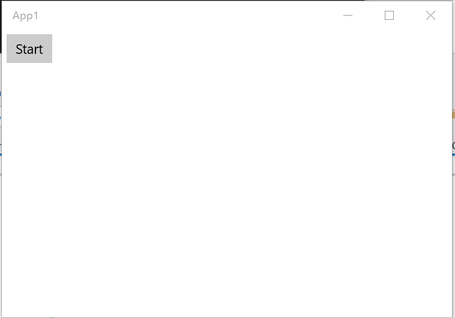
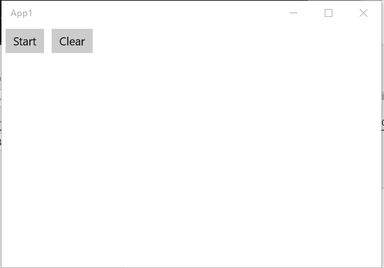
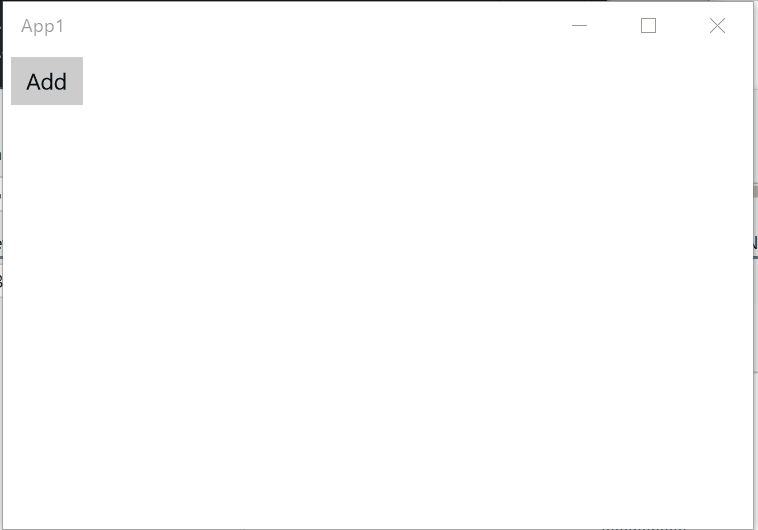
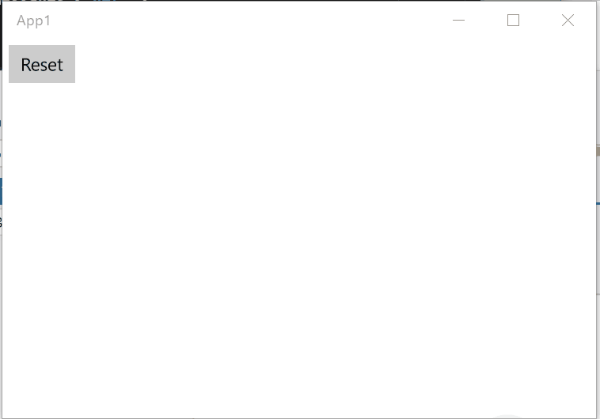
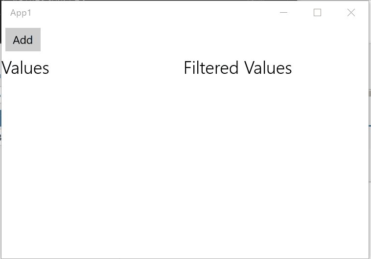

# コレクション

ReactiveProperty はいくつかのコレクション クラスを提供します。

- ReactiveCollection&lt;T&gt;
- ReadOnlyReactiveCollection&lt;T&gt;
- IFilteredReadOnlyObservableCollection&lt;T&gt;

## ReactiveCollection

`ReactiveCollection` は `ObservableCollection` を継承しています。
このクラスは `IObservable` から作成されます。
元の `IObservable` から値が通知されると、項目を追加します。
`ReactiveCollection` はこの処理を `IScheduler` を使って実行します。既定の `IScheduler` は UI スレッドへディスパッチします。

```csharp
public class ViewModel
{
    public ReactiveCollection<DateTime> Records { get; }

    public ReactiveCommand StartRecordCommand { get; }

    public ViewModel()
    {
        StartRecordCommand = new ReactiveCommand();
        // IObservable から ReactiveCollection インスタンスを作成します
        Records = StartRecordCommand
            .ToUnit()
            .Take(1)
            .Concat(Observable.Defer(() => Observable.Interval(TimeSpan.FromSeconds(1)).ToUnit()))
            .Select(_ => DateTime.Now)
            .ToReactiveCollection();
    }
}
```

> `ToUnit` 拡張メソッドは Reactive.Bindings.Extensions 名前空間で定義されています。
> この拡張メソッドは `.Select(_ => Unit.Default)` と同じです。

UWP の例です。

MainPage.xaml.cs
```csharp
public sealed partial class MainPage : Page
{
    public ViewModel ViewModel { get; } = new ViewModel();
    public MainPage()
    {
        this.InitializeComponent();
    }
}
```

MainPage.xaml
```xml
<Page x:Class="App1.MainPage"
      xmlns="http://schemas.microsoft.com/winfx/2006/xaml/presentation"
      xmlns:x="http://schemas.microsoft.com/winfx/2006/xaml"
      xmlns:local="using:App1"
      xmlns:d="http://schemas.microsoft.com/expression/blend/2008"
      xmlns:mc="http://schemas.openxmlformats.org/markup-compatibility/2006"
      mc:Ignorable="d">
    <Grid Background="{ThemeResource ApplicationPageBackgroundThemeBrush}">
        <Grid.RowDefinitions>
            <RowDefinition Height="Auto" />
            <RowDefinition />
        </Grid.RowDefinitions>
        <StackPanel Orientation="Horizontal">
            <Button Content="Start"
                    Command="{x:Bind ViewModel.StartRecordCommand}"
                    Margin="5" />
        </StackPanel>
        <ListView ItemsSource="{x:Bind ViewModel.Records}"
                  Grid.Row="1" />
    </Grid>
</Page>
```



## コレクション操作

`ReactiveCollection` クラスには、`AddOnScheduler`、`RemoveOnScheduler`、`ClearOnScheduler`、`GetOnScheduler` などの `XxxxOnScheduler` メソッドがあります。
これらのメソッドは `IScheduler` 上で実行され、UI スレッド以外から呼び出せます。

```csharp
public class ViewModel
{
    public ReactiveCollection<DateTime> Records { get; }

    public ReactiveCommand StartRecordCommand { get; }

    public ReactiveCommand ClearCommand { get; }

    public ViewModel()
    {
        StartRecordCommand = new ReactiveCommand();
        // IObservable から ReactiveCollection インスタンスを作成します
        Records = StartRecordCommand
            .ToUnit()
            .Take(1)
            .Concat(Observable.Defer(() => Observable.Interval(TimeSpan.FromSeconds(1)).ToUnit()))
            .Select(_ => DateTime.Now)
            .ToReactiveCollection();

        ClearCommand = new ReactiveCommand();
        ClearCommand.ObserveOn(TaskPoolScheduler.Default) // 別スレッドで実行します
            .Subscribe(_ => Records.ClearOnScheduler());
    }
}
```

```xml
<Page x:Class="App1.MainPage"
      xmlns="http://schemas.microsoft.com/winfx/2006/xaml/presentation"
      xmlns:x="http://schemas.microsoft.com/winfx/2006/xaml"
      xmlns:local="using:App1"
      xmlns:d="http://schemas.microsoft.com/expression/blend/2008"
      xmlns:mc="http://schemas.openxmlformats.org/markup-compatibility/2006"
      mc:Ignorable="d">
    <Grid Background="{ThemeResource ApplicationPageBackgroundThemeBrush}">
        <Grid.RowDefinitions>
            <RowDefinition Height="Auto" />
            <RowDefinition />
        </Grid.RowDefinitions>
        <StackPanel Orientation="Horizontal">
            <Button Content="Start"
                    Command="{x:Bind ViewModel.StartRecordCommand}"
                    Margin="5" />
            <Button Content="Clear"
                    Command="{x:Bind ViewModel.ClearCommand}"
                    Margin="5" />
        </StackPanel>
        <ListView ItemsSource="{x:Bind ViewModel.Records}"
                  Grid.Row="1" />
    </Grid>
</Page>
```



`ReactiveCollection` インスタンスを破棄すると、元の IObservable インスタンスから購読解除されます。

## ReadOnlyReactiveCollection

`ReadOnlyReactiveCollection` クラスは、`ObservableCollection` からの一方向同期を提供します。変換ロジックを設定し、`CollectionChanged` イベントを `IScheduler` 上でディスパッチできます。既定の `IScheduler` は UI スレッドへディスパッチします。

まず POCO クラスを作成します。

```csharp
public class BindableBase : INotifyPropertyChanged
{
    public event PropertyChangedEventHandler PropertyChanged;

    protected void RaisePropertyChanged([CallerMemberName]string propertyName = null) =>
        PropertyChanged?.Invoke(this, new PropertyChangedEventArgs(propertyName));

    protected void SetProperty<T>(ref T field, T value, [CallerMemberName]string propertyName = null)
    {
        if (EqualityComparer<T>.Default.Equals(field, value))
        {
            return;
        }

        field = value;
        RaisePropertyChanged(propertyName);
    }
}

public class TimerObject : BindableBase, IDisposable
{
    private IDisposable Disposable { get; }

    private long _count;
    public long Count
    {
        get { return _count; }
        private set { SetProperty(ref _count, value); }
    }

    public TimerObject()
    {
        Disposable = Observable.Interval(TimeSpan.FromSeconds(1))
            .Subscribe(_ => Count++);
    }

    public void Dispose()
    {
        Disposable.Dispose();
    }
}
```

これは `Count` プロパティを 1 秒ごとにインクリメントする単純なクラスです。

ReactiveProperty を使って、このクラスを ViewModel レイヤーでラップします。

```csharp
public class TimerObjectViewModel : IDisposable
{
    public TimerObject Model { get; }

    public ReadOnlyReactiveProperty<string> CountMessage { get; }

    public TimerObjectViewModel(TimerObject timerObject)
    {
        Model = timerObject;
        CountMessage = Model.ObserveProperty(x => x.Count)
            .Select(x => $"Count value is {x}.")
            .ToReadOnlyReactiveProperty();
    }

    public void Dispose()
    {
        Model.Dispose();
    }
}
```

`ObservableCollection` を使って `TimerObject` インスタンスを管理します。
View レイヤーへ `TimerObjectViewModel` インスタンスを提供するには、`ReadOnlyReactiveCollection` クラスを使います。
`ReadOnlyReactiveCollection` インスタンスは `ToReadOnlyReactiveCollection` 拡張メソッドで作成します。

```csharp
public class ViewModel
{
    // TimerObject のコレクション
    private ReactiveCollection<TimerObject> ModelCollection { get; }
    // TimerObjectViewModel のコレクション
    public ReadOnlyReactiveCollection<TimerObjectViewModel> ViewModelCollection { get; }

    public ReactiveCommand AddCommand { get; }

    public ReactiveCommand<TimerObjectViewModel> RemoveCommand { get; }

    public ViewModel()
    {
        AddCommand = new ReactiveCommand();
        ModelCollection = AddCommand
            .Select(_ => new TimerObject())
            .ToReactiveCollection();
        // 変換ロジックを使って ReadOnlyReactiveCollection インスタンスを作成します。
        ViewModelCollection = ModelCollection
            .ToReadOnlyReactiveCollection(x => new TimerObjectViewModel(x));

        RemoveCommand = new ReactiveCommand<TimerObjectViewModel>()
            .WithSubscribe(x => ModelCollection.Remove(x.Model));
    }
}
```

テスト用の View は次のとおりです。

```xml
<Page x:Class="App1.MainPage"
      xmlns="http://schemas.microsoft.com/winfx/2006/xaml/presentation"
      xmlns:x="http://schemas.microsoft.com/winfx/2006/xaml"
      xmlns:local="using:App1"
      xmlns:d="http://schemas.microsoft.com/expression/blend/2008"
      xmlns:mc="http://schemas.openxmlformats.org/markup-compatibility/2006"
      xmlns:viewModels="using:ViewModels"
      mc:Ignorable="d"
      x:Name="root">
    <Grid Background="{ThemeResource ApplicationPageBackgroundThemeBrush}">
        <Grid.RowDefinitions>
            <RowDefinition Height="Auto" />
            <RowDefinition />
        </Grid.RowDefinitions>
        <Button Content="Add"
                Command="{x:Bind ViewModel.AddCommand}"
                Margin="5" />
        <ListView ItemsSource="{x:Bind ViewModel.ViewModelCollection}"
                  Grid.Row="1">
            <ListView.ItemTemplate>
                <DataTemplate x:DataType="viewModels:TimerObjectViewModel">
                    <Grid>
                        <Grid.ColumnDefinitions>
                            <ColumnDefinition Width="Auto" />
                            <ColumnDefinition />
                        </Grid.ColumnDefinitions>
                        <Button Content="Remove"
                                Command="{Binding ViewModel.RemoveCommand, ElementName=root}"
                                CommandParameter="{x:Bind}"
                                Margin="5" />
                        <TextBlock Text="{x:Bind CountMessage.Value, Mode=OneWay}"
                                   VerticalAlignment="Center"
                                   Style="{ThemeResource BodyTextBlockStyle}"
                                   Grid.Column="1" />
                    </Grid>
                </DataTemplate>
            </ListView.ItemTemplate>
        </ListView>
    </Grid>
</Page>
```




`ReadOnlyReactiveCollection` からインスタンスが削除されると、`Dispose` メソッドが呼び出されます。この動作が不要な場合は、`ToReadOnlyReactiveCollection()` の `disposeElement` 引数に `false` を設定します。

```csharp
ViewModelCollection = ModelCollection
    .ToReadOnlyReactiveCollection(x => new TimerObjectViewModel(x), disposeElement: false);
```

### `IObservable` から作成する

`ReadOnlyReactiveCollection` は `ReactiveCollection` と同様に `IObservable` から作成できます。ただし、`ReadOnlyReactiveCollection` にはコレクション操作メソッドがありません。
`ToReadOnlyReactiveCollection` 拡張メソッドには `IObservable<Unit>` 型の `onReset` 引数があります。
この引数が値を発行すると、コレクションはクリアされます。

```csharp
public class ViewModel
{
    public ReadOnlyReactiveCollection<string> Messages { get; }

    public ReactiveCommand ResetCommand { get; }

    public ViewModel()
    {
        ResetCommand = new ReactiveCommand();
        Messages = Observable.Interval(TimeSpan.FromSeconds(1))
            .Select(_ => DateTime.Now.ToString("yyyy/MM/dd HH:mm:ss"))
            .ToReadOnlyReactiveCollection(ResetCommand.ToUnit());
    }
}
```

```xml
<Page x:Class="App1.MainPage"
      xmlns="http://schemas.microsoft.com/winfx/2006/xaml/presentation"
      xmlns:x="http://schemas.microsoft.com/winfx/2006/xaml"
      xmlns:local="using:App1"
      xmlns:d="http://schemas.microsoft.com/expression/blend/2008"
      xmlns:mc="http://schemas.openxmlformats.org/markup-compatibility/2006"
      mc:Ignorable="d">
    <Grid Background="{ThemeResource ApplicationPageBackgroundThemeBrush}">
        <Grid.RowDefinitions>
            <RowDefinition Height="Auto" />
            <RowDefinition />
        </Grid.RowDefinitions>
        <Button Content="Reset"
                Command="{x:Bind ViewModel.ResetCommand}"
                Margin="5" />
        <ListView ItemsSource="{x:Bind ViewModel.Messages}"
                  Grid.Row="1" />
    </Grid>
</Page>
```

`ResetCommand` が実行されると、Messages コレクションがクリアされます。



## IFilteredReadOnlyObservableCollection

`ObservableCollection` からリアルタイムにフィルターするコレクションです。
`IFilteredReadOnlyObservableCollection` は、元コレクション内の項目の `PropertyChanged` イベントと `CollectionChanged` イベントを監視します。

```csharp
public class ValueHolder : INotifyPropertyChanged
{
    public event PropertyChangedEventHandler PropertyChanged;

    public int Id { get; set; }

    private int _value;
    public int Value
    {
        get => _value;
        set
        {
            _value = value;
            PropertyChanged?.Invoke(this, new PropertyChangedEventArgs(nameof(Value)));
        }
    }

    public ValueHolder()
    {
        var r = new Random();
        Observable.Interval(TimeSpan.FromSeconds(1))
            .ObserveOnUIDispatcher()
            .Subscribe(_ => Value = r.Next(10));
    }
}

public class ViewModel
{
    public ReactiveCollection<ValueHolder> ValuesSource { get; }

    public IFilteredReadOnlyObservableCollection<ValueHolder> Values { get; }

    public ReactiveCommand AddCommand { get; }

    public ViewModel()
    {
        AddCommand = new ReactiveCommand();
        ValuesSource = AddCommand
            .Select(_ => new ValueHolder { Id = ValuesSource.Count })
            .ToReactiveCollection();
        Values = ValuesSource.ToFilteredReadOnlyObservableCollection(
            x => x.Value > 7);
    }
}
```

> `ObserveOnUIDispatcher` 拡張メソッドは、現在のスレッドから UI スレッドへ切り替えます。


```xml
<Page x:Class="App1.MainPage"
      xmlns="http://schemas.microsoft.com/winfx/2006/xaml/presentation"
      xmlns:x="http://schemas.microsoft.com/winfx/2006/xaml"
      xmlns:local="using:App1"
      xmlns:d="http://schemas.microsoft.com/expression/blend/2008"
      xmlns:mc="http://schemas.openxmlformats.org/markup-compatibility/2006"
      xmlns:viewModels="using:ViewModels"
      mc:Ignorable="d"
      x:Name="root">
    <Page.Resources>
        <DataTemplate x:Key="valueHolderDataTemplate"
                      x:DataType="viewModels:ValueHolder">
            <TextBlock>
                <Run Text="Id: " />
                <Run Text="{x:Bind Id}" />
                <Run Text=", Value: " />
                <Run Text="{x:Bind Value, Mode=OneWay}" />
            </TextBlock>
        </DataTemplate>
    </Page.Resources>
    <Grid Background="{ThemeResource ApplicationPageBackgroundThemeBrush}">
        <Grid.RowDefinitions>
            <RowDefinition Height="Auto" />
            <RowDefinition Height="Auto" />
            <RowDefinition />
        </Grid.RowDefinitions>
        <Grid.ColumnDefinitions>
            <ColumnDefinition />
            <ColumnDefinition />
        </Grid.ColumnDefinitions>
        <Button Content="Add"
                Command="{x:Bind ViewModel.AddCommand}"
                Margin="5" />
        <TextBlock Text="Values"
                   Style="{ThemeResource TitleTextBlockStyle}"
                   Grid.Row="1" />
        <ListView ItemsSource="{x:Bind ViewModel.ValuesSource}"
                  ItemTemplate="{StaticResource valueHolderDataTemplate}"
                  Grid.Row="2" />
        <TextBlock Text="Filtered Values"
                   Style="{ThemeResource TitleTextBlockStyle}"
                   Grid.Row="1"
                   Grid.Column="1" />
        <ListView ItemsSource="{x:Bind ViewModel.Values}"
                  ItemTemplate="{StaticResource valueHolderDataTemplate}"
                  Grid.Row="2"
                  Grid.Column="1" />
    </Grid>
</Page>
```



Value プロパティが 7 より大きいとき、Filtered Values の ListView（右側）に値を表示します。

### コレクション要素の監視方法をカスタマイズする

要素を更新するトリガーを CollectionChanged イベントから別のトリガーに変更したい場合は、`IObservable<T> sourceElementStatusChanged` 引数を持つ別のオーバーロードを使ってカスタマイズできます。

たとえば、コレクション内の要素のネストされたプロパティでフィルターしたい場合があります。

```csharp
// ネストされたオブジェクト プロパティを持つオブジェクト
public class NestedPropertyObject : INotifyPropertyChanged
{
    // INPC 実装は省略

    public string Id { get; } => Guid.NewGuid().ToString();
    public ReactivePropertySlim<bool> NestedObject { get; } = new ReactivePropertySlim<bool>(true);
}

// --------------------
// トリガー
var sourceCollection = new ObservableCollection<NestedPropertyObject>
{
    new NestedPropertyObject(),
    new NestedPropertyObject(),
    new NestedPropertyObject(),
};

var filteredCollection = sourceCollection.ToFilteredReadOnlyObservableCollection(
    // フィルター条件のラムダ式
    x => x.NestedObject.Value,
    // コレクション要素の更新トリガーとなる IObservable インスタンスを作成します
    x => x.ObserveProperty(y => NestedObject.Value)
);

Console.WriteLine(filteredCollection.Count); // 3
// filteredCollection は NestedObject.Value プロパティ パスを監視しています。
// そのため、次の行でフィルター条件の再評価がトリガーされます
sourceCollection[1].NestedObject.Value = false;
Console.WriteLine(filteredCollection.Count); // 2
```

次の 2 行は同じです。

```csharp
collection.ToFilteredReadOnlyObservableCollection(x => x.SomeProperty);
collection.ToFilteredReadOnlyObservableCollection(x => x.SomeProperty, x => x.PropertyChangedAsObservable());
```
