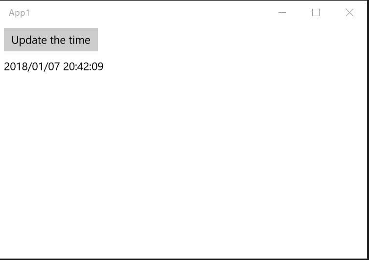
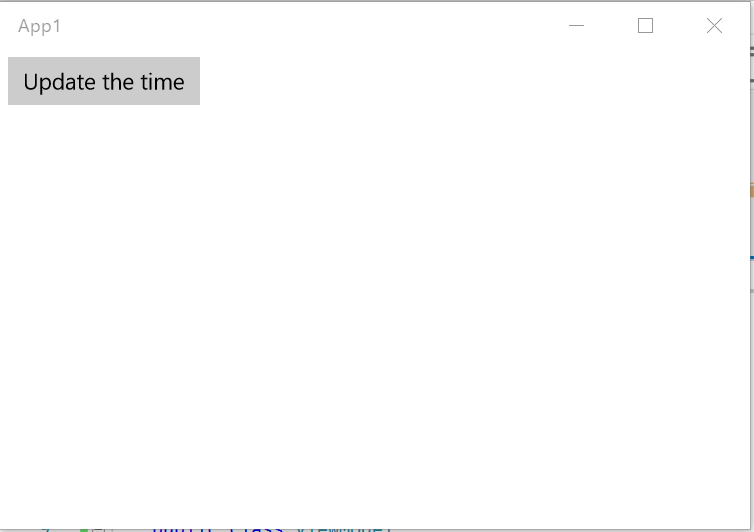
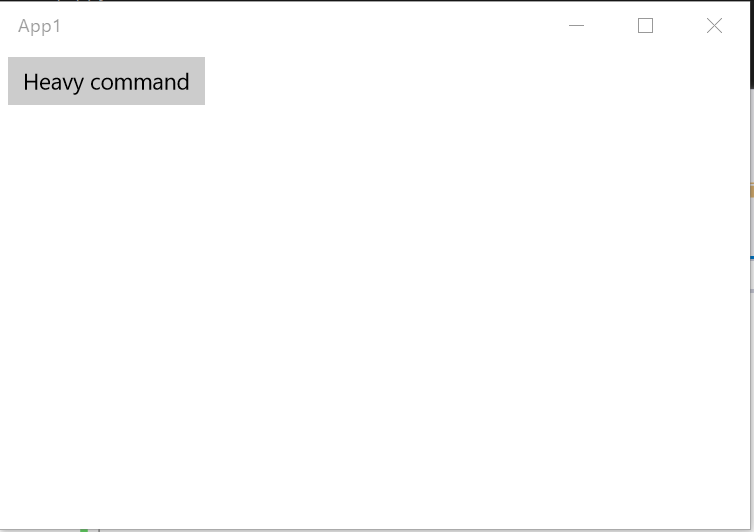
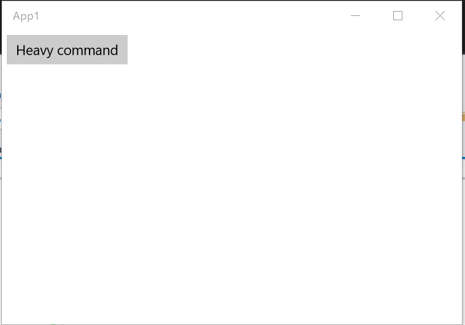
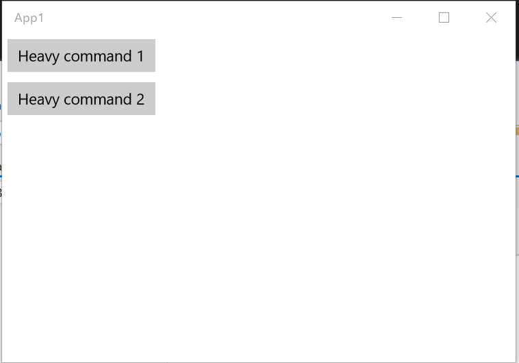
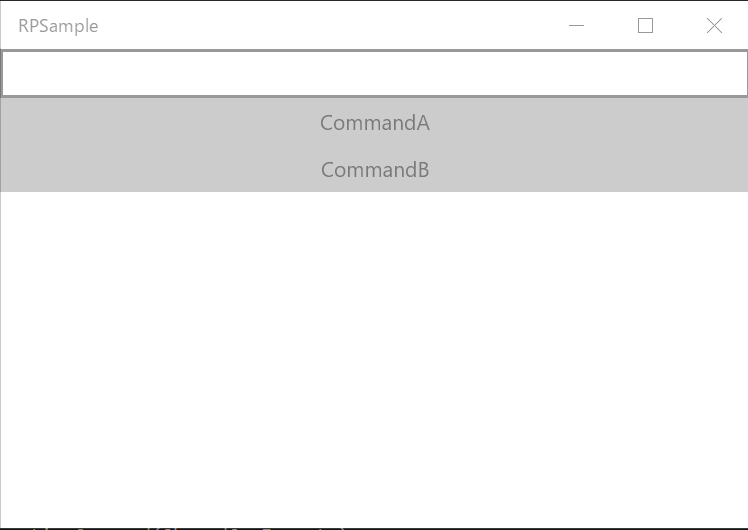

# コマンド

`ReactiveCommand` クラスは次の 2 つのインターフェイスを実装しています。

- `ICommand` インターフェイス
- `IObservable<T>`

## 基本的な使い方

このクラスは、`IObservable<bool>` インスタンスから `ToReactiveCommand` 拡張メソッドを使って作成できます。
`IObservable<bool>` インスタンスが値を発行すると、`CanExecuteChanged` イベントが発生します。

常に実行可能なコマンドが必要な場合は、既定のコンストラクターを使って `ReactiveCommand` インスタンスを作成できます。

```csharp
IObservable<bool> canExecuteSource = ...;

ReactiveCommand someCommand = canExecuteSource.ToReactiveCommand(); // コマンド パラメーターなしのバージョン
ReactiveCommand<string> hasCommandParameterCommand = canExecuteSource.ToReactiveCommand<string>(); // コマンド パラメーターありのバージョン
ReactiveCommand alwaysExecutableCommand = new ReactiveCommand(); // コマンド パラメーターなしで常に実行できるバージョン
ReactiveCommand<string> alwaysExecutableAndHasCommandParameterCommand = new ReactiveCommand<string>(); // コマンド パラメーターありで常に実行できるバージョン
```

ファクトリ拡張メソッドの `initialValue` 引数を使って、`CanExecute` メソッドの初期戻り値を設定できます。
既定値は `true` です。

```csharp
IObservable<bool> canExecuteSource = ...;

ReactiveCommand someCommand = canExecuteSource.ToReactiveCommand(false);
ReactiveCommand<string> hasCommandParameterCommand = canExecuteSource.ToReactiveCommand<string>(false);
```

`Execute` メソッドが呼び出されると、`ReactiveCommand` は `OnNext` コールバックを呼び出します。
実行ロジックは `Subscribe` メソッドで登録できます。

```csharp
ReactiveCommand someCommand = new ReactiveCommand();
someCommand.Subscribe(_ => { ... some logic ... }); // OnNext コールバックを設定します

someCommand.Execute(); // OnNext コールバックが呼び出されます。
```

## ViewModel クラスで使う

最初の例では、`ReactiveCommand` クラスだけを使います。

```csharp
public class ViewModel
{
    public ReactiveCommand UpdateTimeCommand { get; }

    public ReactiveProperty<string> Time { get; }

    public ViewModel()
    {
        Time = new ReactiveProperty<string>();
        UpdateTimeCommand = new ReactiveCommand();
        UpdateTimeCommand.Subscribe(_ => Time.Value = DateTime.Now.ToString("yyyy/MM/dd HH:mm:ss"));
    }
}
```

UWP の例です。

```csharp
public sealed partial class MainPage : Page
{
    private ViewModel ViewModel { get; } = new ViewModel();
    public MainPage()
    {
        this.InitializeComponent();
    }
}
```

```xml
<Page x:Class="App1.MainPage"
      xmlns="http://schemas.microsoft.com/winfx/2006/xaml/presentation"
      xmlns:x="http://schemas.microsoft.com/winfx/2006/xaml"
      xmlns:local="using:App1"
      xmlns:d="http://schemas.microsoft.com/expression/blend/2008"
      xmlns:mc="http://schemas.openxmlformats.org/markup-compatibility/2006"
      mc:Ignorable="d">
    <StackPanel Background="{ThemeResource ApplicationPageBackgroundThemeBrush}">
        <Button Content="Update the time"
                Command="{x:Bind ViewModel.UpdateTimeCommand}"
                Margin="5" />
        <TextBlock Text="{x:Bind ViewModel.Time.Value, Mode=OneWay}"
                   Style="{ThemeResource BodyTextBlockStyle}"
                   Margin="5" />
    </StackPanel>
</Page>
```



## LINQ と連携する

`ReactiveCommand` クラスは `IObservable<T>` インターフェイスを実装しています。
LINQ メソッドを使用でき、`ReactiveProperty<T>` クラスは `IObservable<T>` から作成できます。
前の例のコードは次のように変更できます。

```csharp
public class ViewModel
{
    public ReactiveCommand UpdateTimeCommand { get; }

    // Value プロパティを設定する必要がないため、ReadOnlyReactiveProperty に変更できます。
    public ReadOnlyReactiveProperty<string> Time { get; }

    public ViewModel()
    {
        UpdateTimeCommand = new ReactiveCommand();
        Time = UpdateTimeCommand
            .Select(_ => DateTime.Now.ToString("yyyy/MM/dd HH:mm:ss"))
            .ToReadOnlyReactiveProperty();
    }
}
```

## `IObservable<bool>` から作成する

コマンド実行後 5 秒間は `UpdateTimeCommand` を実行できないように変更します。

```csharp
public class ViewModel
{
    public ReactiveCommand UpdateTimeCommand { get; }

    public ReadOnlyReactiveProperty<string> Time { get; }

    public ViewModel()
    {
        var updateTimeTrigger = new Subject<Unit>();
        UpdateTimeCommand = Observable.Merge(
            updateTimeTrigger.Select(_ => false),
            updateTimeTrigger.Delay(TimeSpan.FromSeconds(5)).Select(_ => true))
            .ToReactiveCommand();
        Time = UpdateTimeCommand
            .Select(_ => DateTime.Now.ToString("yyyy/MM/dd HH:mm:ss"))
            .Do(_ => updateTimeTrigger.OnNext(Unit.Default))
            .ToReadOnlyReactiveProperty();
    }
}
```



## コマンドの作成と購読を 1 文で行う

LINQ メソッドを使わない場合は、コマンドの作成と購読を 1 文で行えます。
`WithSubscribe` 拡張メソッドは購読して、`ReactiveCommand` インスタンスを返します。

```csharp
public class ViewModel
{
    public ReactiveCommand UpdateTimeCommand { get; }

    public ReactiveProperty<string> Time { get; }

    public ViewModel()
    {
        Time = new ReactiveProperty<string>();

        var updateTimeTrigger = new Subject<Unit>();
        UpdateTimeCommand = Observable.Merge(
            updateTimeTrigger.Select(_ => false),
            updateTimeTrigger.Delay(TimeSpan.FromSeconds(5)).Select(_ => true))
            .ToReactiveCommand()
            .WithSubscribe(() => Time.Value = DateTime.Now.ToString("yyyy/MM/dd HH:mm:ss")); // ここ
    }
}
```

`WithSubscribe` メソッドは単なるショートカットです。

```csharp
// WithSubscribe を使わない場合
var command = new ReactiveCommand();
command.Subscribe(_ => { ... some actions ... });

// WithSubscribe を使う場合
var command = new ReactiveCommand()
    .WithSubscribe(() => { ... some actions ... });
```

LINQ メソッドを使う場合は、インスタンス化と購読を別の文に分けてください。

## アクションの購読解除

アクションの購読を解除する必要がある場合は、`Subscribe` メソッドが返す `IDisposable` インスタンスの `Dispose` メソッドを使います。

```csharp
var command = new ReactiveCommand();
var subscription1 = command.Subscribe(_ => { ... some actions ... });
var subscription2 = command.Subscribe(_ => { ... some actions ... });

// 各 Subscribe メソッドの購読を解除します。
subscription1.Dispose();
subscription2.Dispose();

// すべて購読解除します
command.Dispose();
```

`WithSubscribe` 拡張メソッドには、`IDisposable` 引数を持つオーバーロードがあります。

```csharp
IDisposable subscription = null;
var command = new ReactiveCommand().WithSubscribe(() => { ... some actions ... }, out subscription);

// 購読解除
subscription.Dispose();
```

`Action<IDisposable>` 引数を持つ別のオーバーロードもあります。
これは `CompositeDisposable` クラスと一緒に使います。

```csharp
var subscriptions = new CompositeDisposable();
var command = new ReactiveCommand()
    .WithSubscribe(() => { ... some actions ... }, subscriptions.Add)
    .WithSubscribe(() => { ... some actions ... }, subscriptions.Add);

// 購読解除
subscription.Dispose();
```

別のインスタンスのイベントを購読する場合は、ViewModel のライフサイクルの最後に `ReactiveCommand` クラスの `Dispose` メソッドを呼び出してください。

## ReactiveCommand の非同期版

`AsyncReactiveCommand` クラスは、`ReactiveCommand` クラスの `async` 版です。
このクラスは `async` メソッドを購読できます。async メソッドの実行中は、`CanExecute` メソッドが `false` を返します。
そのため、async メソッドの実行中は再実行できません。

`ExecuteAsync` メソッドは `Execute` メソッドの async 版です。コマンドに追加されたすべての async 処理の完了を待てます。このメソッドは単体テストや C# からコマンドを呼び出すときに便利です。

### 基本的な使い方

`ReactiveCommand` クラスとほぼ同じです。
唯一の違いは、`Subscribe` メソッドの引数として `async` メソッドを受け取れることと、`IObservable<T>` インターフェイスを実装していないことです。

```csharp
public class ViewModel
{
    public AsyncReactiveCommand HeavyCommand { get; }

    public ReactiveProperty<string> Message { get; } = new ReactiveProperty<string>();

    public ViewModel()
    {
        HeavyCommand = new AsyncReactiveCommand()
            .WithSubscribe(async () =>
            {
                Message.Value = "Heavy command started.";
                await Task.Delay(TimeSpan.FromSeconds(5));
                Message.Value = "Heavy command finished.";
            });
    }
}
```

```xml
<Page x:Class="App1.MainPage"
      xmlns="http://schemas.microsoft.com/winfx/2006/xaml/presentation"
      xmlns:x="http://schemas.microsoft.com/winfx/2006/xaml"
      xmlns:local="using:App1"
      xmlns:d="http://schemas.microsoft.com/expression/blend/2008"
      xmlns:mc="http://schemas.openxmlformats.org/markup-compatibility/2006"
      mc:Ignorable="d">
    <StackPanel Background="{ThemeResource ApplicationPageBackgroundThemeBrush}">
        <Button Content="Heavy command"
                Command="{x:Bind ViewModel.HeavyCommand}"
                Margin="5" />
        <TextBlock Text="{x:Bind ViewModel.Message.Value, Mode=OneWay}"
                   Margin="5" />
    </StackPanel>
</Page>
```



もちろん、`AsyncReactiveCommand` は `IObservable<bool>` からも作成できます。

```csharp
public class ViewModel
{
    public AsyncReactiveCommand HeavyCommand { get; }

    public ReactiveProperty<string> Message { get; } = new ReactiveProperty<string>();

    public ViewModel()
    {
        HeavyCommand = Observable.Interval(TimeSpan.FromSeconds(1))
            .Select(x => x % 2 == 0)
            .ToAsyncReactiveCommand()
            .WithSubscribe(async () =>
            {
                Message.Value = "Heavy command started.";
                await Task.Delay(TimeSpan.FromSeconds(5));
                Message.Value = "Heavy command finished.";
            });
    }
}
```



`AsyncReactiveCommand` クラスも `IDisposable` インターフェイスを実装しています。
別のインスタンスのイベントを購読する場合は、`Dispose` メソッドを呼び出してください。

### `CanExecute` 状態を共有する

ページ上で一度に 1 つの async メソッドだけを実行したい場合があります。
この場合、`AsyncReactiveCommand` インスタンス間で `CanExecute` 状態を共有できます。
同じ `IReactiveProperty<bool>` インスタンスから作成すると、`CanExecute` 状態を同期できます。

```csharp
public class ViewModel
{
    private ReactiveProperty<bool> HeavyCommandCanExecuteState { get; } = new ReactiveProperty<bool>(true);
    public AsyncReactiveCommand HeavyCommand1 { get; }
    public AsyncReactiveCommand HeavyCommand2 { get; }

    public ReactiveProperty<string> Message { get; } = new ReactiveProperty<string>();

    public ViewModel()
    {
        HeavyCommand1 = HeavyCommandCanExecuteState
            .ToAsyncReactiveCommand()
            .WithSubscribe(async () =>
            {
                Message.Value = "Heavy command 1 started.";
                await Task.Delay(TimeSpan.FromSeconds(5));
                Message.Value = "Heavy command 1 finished.";
            });
        HeavyCommand2 = HeavyCommandCanExecuteState
            .ToAsyncReactiveCommand()
            .WithSubscribe(async () =>
            {
                Message.Value = "Heavy command 2 started.";
                await Task.Delay(TimeSpan.FromSeconds(5));
                Message.Value = "Heavy command 2 finished.";
            });
    }
}
```

```xml
<Page x:Class="App1.MainPage"
      xmlns="http://schemas.microsoft.com/winfx/2006/xaml/presentation"
      xmlns:x="http://schemas.microsoft.com/winfx/2006/xaml"
      xmlns:local="using:App1"
      xmlns:d="http://schemas.microsoft.com/expression/blend/2008"
      xmlns:mc="http://schemas.openxmlformats.org/markup-compatibility/2006"
      mc:Ignorable="d">
    <StackPanel Background="{ThemeResource ApplicationPageBackgroundThemeBrush}">
        <Button Content="Heavy command 1"
                Command="{x:Bind ViewModel.HeavyCommand1}"
                Margin="5" />
        <Button Content="Heavy command 2"
                Command="{x:Bind ViewModel.HeavyCommand2}"
                Margin="5" />
        <TextBlock Text="{x:Bind ViewModel.Message.Value, Mode=OneWay}"
                   Margin="5" />
    </StackPanel>
</Page>
```



もちろん、`IObservable<bool>` と `IReactiveProperty<bool>` を組み合わせることもできます。`AsyncReactiveCommand` のソースとして `IObservable<bool>` を使い、複数の `AsyncReactiveCommand` で状態を共有するために `IReactiveProperty<bool>` を使います。
次のように、`ToAsyncReactiveCommand(this IObservable<bool> source, IReactiveProperty<bool> sharedCanExecute = null)` メソッドを使えます。

```csharp
using Reactive.Bindings;
using Reactive.Bindings.Extensions;
using System.ComponentModel.DataAnnotations;
using System.Threading.Tasks;

namespace RPSample
{
    public class MainPageViewModel
    {
        // 共有状態用
        private ReactivePropertySlim<bool> SharedCanExecute { get; }
        // コマンド ソース用
        [Required]
        public ReactiveProperty<string> Input { get; }

        // コマンド
        public AsyncReactiveCommand CommandA { get; }
        public AsyncReactiveCommand CommandB { get; }

        public MainPageViewModel()
        {
            Input = new ReactiveProperty<string>().SetValidateAttribute(() => Input);

            // CanExecute 状態を共有するため、同じソースと同じ IReactiveProperty<bool> から AsyncReactiveCommand を作成します。
            SharedCanExecute = new ReactivePropertySlim<bool>(true);
            CommandA = Input.ObserveHasErrors
                .Inverse()
                .ToAsyncReactiveCommand(SharedCanExecute)
                .WithSubscribe(() => Task.Delay(3000));
            CommandB = Input.ObserveHasErrors
                .Inverse()
                .ToAsyncReactiveCommand(SharedCanExecute)
                .WithSubscribe(() => Task.Delay(3000));
        }
    }
}
```

ViewModel クラスを View にバインディングした後は次のようになります。

```csharp
// コード ビハインド
using Windows.UI.Xaml.Controls;

namespace RPSample
{
    public sealed partial class MainPage : Page
    {
        private MainPageViewModel ViewModel { get; } = new MainPageViewModel();
        public MainPage()
        {
            InitializeComponent();
        }
    }
}
```

```xml
<Page
    x:Class="RPSample.MainPage"
    xmlns="http://schemas.microsoft.com/winfx/2006/xaml/presentation"
    xmlns:x="http://schemas.microsoft.com/winfx/2006/xaml"
    xmlns:d="http://schemas.microsoft.com/expression/blend/2008"
    xmlns:mc="http://schemas.openxmlformats.org/markup-compatibility/2006"
    Background="{ThemeResource ApplicationPageBackgroundThemeBrush}"
    mc:Ignorable="d">

    <StackPanel>
        <TextBox Text="{x:Bind ViewModel.Input.Value, Mode=TwoWay, UpdateSourceTrigger=PropertyChanged}" />
        <Button
            HorizontalAlignment="Stretch"
            Command="{x:Bind ViewModel.CommandA}"
            Content="CommandA" />
        <Button
            HorizontalAlignment="Stretch"
            Command="{x:Bind ViewModel.CommandB}"
            Content="CommandB" />
    </StackPanel>
</Page>
```

動作は次のようになります。




## スレッド処理

### `ReactiveCommand` クラス

`ReactiveCommand` クラスを使うと、このクラスはスケジューラー上で `CanExecute` イベントを発生させます（既定は UI スレッド スケジューラーです）。この動作を変更したい場合は、`IScheduler` 引数を持つ `ToReactiveCommand` のオーバーロードを使います。

次の例を参照してください。

```csharp
canExecuteSource.ToReactiveCommand(theSchedulerInstanceYouWant);
```

### `AsyncReactiveCommand` クラス

`AsyncReactiveCommand` クラスはスレッドを自動的に変更しません。スレッドを変更したい場合は、`ObserveOn` メソッドを使います。

次の例を参照してください。

```csharp
canExecuteSource.ObserveOn(theSchedulerInstanceYouWant).ToAsyncReactiveCommand();
```

### `ReactiveCommandSlim`

これは `ReactiveCommand` の軽量版です。従来の `ReactiveCommand` との主な違いは、`CanExecuteChanged` イベントが UI スレッドへディスパッチされなくなったことです。常に UI スレッドでイベントを発生させる必要がある場合は、`ReactiveCommandSlim` のソースである `IObservable<bool>` に対して `ObserveOn` メソッドを使い、明示的に設定してください。

さらに、`ReactivePropertySlim` と同じ方法で実装することで、さまざまな性能改善が行われています。ベンチマークは次のとおりです。

|                                        メソッド |         平均 |       エラー |      標準偏差 |       中央値 |
|---------------------------------------------- |-------------:|------------:|------------:|-------------:|
|                         CreateReactiveCommand |   291.931 ns |   5.6965 ns |  10.5589 ns |   291.178 ns |
|                     CreateReactiveCommandSlim |     4.313 ns |   0.1293 ns |   0.1080 ns |     4.269 ns |
|                BasicUsecaseForReactiveCommand | 1,187.294 ns |  22.8930 ns |  21.4141 ns | 1,179.896 ns |
|            BasicUsecaseForReactiveCommandSlim |    91.861 ns |   1.8934 ns |   3.5096 ns |    91.750 ns |

上から順に、`ReactiveCommand` の作成、`ReactiveCommandSlim` の作成、`ReactiveCommand` の基本的なユースケース、`ReactiveCommandSlim` の基本的なユースケースを表しています。インスタンス化では 70 倍以上、基本機能の利用では 13 倍の性能差があります。

さらに、`AsyncReactiveCommand` と同様に、`IReactiveProperty<bool>` を共有することで複数のコマンド間で実行状態を簡単に共有できます。
