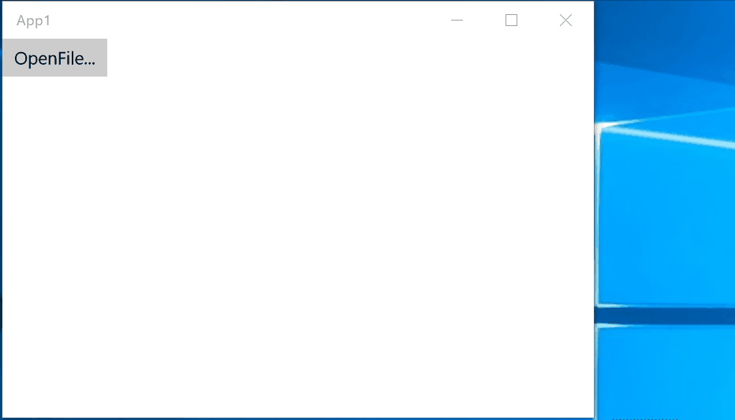

# View から ViewModel へイベントを転送する

`EventToReactiveProperty` クラスと `EventToReactiveCommand` クラスは、View レイヤーからのイベントを `ReactiveProperty` または `ReactiveCommand` に転送します。
これらのクラスは `TriggerAction` を拡張しており、`EventTrigger` と一緒に使うように設計されています。

<b>メモ:</b>
> この機能は WPF と UWP でのみ利用できます。Xamarin.Forms では使えません。使いたい場合は、WPF では `ReactiveProperty.WPF` パッケージを、UWP では `ReactiveProperty.UWP` パッケージをプロジェクトに追加してください。

これらのクラスは、`ReactiveConverter<T, U>` を使って `EventArgs` を任意のオブジェクト型に変換できます。

`ReactiveConverter` クラスでは Rx のメソッド チェーンを使用できます。非常に強力です。


UWP のサンプル:

```csharp
using Reactive.Bindings.Interactivity;
using System;
using System.Linq;
using System.Reactive.Linq;
using Windows.Storage.Pickers;
using Windows.UI.Xaml;

namespace App1
{
    public class FileOpenReactiveConverter : ReactiveConverter<RoutedEventArgs, string>
    {
        protected override IObservable<string> OnConvert(IObservable<RoutedEventArgs> source)
        {
            return source.SelectMany(async _ =>
            {
                var picker = new FileOpenPicker();
                picker.FileTypeFilter.Add(".snippet");
                var f = await picker.PickSingleFileAsync();
                return f?.Path;
            })
            .Where(x => x != null);

        }
    }
}
```

これは `RoutedEventArgs` をファイル パスに変換します。

XAML とコード ビハインドは次のとおりです。

```xml
<Page x:Class="App1.MainPage"
      xmlns="http://schemas.microsoft.com/winfx/2006/xaml/presentation"
      xmlns:x="http://schemas.microsoft.com/winfx/2006/xaml"
      xmlns:local="using:App1"
      xmlns:d="http://schemas.microsoft.com/expression/blend/2008"
      xmlns:mc="http://schemas.openxmlformats.org/markup-compatibility/2006"
      xmlns:i="using:Microsoft.Xaml.Interactivity"
      xmlns:c="using:Microsoft.Xaml.Interactions.Core"
      xmlns:reactiveProperty="using:Reactive.Bindings.Interactivity"
      mc:Ignorable="d">
    <StackPanel Background="{ThemeResource ApplicationPageBackgroundThemeBrush}">
        <Button Content="OpenFile...">
            <i:Interaction.Behaviors>
                <c:EventTriggerBehavior EventName="Click">
                    <reactiveProperty:EventToReactiveCommand Command="{x:Bind ViewModel.SelectFileCommand}">
                        <local:FileOpenReactiveConverter />
                    </reactiveProperty:EventToReactiveCommand>
                </c:EventTriggerBehavior>
            </i:Interaction.Behaviors>
        </Button>
        <TextBlock Text="{x:Bind ViewModel.FileName.Value, Mode=OneWay}" />
    </StackPanel>
</Page>
```

```csharp
using Reactive.Bindings;
using Windows.UI.Xaml.Controls;

namespace App1
{
    public sealed partial class MainPage : Page
    {
        public MainPageViewModel ViewModel { get; } = new MainPageViewModel();

        public MainPage()
        {
            this.InitializeComponent();
        }
    }

    public class MainPageViewModel
    {
        public ReactiveCommand<string> SelectFileCommand { get; }
        public ReadOnlyReactiveProperty<string> FileName { get; }

        public MainPageViewModel()
        {
            this.SelectFileCommand = new ReactiveCommand<string>();
            this.FileName = this.SelectFileCommand.ToReadOnlyReactiveProperty();
        }
    }

}
```




`EventToReactiveProperty` は、`ReactiveConverter` で変換された値を `ReactiveProperty` に設定します。

```xml
<Page x:Class="App1.MainPage"
      xmlns="http://schemas.microsoft.com/winfx/2006/xaml/presentation"
      xmlns:x="http://schemas.microsoft.com/winfx/2006/xaml"
      xmlns:local="using:App1"
      xmlns:d="http://schemas.microsoft.com/expression/blend/2008"
      xmlns:mc="http://schemas.openxmlformats.org/markup-compatibility/2006"
      xmlns:i="using:Microsoft.Xaml.Interactivity"
      xmlns:c="using:Microsoft.Xaml.Interactions.Core"
      xmlns:reactiveProperty="using:Reactive.Bindings.Interactivity"
      mc:Ignorable="d">
    <StackPanel Background="{ThemeResource ApplicationPageBackgroundThemeBrush}">
        <Button Content="OpenFile...">
            <i:Interaction.Behaviors>
                <c:EventTriggerBehavior EventName="Click">
                    <reactiveProperty:EventToReactiveProperty ReactiveProperty="{x:Bind ViewModel.FileName}">
                        <local:FileOpenReactiveConverter />
                    </reactiveProperty:EventToReactiveProperty>
                </c:EventTriggerBehavior>
            </i:Interaction.Behaviors>
        </Button>
        <TextBlock Text="{x:Bind ViewModel.FileName.Value, Mode=OneWay}" />
    </StackPanel>
</Page>
```

```csharp
using Reactive.Bindings;
using Windows.UI.Xaml.Controls;

namespace App1
{
    public sealed partial class MainPage : Page
    {
        public MainPageViewModel ViewModel { get; } = new MainPageViewModel();

        public MainPage()
        {
            this.InitializeComponent();
        }
    }

    public class MainPageViewModel
    {
        public ReactiveProperty<string> FileName { get; } = new ReactiveProperty<string>();
    }

}
```

## EventToReactiveCommand のカスタマイズ

### CallExecuteOnScheduler プロパティ

既定の動作では、`ReactivePropertyScheduler.Default` に設定された `IScheduler` 上でコマンドの Execute メソッドを呼び出します。この動作を無効にするには、このプロパティを false に設定します。

### AutoEnable プロパティ

既定の動作では、AssociatedObject.IsEnabled とコマンドの CanExecute が自動的に同期されます。
この動作を無効にするには、このプロパティを false に設定します。
