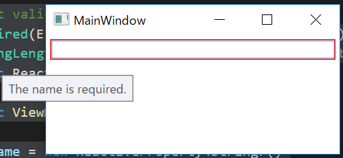
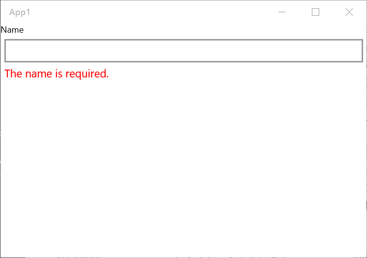
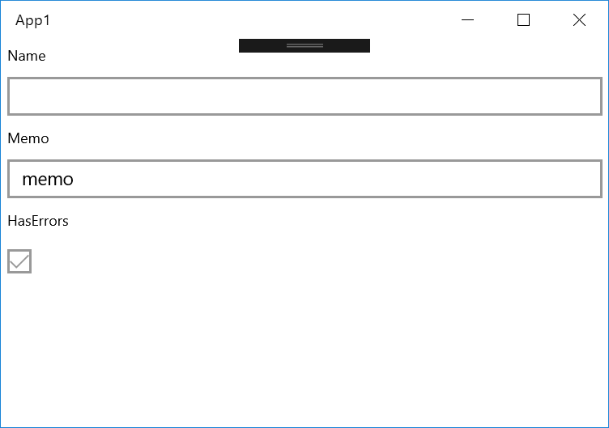
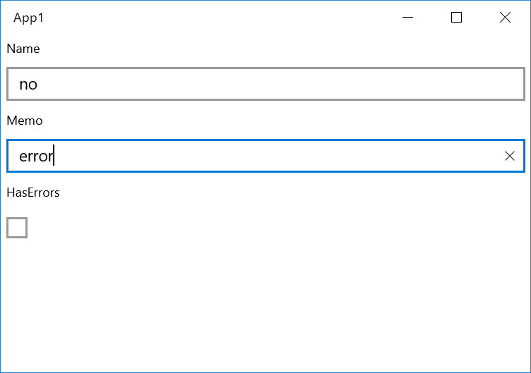

# ReactiveProperty

`ReactiveProperty` はこのライブラリの中核となるクラスです。
次の機能を備えています。

- `INotifyPropertyChanged` インターフェイスを実装しています。
    - Value プロパティは `PropertyChanged` イベントを発生させます。
- `IObservable<T>` インターフェイスを実装しています。

はい、Value プロパティは XAML コントロールのプロパティへバインディングできます。
また、このクラスは値が設定されたときに `IObserver<T>` の `OnNext` メソッドも呼び出します。

サンプル コードを次に示します。

```csharp
using Reactive.Bindings;
using System;

namespace ReactivePropertyEduApp
{
    class Program
    {
        static void Main(string[] args)
        {
            // 既定のコンストラクターから作成します（既定値は null）。
            var name = new ReactiveProperty<string>();
            // イベント ハンドラーと OnNext コールバックを設定します。
            name.PropertyChanged += (_, e) => Console.WriteLine($"PropertyChanged: {e.PropertyName}");
            name.Subscribe(x => Console.WriteLine($"OnNext: {x}"));

            // Value プロパティを更新します。
            name.Value = "neuecc";
            name.Value = "xin9le";
            name.Value = "okazuki";
        }
    }
}
```

このプログラムの出力は次のとおりです。

```
OnNext:
OnNext: neuecc
PropertyChanged: Value
OnNext: xin9le
PropertyChanged: Value
OnNext: okazuki
PropertyChanged: Value
```

`PropertyChanged` コールバックと `OnNext` コールバックの違いは何でしょうか。
`OnNext` コールバックは購読時に呼び出されます。`PropertyChanged` はイベント ハンドラーが追加されても呼び出されません。また、`OnNext` コールバックの引数はプロパティ値ですが、`PropertyChanged` の引数にはプロパティ値がありません。

`PropertyChanged` イベントはデータ バインディングのために提供されています。通常は Reactive Extensions のメソッドを使うべきです。

## XAML プラットフォームで使う

`ReactiveProperty` クラスは、WPF、UWP、Xamarin.Forms などの XAML プラットフォーム向けに設計されています。
このクラスは ViewModel レイヤーで使用できます。

`ReactiveProperty` を使わない場合、ViewModel クラスは次のようになります。

```csharp
public class MainPageViewModel : INotifyPropertyChanged
{
    public event PropertyChangedEventHandler PropertyChanged;

    private string _name;
    public string Name
    {
        get => _name;
        set
        {
            _name = value;
            PropertyChanged?.Invoke(this, new PropertyChangedEventArgs(nameof(Name)));
        }
    }

    // 他のプロパティも同様のコードで定義します。
}
```

これらのプロパティは XAML コードでバインディングします。

```xml
<!-- WPF の場合 -->
<TextBox Text="{Binding Name}" />

<!-- UWP の場合（実行時データ バインディング） -->
<TextBox Text="{Binding Name}" />

<!-- UWP の場合（コンパイル時データ バインディング） -->
<TextBox Text="{x:Bind ViewModel.Name, Mode=TwoWay}" />

<!-- Xamarin.Forms の場合 -->
<Entry Text="{Binding Name}" />
```

`ReactiveProperty` を使うと、ViewModel のコードはとてもシンプルになります。

```csharp
// WPF で使用する場合は、INotifyPropertyChanged インターフェイスを実装する必要があります。
// そうしないとメモリ リークが発生する可能性があります。
public class MainPageViewModel
{
    public ReactiveProperty<string> Name { get; } = new ReactiveProperty<string>();

    // 他のプロパティも同様のコードで定義します。
}
```

XAML コードでバインディングするときは、バインディング パスに `.Value` を追加する必要があります。
これがこのライブラリの唯一の制限です。

```xml
<!-- WPF の場合 -->
<TextBox Text="{Binding Name.Value}" />

<!-- UWP の場合（実行時データ バインディング） -->
<TextBox Text="{Binding Name.Value}" />

<!-- UWP の場合（コンパイル時データ バインディング） -->
<TextBox Text="{x:Bind ViewModel.Name.Value, Mode=TwoWay}" />

<!-- Xamarin.Forms の場合 -->
<Entry Text="{Binding Name.Value}" />
```

> `.Value` を忘れてしまうことがあります。ReSharper ライセンスをお持ちの場合は、このプラグインを利用できます。
> [ReactiveProperty XAML Binding Corrector](https://resharper-plugins.jetbrains.com/packages/ReSharper.RpCorrector/)
> XAML で ReactiveProperty の ".Value" バインディングが不足している箇所を強調表示します。

## `ReactiveProperty` インスタンスの作成方法

`ReactiveProperty` クラスはさまざまな方法で作成できます。

### コンストラクターから作成する

最も簡単な方法は、コンストラクターを使うことです。

```csharp
// 既定値で作成します。
var name = new ReactiveProperty<string>();
Console.WriteLine(name.Value); // -> 空の出力

// 初期値を指定して作成します。
var name = new ReactiveProperty<string>("okazuki");
Console.WriteLine(name.Value); // -> okazuki
```

### `IObservable<T>` から作成する

`IObservable<T>` から作成できます。
`ToReactiveProperty` メソッドを呼び出すだけです。

```csharp
IObservable<long> observableInstance = Observable.Interval(TimeSpan.FromSeconds(1));

// IObservable から ReactiveProperty に変換します。
ReactiveProperty<long> counter = observableInstance.ToReactiveProperty();
```

#### `ReactiveProperty` から作成する

`ReactiveProperty` は `IObservable` インターフェイスを実装しています。
つまり、`ReactiveProperty` から `ReactiveProperty` を作成できます。

```csharp
var name = new ReactiveProperty<string>("");

var formalName = name.Select(x => $"Dear {x}")
    .ToReactiveProperty();
```

すべての `IObservable` インスタンスは `ReactiveProperty` になれます。

## 検証

`ReactiveProperty` クラスは `INotifyDataErrorInfo` インターフェイスを実装しています。

### カスタム検証ロジックを設定する

`SetValidateNotifyError` メソッドを使ってカスタム検証ロジックを設定できます。

```csharp
var name = new ReactiveProperty<string>()
    .SetValidateNotifyError(x => string.IsNullOrWhiteSpace(x) ? "Error message" : null);
```

値が正しい場合、検証ロジックは null を返す必要があります。
値が不正な場合、検証ロジックはエラー メッセージを返す必要があります。

### DataAnnotations と連携する

このクラスは DataAnnotations と連携できます。
`SetValidateAttribute` メソッドを使って検証属性を設定できます。

```csharp
class ViewModel
{
    // 検証属性を設定します
    [Required(ErrorMessage = "The name is required.")]
    [StringLength(100, ErrorMessage = "The name length should be lower than 30.")]
    public ReactiveProperty<string> Name { get; }

    public ViewModel()
    {
        Name = new ReactiveProperty<string>()
            // 検証属性を ReactiveProperty に設定します。
            .SetValidateAttribute(() => Name);
    }
}
```

WPF は `INotifyDataErrorInfo` インターフェイスと統合されています。次の例を参照してください。



### 検証エラーの処理

他のプラットフォームでは、`INotifyDataErrorInfo` インターフェイスからのエラー メッセージを表示できません。
`ReactiveProperty` クラスには、検証エラーを処理するためのプロパティがいくつかあります。

最初のプロパティは `ObserveErrorChanged` です。
この型は `IObservable<IEnumerable>` です。`IEnumerable` をエラー メッセージに変換できます。次の例を参照してください。

```csharp
class ViewModel
{
    // 検証属性を設定します
    [Required(ErrorMessage = "The name is required.")]
    [StringLength(100, ErrorMessage = "The name length should be lower than 30.")]
    public ReactiveProperty<string> Name { get; }

    public ReadOnlyReactiveProperty<string> NameErrorMessage { get; }

    public ViewModel()
    {
        Name = new ReactiveProperty<string>()
            // 検証属性を ReactiveProperty に設定します。
            .SetValidateAttribute(() => Name);

        // エラー メッセージの処理
        NameErrorMessage = Name.ObserveErrorChanged
            .Select(x => x?.OfType<string>()?.FirstOrDefault())
            .ToReadOnlyReactiveProperty();
    }
}
```

`NameErrorMessage.Value` プロパティをテキスト コントロールにバインディングします。エラー メッセージを表示できます。

UWP の場合は、次の例を参照してください。

```csharp
public sealed partial class MainPage : Page
{
    private ViewModel ViewModel { get; } = new ViewModel();
    public MainPage()
    {
        this.InitializeComponent();
    }
}
```

```xml
<Page x:Class="App1.MainPage"
      xmlns="http://schemas.microsoft.com/winfx/2006/xaml/presentation"
      xmlns:x="http://schemas.microsoft.com/winfx/2006/xaml"
      xmlns:local="using:App1"
      xmlns:d="http://schemas.microsoft.com/expression/blend/2008"
      xmlns:mc="http://schemas.openxmlformats.org/markup-compatibility/2006"
      mc:Ignorable="d">
    <StackPanel Background="{ThemeResource ApplicationPageBackgroundThemeBrush}">
        <TextBlock Text="Name"
                   Style="{ThemeResource CaptionTextBlockStyle}" />
        <TextBox Text="{x:Bind ViewModel.Name.Value, Mode=TwoWay, UpdateSourceTrigger=PropertyChanged}"
                 Margin="5" />
        <TextBlock Text="{x:Bind ViewModel.NameErrorMessage.Value, Mode=OneWay}"
                   Foreground="Red"
                   Margin="5,0"
                   Style="{ThemeResource BodyTextBlockStyle}" />
    </StackPanel>
</Page>
```



ReactiveProperty v7.0.0 以降では、`ObserveErrorChanged.Select(x => x?.OfType<string>()?.FirstOrDefault())` の代わりに `ObserveValidationErrorMessage` 拡張メソッドを使います。上のコードは次のようになります。

```csharp
class ViewModel
{
    // 検証属性を設定します
    [Required(ErrorMessage = "The name is required.")]
    [StringLength(100, ErrorMessage = "The name length should be lower than 30.")]
    public ReactiveProperty<string> Name { get; }

    public ReadOnlyReactiveProperty<string> NameErrorMessage { get; }

    public ViewModel()
    {
        Name = new ReactiveProperty<string>()
            // 検証属性を ReactiveProperty に設定します。
            .SetValidateAttribute(() => Name);

        // エラー メッセージの処理
        NameErrorMessage = Name.ObserveValidationErrorMessage()
            .ToReadOnlyReactiveProperty();
    }
}
```

次のプロパティは `ObserveHasErrors` です。`ObserveHasErrors` プロパティの型は `IObservable<bool>` です。
一般的な入力フォームでは、`ObserveHasErrors` プロパティの値を組み合わせると非常に便利です。

このサンプル プログラムは、2 つの `ReactiveProperty` の `ObserveHasErrors` プロパティを組み合わせて、`ReactiveProperty<bool>` 型の `HasErrors` プロパティを作成します。

```csharp
public class ViewModel
{
    // 検証属性を設定します
    [Required(ErrorMessage = "The name is required.")]
    [StringLength(100, ErrorMessage = "The name length should be lower than 30.")]
    public ReactiveProperty<string> Name { get; }

    [Required(ErrorMessage = "The memo is required.")]
    public ReactiveProperty<string> Memo { get; }

    public ReadOnlyReactiveProperty<bool> HasErrors { get; }

    public ViewModel()
    {
        Name = new ReactiveProperty<string>()
            .SetValidateAttribute(() => Name);

        Memo = new ReactiveProperty<string>()
            .SetValidateAttribute(() => Memo);

        // 複数の ObserveHasErrors 値を組み合わせられます。
        HasErrors = new[]
            {
                Name.ObserveHasErrors,
                Memo.ObserveHasErrors,
            }.CombineLatest(x => x.Any(y => y))
            .ToReadOnlyReactiveProperty();
    }
}
```

```xml
<Page x:Class="App1.MainPage"
      xmlns="http://schemas.microsoft.com/winfx/2006/xaml/presentation"
      xmlns:x="http://schemas.microsoft.com/winfx/2006/xaml"
      xmlns:local="using:App1"
      xmlns:d="http://schemas.microsoft.com/expression/blend/2008"
      xmlns:mc="http://schemas.openxmlformats.org/markup-compatibility/2006"
      mc:Ignorable="d">
    <StackPanel Background="{ThemeResource ApplicationPageBackgroundThemeBrush}">
        <TextBlock Text="Name"
                   Style="{ThemeResource CaptionTextBlockStyle}"
                   Margin="5" />
        <TextBox Text="{x:Bind ViewModel.Name.Value, Mode=TwoWay, UpdateSourceTrigger=PropertyChanged}"
                 Margin="5" />
        <TextBlock Text="Memo"
                   Style="{ThemeResource CaptionTextBlockStyle}"
                   Margin="5" />
        <TextBox Text="{x:Bind ViewModel.Memo.Value, Mode=TwoWay, UpdateSourceTrigger=PropertyChanged}"
                 Margin="5" />
        <TextBlock Text="HasErrors"
                   Style="{ThemeResource CaptionTextBlockStyle}"
                   Margin="5" />
        <CheckBox IsChecked="{x:Bind ViewModel.HasErrors.Value, Mode=OneWay}"
                  IsEnabled="False"
                  Margin="5" />
    </StackPanel>
</Page>
```





最後のプロパティは `HasErrors` です。これは単なる `bool` プロパティです。

```csharp
public class ViewModel
{
    // 検証属性を設定します
    [Required(ErrorMessage = "The name is required.")]
    [StringLength(100, ErrorMessage = "The name length should be lower than 30.")]
    public ReactiveProperty<string> Name { get; }

    public ViewModel()
    {
        Name = new ReactiveProperty<string>()
            .SetValidateAttribute(() => Name);
    }

    public void DoSomething()
    {
        if (Name.HasErrors)
        {
            // 値が不正な場合
        }
        else
        {
            // 値が正しい場合
        }
    }
}
```

### 初期検証エラーが不要な場合

既定の動作では、`ReactiveProperty` は検証ロジックが設定されたときにエラーを通知します。
初期検証エラーが不要な場合は、そのエラーをスキップできます。
`Skip` メソッドを呼び出すだけです。

```csharp
class ViewModel
{
    // 検証属性を設定します
    [Required(ErrorMessage = "The name is required.")]
    [StringLength(100, ErrorMessage = "The name length should be lower than 30.")]
    public ReactiveProperty<string> Name { get; }

    public ReadOnlyReactiveProperty<string> NameErrorMessage { get; }

    public ViewModel()
    {
        Name = new ReactiveProperty<string>()
            .SetValidateAttribute(() => Name);

        // エラー メッセージの処理
        NameErrorMessage = Name.ObserveErrorChanged
            .Skip(1) // 最初のエラーをスキップします。
            .Select(x => x?.OfType<string>()?.FirstOrDefault())
            .ToReadOnlyReactiveProperty();
    }
}
```

または、コンストラクターで `IgnoreInitialValidationError` フラグを設定します。

```csharp
class ViewModel
{
    // 検証属性を設定します
    [Required(ErrorMessage = "The name is required.")]
    [StringLength(100, ErrorMessage = "The name length should be lower than 30.")]
    public ReactiveProperty<string> Name { get; }

    public ReadOnlyReactiveProperty<string> NameErrorMessage { get; }

    public ViewModel()
    {
        // IgnoreInitialValidationError フラグを追加します
        Name = new ReactiveProperty<string>(mode: ReactivePropertyMode.Default | ReactivePropertyMode.IgnoreInitialValidationError)
            .SetValidateAttribute(() => Name);

        // エラー メッセージの処理
        NameErrorMessage = Name.ObserveErrorChanged
            .Select(x => x?.OfType<string>()?.FirstOrDefault())
            .ToReadOnlyReactiveProperty();
    }
}
```

`Skip` と `IgnoreInitialValidationError` の違いは何でしょうか。
`IgnoreInitialValidationError` の場合、`ReactiveProperty` クラスは初期値のエラーを通知しません。
`Skip` の場合は、エラー イベントを無視するだけです。

この違いは、WPF など `INotifyDataErrorInfo` をサポートするプラットフォームで重要です。
`Skip` のアプローチでは、赤い枠として UI に反映されます。
`IgnoreInitialValidationError` のアプローチでは、UI に反映されません。

## `ReactiveProperty` のモード

`ReactiveProperty` クラスは、`Subscribe` メソッドが呼び出されたときに `OnNext` コールバックを呼び出します。

```csharp
var x = new ReactiveProperty<string>("initial value");
x.Subscribe(x => Console.WriteLine(x)); // -> initial value
```

この動作は、`ReactiveProperty` インスタンスの作成時に変更できます。
コンストラクターと `ToReactiveProperty` メソッドには `ReactivePropertyMode` 引数があります。
次の値を設定できます。

- `ReactivePropertyMode.None`
    - ReactiveProperty は、`Subscribe` メソッドが呼び出されても `OnNext` コールバックを呼び出しません。同じ値が設定された場合は `OnNext` コールバックを呼び出します。
- `ReactivePropertyMode.DistinctUntilChanged`
    - 同じ値が設定された場合、`OnNext` コールバックを呼び出しません。
- `ReactivePropertyMode.RaiseLatestValueOnSubscribe`
    - `Subscribe` メソッドが呼び出されたときに `OnNext` コールバックを呼び出します。
- `ReactivePropertyMode.Default`
    - 既定値です。`ReactivePropertyMode.DistinctUntilChanged | ReactivePropertyMode.RaiseLatestValueOnSubscribe` と同じです。
- `ReactivePropertyMode.IgnoreInitialValidationError`
    - 初期検証エラーを無視します。

この動作が不要な場合は、`ReactivePropertyMode.None` 値を設定できます。

```csharp
var rp = new ReactiveProperty<string>("initial value", mode: ReactivePropertyMode.None);
rp.Subscribe(x => Console.WriteLine(x)); // -> 値を出力しません
rp.Value = "initial value"; // -> initial value
```

## `ForceNotify`

値を強制的に通知したい場合は、`ForceNotify` メソッドを使えます。
このメソッドは値を subscriber に通知し、`PropertyChanged` イベントを発生させます。

```csharp
var rp = new ReactiveProperty<string>("value");
rp.Subscribe(x => Console.WriteLine(x));
rp.PropertyChanged += (_, e) => Console.WriteLine($"{e.PropertyName} changed");

rp.ForceNotify();
```

出力は次のとおりです。

```
value                  # 最初の subscribe
value                  # ForceNotify メソッドによる
Value changed          # ForceNotify メソッドによる
```

## 比較ロジックを変更する

コンストラクターとファクトリ メソッドの equalityComparer 引数を使って、比較ロジックを変更できます。

たとえば、大文字と小文字を区別しない comparer は次のとおりです。

```csharp
class IgnoreCaseComparer : EqualityComparer<string>
{
    public override bool Equals(string x, string y)
        => x?.ToLower() == y?.ToLower();

    public override int GetHashCode(string obj)
        => (obj?.ToLower()).GetHashCode();
}

// コンストラクター
var rp = new ReactiveProperty<string>(equalityComparer: new IgnoreCaseComparer());
rp.Value = "Hello world"; // null から "Hello world" に変更
rp.Value = "HELLO WORLD"; // 変更しません
rp.Value = "Hello japan"; // "Hello world" から "Hello japan" に変更

// ファクトリ メソッド
var source = new Subject<string>();
var rp = source.ToReactiveProperty(equalityComparer: new IgnoreCaseComparer());
source.OnNext("Hello world"); // null から "Hello world" に変更
source.OnNext("HELLO WORLD"); // 変更しません
source.OnNext("Hello japan"); // "Hello world" から "Hello japan" に変更
```


## `ReadOnlyReactiveProperty` クラス

`Value` プロパティを一切設定しない場合は、`ReadOnlyReactiveProperty` クラスを使えます。
このクラスではプロパティを設定できず、それ以外の動作は ReactiveProperty クラスと同じです。
`ReadOnlyReactiveProperty` クラスは `ToReadOnlyReactiveProperty` 拡張メソッドから作成されます。

次の例を参照してください。

```csharp
public class ViewModel
{
    public ReactiveProperty<string> Input { get; }

    // Output は値を設定しません。
    public ReadOnlyReactiveProperty<string> Output { get; }

    public ViewModel()
    {
        Input = new ReactiveProperty<string>("");
        Output = Input
            .Delay(TimeSpan.FromSeconds(1))
            .Select(x => x.ToUpper())
            .ToReadOnlyReactiveProperty(); // ReadOnlyReactiveProperty に変換します
    }
}
```

## `Unsubscribe`

`ReactiveProperty` クラスは `IDisposable` インターフェイスを実装しています。
`Dispose` メソッドが呼び出されると、`ReactiveProperty` クラスはすべての購読を解放します。
別のインスタンスのイベントを購読する場合は、ViewModel のライフサイクルの最後に `Dispose` メソッドを呼び出してください。

```csharp
public class ViewModel : IDisposable
{
    public ReadOnlyReactiveProperty<string> Time { get; }

    public ViewModel()
    {
        Time = Observable.Interval(TimeSpan.FromSeconds(1))
            .Select(_ => DateTime.Now.ToString("yyyy/MM/dd HH:mm:ss"))
            .ToReadOnlyReactiveProperty();
    }

    public void Dispose()
    {
        // 購読解除
        Time.Dispose();
    }
}
```
