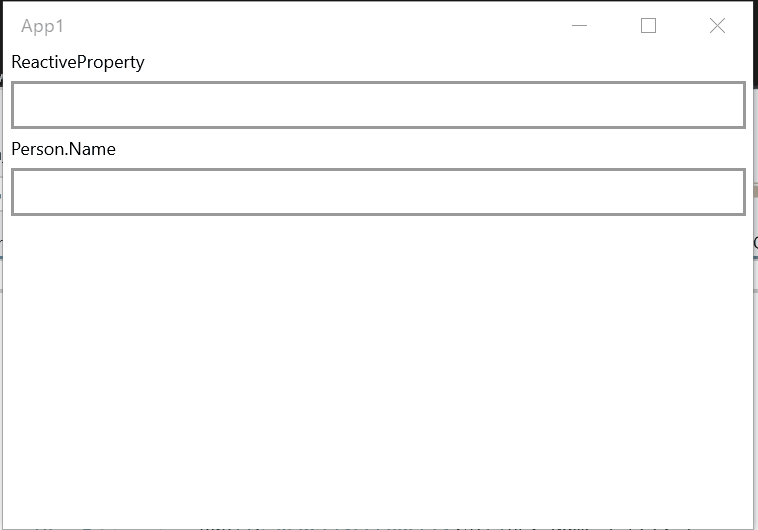

# POCO と連携する

このライブラリのクラスは POCO クラスと連携できます。

## `INotifyPropertyChanged` を実装するクラスと接続する

ReactiveProperty は、POCO クラスのインスタンスと同期するための多くの機能を提供します。

### 一方向同期

`INotifyPropertyChanged` インターフェイスの `ObserveProperty` 拡張メソッドは、`INotifyPropertyChanged` を `IObservable<T>` に変換します。
`IObservable` は `ReactiveProperty` に変換できます。つまり、`INotifyPropertyChanged` から `ReactiveProperty` への一方向同期を実現できます。

例を示します。

```csharp
public class BindableBase : INotifyPropertyChanged
{
    public event PropertyChangedEventHandler PropertyChanged;

    protected void RaisePropertyChanged([CallerMemberName]string propertyName = null) =>
        PropertyChanged?.Invoke(this, new PropertyChangedEventArgs(propertyName));

    protected void SetProperty<T>(ref T field, T value, [CallerMemberName]string propertyName = null)
    {
        if (Comparer<T>.Default.Compare(field, value) == 0)
        {
            return;
        }

        field = value;
        RaisePropertyChanged(propertyName);
    }
}

public class Person : BindableBase
{
    private string _name;
    public string Name
    {
        get { return _name; }
        set { SetProperty(ref _name, value); }
    }

    private int _age;
    public int Age
    {
        get { return _age; }
        set { SetProperty(ref _age, value); }
    }
}
```

一方向同期は次のように記述します。

```csharp
// using Reactive.Bindings.Extensions;
public class ViewModel
{
    private Person Person { get; } = new Person();

    public ReadOnlyReactiveProperty<string> Name { get; }

    public ReactiveCommand UpdatePersonCommand { get; }

    public ViewModel()
    {
        Name = Person
            // Name の PropertyChanged イベントを IObservable<string> に変換します
            .ObserveProperty(x => x.Name)
            // ReadOnlyReactiveProperty<string> に変換します
            .ToReadOnlyReactiveProperty();

        UpdatePersonCommand = new ReactiveCommand()
            .WithSubscribe(() =>
            {
                // name プロパティを更新します。
                Person.Name = "Tanaka";
            });
    }
}
```

### 双方向同期

`ToReactivePropertyAsSynchronized` 拡張メソッドは双方向同期を提供します。

```csharp
// using Reactive.Bindings.Extensions;
public class ViewModel
{
    public Person Person { get; } = new Person();

    public ReactiveProperty<string> Name { get; }

    public ViewModel()
    {
        Name = Person.ToReactivePropertyAsSynchronized(x => x.Name);
    }
}
```

UWP の例を次に示します。

MainPage.xaml.cs

```csharp
public sealed partial class MainPage : Page
{
    private ViewModel ViewModel { get; } = new ViewModel();
    public MainPage()
    {
        this.InitializeComponent();
    }
}
```

MainPage.xaml

```xml
<Page x:Class="App1.MainPage"
      xmlns="http://schemas.microsoft.com/winfx/2006/xaml/presentation"
      xmlns:x="http://schemas.microsoft.com/winfx/2006/xaml"
      xmlns:local="using:App1"
      xmlns:d="http://schemas.microsoft.com/expression/blend/2008"
      xmlns:mc="http://schemas.openxmlformats.org/markup-compatibility/2006"
      mc:Ignorable="d">
    <StackPanel Background="{ThemeResource ApplicationPageBackgroundThemeBrush}">
        <TextBlock Text="ReactiveProperty"
                   Style="{ThemeResource CaptionTextBlockStyle}"
                   Margin="5,0" />
        <TextBox Text="{x:Bind ViewModel.Name.Value, Mode=TwoWay, UpdateSourceTrigger=PropertyChanged}"
                 Margin="5" />
        <TextBlock Text="Person.Name"
                   Style="{ThemeResource CaptionTextBlockStyle}"
                   Margin="5,0" />
        <TextBox Text="{x:Bind ViewModel.Person.Name, Mode=TwoWay, UpdateSourceTrigger=PropertyChanged}"
                 Margin="5" />
    </StackPanel>
</Page>
```


`ToReactivePropertyAsSynchronized` 拡張メソッドには、変換ロジックと逆変換ロジックを追加できます。

```csharp
public class ViewModel
{
    public Person Person { get; } = new Person();

    public ReactiveProperty<string> Name { get; }

    public ViewModel()
    {
        Name = Person.ToReactivePropertyAsSynchronized(x => x.Name,
            convert: x => string.IsNullOrWhiteSpace(x) ? "" : $"{x}-san",
            convertBack: x => Regex.Replace(x, "-san$", ""));
    }
}
```



`ignoreValidationErrorValue` 引数を true に設定すると、検証エラーが発生した場合に同期を停止します。

```csharp
public class ViewModel
{
    public Person Person { get; } = new Person();

    [StringLength(10)]
    public ReactiveProperty<string> Name { get; }

    public ViewModel()
    {
        Name = Person.ToReactivePropertyAsSynchronized(x => x.Name,
            convert: x => string.IsNullOrWhiteSpace(x) ? "" : $"{x}-san",
            convertBack: x => Regex.Replace(x, "-san$", ""),
            ignoreValidationErrorValue: true)  // この動作を有効にします
            .SetValidateAttribute(() => Name); // 検証ロジックを設定します
    }
}
```


次のように LINQ を使って値を変換することもできます。

```csharp
public class ViewModel
{
    public Person Person { get; } = new Person();

    public ReactiveProperty<string> Name { get; }

    public ViewModel()
    {
        Name = Person.ToReactivePropertyAsSynchronized(x => x.Name,
            // ox は IObservable<string> です。string は Name プロパティの型です。
            convert: ox => Observable.Merge(
                ox.Where(x => string.IsNullOrEmpty(x)).Select(_ => ""),
                ox.Where(x => !string.IsNullOrEmpty(x)).Select(x => $"{x}-san")
            ),
            // ox は IObservable<string> です。string は変換ロジックの結果型です。
            convertBack: ox => ox
                .Where(x => x.Length <= 10) // このようにすべての LINQ メソッドを使用できます。
                .Select(x => x.Replace("-san", "")));
    }
}
```

`ReactivePropertySlim` を使いたい場合は、`ToReactivePropertySlimAsSynchronized` 拡張メソッドを使えます。
これは `ToReactivePropertyAsSynchronized` に似ています。`ignoreValidationErrorValue` 引数と `scheduler` 引数は利用できませんが、それ以外は同じです。

### ソースへの一方向同期

`FromObject` メソッドは、POCO から `ReactiveProperty` インスタンスを作成します。
このメソッドは、`ReactiveProperty` インスタンスが作成されたときに POCO から `Value` プロパティを設定します。`Value` プロパティが更新されると、ソース値を更新します。

```csharp
using Reactive.Bindings;
using System;

namespace ReactivePropertyEduApp
{
    class Sample
    {
        public string Property1 { get; set; }
    }
    class Program
    {
        static void Main(string[] args)
        {
            var sample = new Sample { Property1 = "xxx" };

            var rp = ReactiveProperty.FromObject(sample, x => x.Property1);
            Console.WriteLine(rp.Value); // -> xxx
            sample.Property1 = "updated";
            Console.WriteLine(rp.Value); // -> xxx
        }
    }
}
```

### ネストされたプロパティ パス

`ObserveProperty`、`ToReactivePropertyAsSynchronized`、`ToReactivePropertySlimAsSynchronized`、`FromObject` は、`x => x.Child.Name` のようなネストされたプロパティ パスをサポートしています。
パス内のいずれかのプロパティの値が null の場合、ソース プロパティから ReactiveProperty へ同期するときは ReactiveProperty が Value プロパティに `default(T)` を設定し、ReactiveProperty からソース プロパティへ同期するときはソース プロパティへの同期を停止します。

値が null 以外の値に更新された後、ReactiveProperty は同期を再開します。
