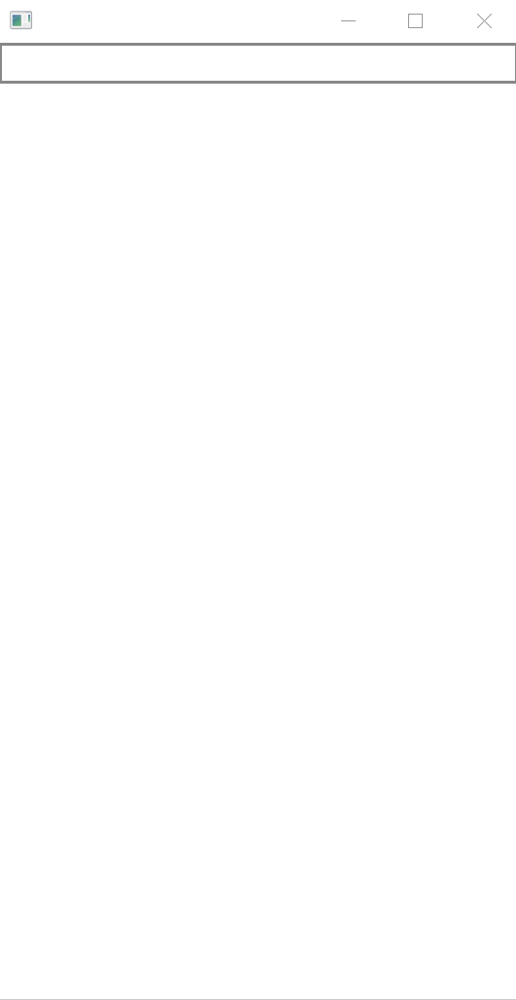

# Avalonia UI をはじめる

Avalonia はクロスプラットフォームの .NET UI フレームワークです!

次を参照してください:

[Avalonia UI フレームワーク](http://avaloniaui.net/)

## プロジェクトの作成
- Avalonia .NET Core Application プロジェクトを作成します。（もちろん、Avalonia アプリケーション プロジェクトでも .NET Core プロジェクトと同じ ReactiveProperty を使用できます。）
- NuGet から ReactiveProperty をインストールします。

## コードの編集
- MainWindowViewModel.cs ファイルを作成します。
- 次のようにファイルを編集します。

MainWindowViewModel.cs
```csharp
using Reactive.Bindings;
using System;
using System.Reactive.Linq;

namespace AvaloniaApp
{
    public class MainWindowViewModel
    {
        public ReactiveProperty<string> Input { get; }
        public ReadOnlyReactiveProperty<string> Output { get; }
        public MainWindowViewModel()
        {
            Input = new ReactiveProperty<string>("");
            Output = Input
                .Delay(TimeSpan.FromSeconds(1))
                .Select(x => x.ToUpper())
                .ToReadOnlyReactiveProperty();
        }
    }
}
```

MainWindow.xaml
```xml
<Window xmlns="https://github.com/avaloniaui"
        MinWidth="200"
        MinHeight="300"
        xmlns:local="clr-namespace:AvaloniaApp;assembly=AvaloniaApp">
  <Window.DataContext>
    <local:MainWindowViewModel />
  </Window.DataContext>
  <StackPanel>
    <TextBox Text="{Binding Input.Value, Mode=TwoWay}" />
    <TextBlock Text="{Binding Output.Value}" />
  </StackPanel>
</Window>
```

## アプリケーションの起動

アプリを起動すると、下のウィンドウが表示されます。
入力してから 1 秒後に、出力値が大文字で表示されます。


