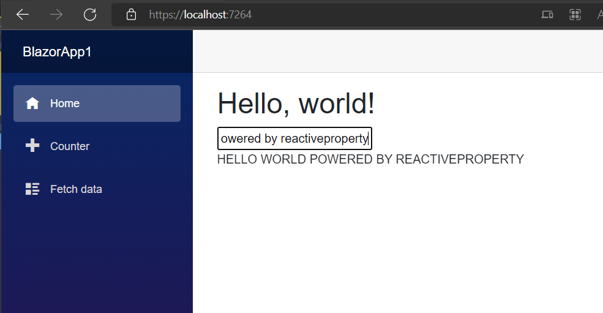

# Blazor をはじめる

Blazor は C# を使用したシングルページ アプリケーション用の開発フレームワークです。

次を参照してください:

[ASP.NET Core Blazor](https://docs.microsoft.com/en-us/aspnet/core/blazor/)

ReactiveProperty は Blazor Server と Blazor WebAssembly の両方で動作しますが、Blazor WebAssembly は Reactive Extensions のすべての操作をサポートしているわけではありません。たとえば、`Delay` 拡張メソッドは Blazor WASM では動作しません。
Blazor WASM で ReactiveProperty を使用する場合は、サポートされていない機能を使用しないように注意してください。

## プロジェクトの作成

- Blazor Server または WebAssembly プロジェクトを作成します。
- NuGet から ReactiveProperty.Blazor パッケージをインストールします。

## コードの編集

- `IndexViewModel` という名前のクラスを作成します。
- 次のようにクラスを編集します:

```csharp
using Reactive.Bindings;
using Reactive.Bindings.Extensions;
using System.Reactive.Disposables;
using System.Reactive.Linq;

namespace BlazorApp1;

public class IndexViewModel : IDisposable
{
    private CompositeDisposable _disposable = new();

    public ReactivePropertySlim<string> Input { get; }
    public ReadOnlyReactivePropertySlim<string> Output { get; }

    public IndexViewModel()
    {
        Input = new ReactivePropertySlim<string>("")
            .AddTo(_disposable);
        Output = Input
            .Delay(TimeSpan.FromSeconds(2)) // 重要! Blazor WASM では Delay メソッドは動作しません。WASM で作業している場合は、この行を削除してください。
            .Select(x => x.ToUpperInvariant())
            .ToReadOnlyReactivePropertySlim("")
            .AddTo(_disposable);
    }

    public void Dispose() => _disposable.Dispose();
}
```

- Index.razor を次のように編集します:

```csharp
@page "/"
@using System.Reactive.Disposables
@using Reactive.Bindings.Extensions
@implements IDisposable

<PageTitle>Index</PageTitle>

<h1>Hello, world!</h1>

<input type="text" @bind="_viewModel.Input.Value" />
<br/>
@_viewModel.Output.Value
<br/>

@code {
    private readonly CompositeDisposable _disposable = new();
    private IndexViewModel _viewModel = default!;

    protected override void OnInitialized()
    {
        _viewModel = new IndexViewModel()
            .AddTo(_disposable);

        // Output プロパティの変更を監視し、UI スレッドで StateHasChanged を呼び出します。
        _viewModel.Output
            .Subscribe(x => InvokeAsync(StateHasChanged))
            .AddTo(_disposable);
    }

    public void Dispose() => _disposable.Dispose();
}
```

- アプリを起動します。

次の結果を確認できます:



## Blazor に関するその他のトピック

### 依存関係の挿入

ViewModel をページに注入したい場合は、Program.cs で DI コンテナーに次のように登録します:

```csharp
builder.Services.AddTransient<IndexViewModel>();
```

その後、`@inject IndexViewModel _viewModel` を使用して ViewModel をページに注入します。


### 検証機能との統合

Blazor の EditForm コンポーネントで ReactiveProperty の検証機能を使用したい場合は、`Reactive.Bindings.Components.ReactivePropertiesValidator` コンポーネントを使用できます。

`ReactivePropertiesValidator` は、以下に示すように `DataAnnotationsValidator` コンポーネントと同じ方法で使用できます:

```csharp
<EditForm Model="_validationViewModel" OnInvalidSubmit="InvalidSubmit" OnValidSubmit="ValidSubmit">
    <ReactivePropertiesValidator /> @* Reactive.Bindings.Components の @using が必要です *@

    <ValidationSummary />

    <div class="mb-3">
        <label for="firstName">First name</label>
        <InputText @bind-Value="_validationViewModel.FirstName.Value" class="form-control" />
        <ValidationMessage For="() => _validationViewModel.FirstName.Value" />
    </div>
```

詳細は Samples/Blazor フォルダーの Blazor サンプル アプリを参照してください。これを使用しているページは、BlazorSample.Shared プロジェクトの Pages/Index.razor です。
