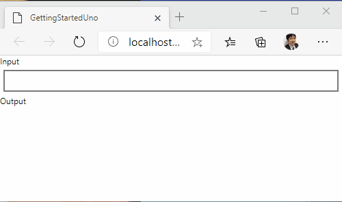
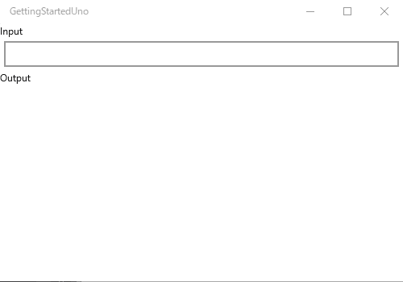
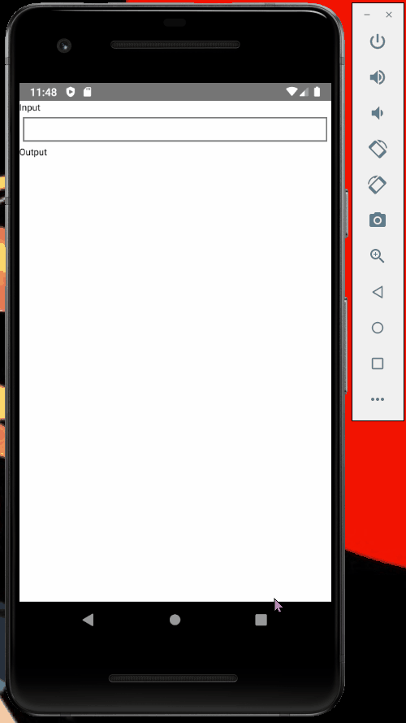

# Uno Platform をはじめる

Uno Platform はクロスプラットフォーム アプリ用の開発プラットフォームです。
Uno は UWP アプリ プロジェクトを Android、iOS、WebAssembly、Linux、macOS アプリとしてビルドします。

このはじめにガイドを開始する前に、Visual Studio 用の Uno Platform 拡張機能をインストールしてください。

## プロジェクトの作成
- Cross-Platform App (Uno Platform) プロジェクトを作成します。
- NuGet からすべてのプロジェクトに ReactiveProperty パッケージをインストールします。
- YourProjectName.Wasm プロジェクトに Reactive.Wasm パッケージをインストールします。

## コードの編集
- Reactive Extensions をサポートするために、Wasm プロジェクトの Program.cs を編集します。

```csharp
using System;
using Windows.UI.Xaml;
using System.Reactive.PlatformServices; // 追加

namespace GettingStartedUno.Wasm
{
    public class Program
    {
        private static App _app;

        static int Main(string[] args)
        {
#pragma warning disable CS0618 // 型またはメンバーは廃止されています
            PlatformEnlightenmentProvider.Current.EnableWasm(); // 追加
#pragma warning restore CS0618 // 型またはメンバーは廃止されています
            Windows.UI.Xaml.Application.Start(_ => _app = new App());

            return 0;
        }
    }
}
```

- Shared プロジェクトに MainPageViewModel.cs ファイルを作成します。
- 次のようにファイルを編集します。

MainPageViewModel.cs
```csharp
using Reactive.Bindings;
using System;
using System.Linq;
using System.Reactive.Linq;

namespace GettingStartedUno
{
    public class MainPageViewModel
    {
        public ReactiveProperty<string> Input { get; }
        public ReadOnlyReactiveProperty<string> Output { get; }

        public MainPageViewModel()
        {
            Input = new ReactiveProperty<string>("");
            Output = Input
                .Delay(TimeSpan.FromSeconds(1))
                .Select(x => x.ToUpper())
                .ToReadOnlyReactiveProperty();
        }
    }
}
```

MainPage.xaml.cs
```csharp
using Windows.UI.Xaml.Controls;

// Blank Page 項目テンプレートについては、https://go.microsoft.com/fwlink/?LinkId=402352&clcid=0x409 を参照してください。

namespace GettingStartedUno
{
    /// <summary>
    /// 単体で使用することも、Frame 内で移動先として使用することもできる空のページです。
    /// </summary>
    public sealed partial class MainPage : Page
    {
        private MainPageViewModel ViewModel { get; } = new MainPageViewModel();
        public MainPage()
        {
            this.InitializeComponent();
        }
    }
}
```

MainPage.xaml
```xml
<Page x:Class="GettingStartedUno.MainPage"
    xmlns="http://schemas.microsoft.com/winfx/2006/xaml/presentation"
    xmlns:x="http://schemas.microsoft.com/winfx/2006/xaml"
    xmlns:local="using:GettingStartedUno"
    xmlns:d="http://schemas.microsoft.com/expression/blend/2008"
    xmlns:mc="http://schemas.openxmlformats.org/markup-compatibility/2006"
    mc:Ignorable="d">

    <StackPanel Background="{ThemeResource ApplicationPageBackgroundThemeBrush}">
        <TextBlock Text="Input"
                Style="{StaticResource CaptionTextBlockStyle}" />
        <TextBox Text="{x:Bind ViewModel.Input.Value, Mode=TwoWay, UpdateSourceTrigger=PropertyChanged}"
                Margin="5" />
        <TextBlock Text="Output"
                Style="{StaticResource CaptionTextBlockStyle}" />
        <TextBlock Text="{x:Bind ViewModel.Output.Value, Mode=OneWay}"
                Style="{StaticResource BodyTextBlockStyle}"
                Margin="5" />
    </StackPanel>
</Page>
```

## アプリケーションの起動

アプリを起動すると、各プラットフォームで以下のアプリを確認できます。
入力してから 1 秒後に、出力値が大文字で表示されます。

### WebAssembly



### UWP



### Android



### iOS

未定
