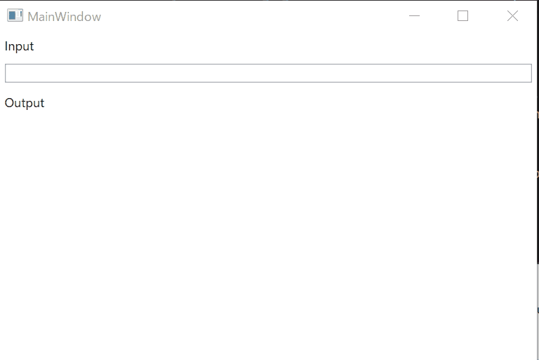

# WPF をはじめる

## プロジェクトの作成
- WPF App (.NET Framework) プロジェクトを作成します。
    - .NET Framework 4.7.2 以降、または .NET Core 3.0 以降を使用する必要があります。
- NuGet から ReactiveProperty.WPF パッケージをインストールします。

## コードの編集

- App クラスに Startup イベント ハンドラーを追加します。
- ReactiveProperty クラス用のスケジューラーを初期化するコードを追加します。

```csharp
using System;
using System.Collections.Generic;
using System.Configuration;
using System.Data;
using System.Linq;
using System.Threading.Tasks;
using System.Windows;
using Reactive.Bindings;
using Reactive.Bindings.Schedulers;

namespace WpfApp1
{
    public partial class App : Application
    {
        private void Application_Startup(object sender, StartupEventArgs e)
        {
            ReactivePropertyScheduler.SetDefault(new ReactivePropertyWpfScheduler(Dispatcher));
        }
    }
}
```

- MainWindowViewModel.cs ファイルを作成します。
- 次のようにファイルを編集します。

MainWindowViewModel.cs
```csharp
using Reactive.Bindings;
using System;
using System.ComponentModel;
using System.Linq;
using System.Reactive.Linq;

namespace WpfApp1
{
    class MainWindowViewModel : INotifyPropertyChanged
    {
        public event PropertyChangedEventHandler PropertyChanged;

        public ReactiveProperty<string> Input { get; }
        public ReadOnlyReactiveProperty<string> Output { get; }

        public MainWindowViewModel()
        {
            Input = new ReactiveProperty<string>("");
            Output = Input
                .Delay(TimeSpan.FromSeconds(1))
                .Select(x => x.ToUpper())
                .ToReadOnlyReactiveProperty();
        }
    }
}
```

MainWindow.xaml
```xml
<Window x:Class="WpfApp1.MainWindow"
        xmlns="http://schemas.microsoft.com/winfx/2006/xaml/presentation"
        xmlns:x="http://schemas.microsoft.com/winfx/2006/xaml"
        xmlns:d="http://schemas.microsoft.com/expression/blend/2008"
        xmlns:mc="http://schemas.openxmlformats.org/markup-compatibility/2006"
        xmlns:local="clr-namespace:WpfApp1"
        mc:Ignorable="d"
        Title="MainWindow"
        Height="350"
        Width="525">
    <Window.DataContext>
        <local:MainWindowViewModel />
    </Window.DataContext>
    <StackPanel>
        <Label Content="Input" />
        <TextBox Text="{Binding Input.Value, UpdateSourceTrigger=PropertyChanged}"
                 Margin="5" />
        <Label Content="Output" />
        <TextBlock Text="{Binding Output.Value}"
                   Margin="5" />
    </StackPanel>
</Window>
```

## アプリケーションの起動

アプリを起動すると、下のウィンドウが表示されます。
入力してから 1 秒後に、出力値が大文字で表示されます。


