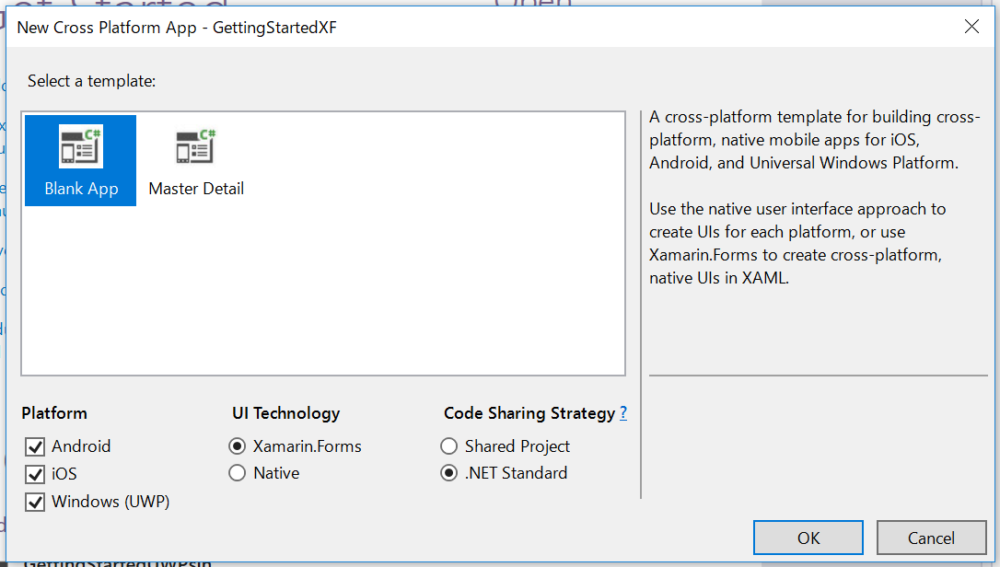
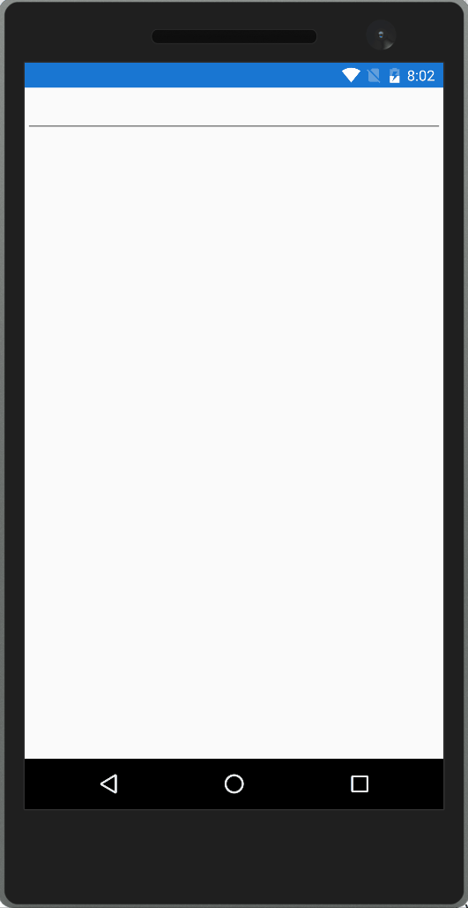

# Xamarin.Forms をはじめる

## プロジェクトの作成

- Cross-Platform app (Xamarin.Forms) プロジェクトを作成します。
- `New Cross Platform App` ダイアログを次のように設定します。
  .NET Standard プロジェクトを選択します。もちろん、共有プロジェクトを選択することもできます。
  
- NuGet からすべてのプロジェクトに ReactiveProperty をインストールします。

## コードの編集

- .NET Standard プロジェクトに MainPageViewModel.cs を作成します。
- 次のようにファイルを編集します。

MainPageViewModel.cs
```csharp
using Reactive.Bindings;
using System;
using System.Reactive.Linq;

namespace GettingStartedXF
{
    public class MainPageViewModel
    {
        public ReactiveProperty<string> Input { get; }
        public ReadOnlyReactiveProperty<string> Output { get; }

        public MainPageViewModel()
        {
            Input = new ReactiveProperty<string>("");
            Output = Input
                .Delay(TimeSpan.FromSeconds(1))
                .Select(x => x.ToUpper())
                .ToReadOnlyReactiveProperty();
        }
    }
}
```

MainPage.xaml
```xml
<?xml version="1.0" encoding="utf-8" ?>
<ContentPage xmlns="http://xamarin.com/schemas/2014/forms"
             xmlns:x="http://schemas.microsoft.com/winfx/2009/xaml"
             xmlns:local="clr-namespace:GettingStartedXF"
             x:Class="GettingStartedXF.MainPage">
    <ContentPage.BindingContext>
        <local:MainPageViewModel />
    </ContentPage.BindingContext>
    <StackLayout>
        <Entry Text="{Binding Input.Value, UpdateSourceEventName=TextChanged}" />
        <Label Text="{Binding Output.Value}" />
    </StackLayout>
</ContentPage>
```

## アプリケーションの起動

アプリを起動すると、下のウィンドウが表示されます。
入力してから 1 秒後に、出力値が大文字で表示されます。




