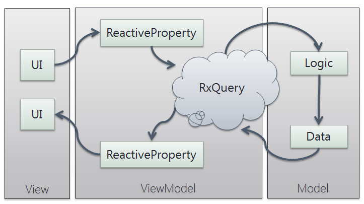
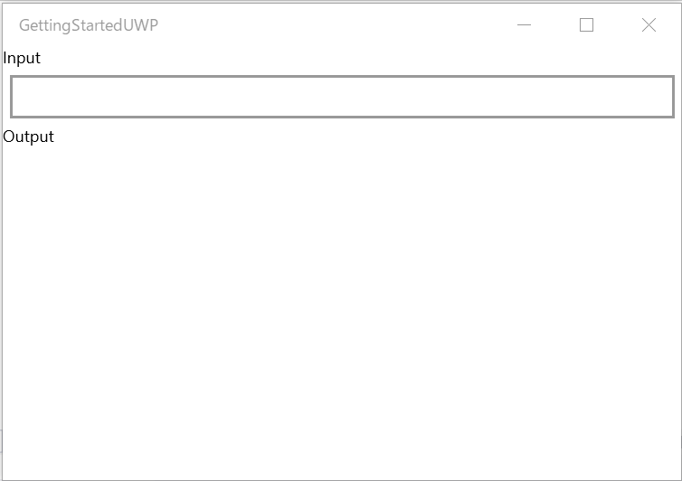

# What is ReactiveProperty

ReactiveProperty provides MVVM and asynchronous support features for Reactive Extensions. The target framework is .NET Standard 2.0.



The concept of ReactiveProperty is <b>Fun programming</b>.
You can write MVVM applications with ReactiveProperty. It's a lot of fun!



The following code shows two-way binding between a ReactiveProperty and a plain object property.

```csharp
class Model : INotifyPropertyChanged
{
    public event PropertyChangedEventHandler PropertyChanged;

    private string _name;
    public string Name
    {
        get => _name;
        set
        {
            _name = value;
            PropertyChanged?.Invoke(this, new PropertyChangedEventArgs(nameof(Name)));
        }
    }
}
class ViewModel
{
    private readonly Model _model = new Model();
    public ReactiveProperty<string> Name { get; }
    public ViewModel()
    {
        // Two-way synchronization between ReactiveProperty and the Model#Name property.
        Name = _model.ToReactivePropertyAsSynchronized(x => x.Name);
    }
}
```

ReactiveProperty is implemented through `IObservable<T>`. Yes! You can use LINQ.

```csharp
var name = new ReactiveProperty<string>();
name.Where(x => x.StartsWith("_")) // filter
    .Select(x => x.ToUpper()) // convert
    .Subscribe(x => { ... some action ... });
```

ReactiveProperty is created from `IObservable<T>`.

```csharp
class ViewModel
{
    public ReactiveProperty<string> Input { get; }
    public ReactiveProperty<string> Output { get; }

    public ViewModel()
    {
        Input = new ReactiveProperty("");
        Output = Input
            .Delay(TimeSpan.FromSeconds(1)) // Using an Rx method.
            .Select(x => x.ToUpper()) // Using a LINQ method.
            .ToReactiveProperty(); // Convert to ReactiveProperty
    }
}
```

This method chain is very cool.

We also provide the `ReactiveCommand` class, which implements the `ICommand` and `IObservable<T>` interfaces. `ReactiveCommand` can be created from an `IObservable<bool>`.
The following sample creates a `ReactiveCommand` that can execute when the `Input` property is not empty.

```csharp
class ViewModel
{
    public ReactiveProperty<string> Input { get; }
    public ReactiveProperty<string> Output { get; }

    public ReactiveCommand ResetCommand { get; }

    public ViewModel()
    {
        Input = new ReactiveProperty("");
        // Same as the sample above
        Output = Input
            .Delay(TimeSpan.FromSeconds(1)) // Using an Rx method.
            .Select(x => x.ToUpper()) // Using a LINQ method.
            .ToReactiveProperty(); // Convert to ReactiveProperty

        ResetCommand = Input.Select(x => !string.IsNullOrWhiteSpace(x)) // Convert ReactiveProperty<string> to IObservable<bool>
            .ToReactiveCommand() // You can create ReactiveCommand from IObservable<bool>. When a true value is published, the command can execute.
            .WithSubscribe(() => Input.Value = ""); // This is a shortcut for ResetCommand.Subscribe(() => ...)
    }
}
```

Cool! It is really declarative and clear.

## Documentation contents

### Getting started

- [Windows Presentation Foundation](getting-started/wpf.md)
- [Universal Windows Platform](getting-started/uwp.md)
- [Xamarin.Forms](getting-started/xf.md)
- [Avalonia](getting-started/avalonia.md)
- [Uno Platform](getting-started/uno-platform.md)
- [Blazor](getting-started/blazor.md)
- [Add code snippets](getting-started/add-snippets.md)

### Features

- [ReactiveProperty](features/ReactiveProperty.md)
- [ReactivePropertySlim](features/ReactivePropertySlim.md)
- [Commanding](features/Commanding.md)
- [Collections](features/Collections.md)
- [Work together with plain model layer objects](features/Work-together-with-plane-model-layer-objects.md)
- [Useful classes which implement IObservable](features/Notifiers.md)
- [Extension methods](features/Extension-methods.md)
- [Transfer event to ViewModel from View](features/Event-transfer-to-ViewModel-from-View.md)

### Advanced topics

- [Thread control](advanced/thread.md)
- [Work with await operator](advanced/awaitable.md)
- [Migrate to R3](advanced/r3-migration.md)
- [Work with other MVVM Frameworks](advanced/work-with-other-mvvm-framwork.md)

### Samples

- [Samples](samples.md)

## Let's start!

You can start using ReactiveProperty from the following links.

- [Windows Presentation Foundation](getting-started/wpf.md)
- [Universal Windows Platform](getting-started/uwp.md)
- [Xamarin.Forms](getting-started/xf.md)
- [Uno Platform](getting-started/uno-platform.md)

Learn the core features from the following links.

- [ReactiveProperty](features/ReactiveProperty.md)
- [Commanding](features/Commanding.md)
- [Collections](features/Collections.md)


## NuGet packages

|Package Id|Version and downloads|Description|
|----|----|----|
|ReactiveProperty||The package includes all core features, and the target platform is .NET Standard 2.0. It fits almost all situations.|
|ReactiveProperty.Core||The package includes minimal classes such as `ReactivePropertySlim<T>` and `ReadOnlyReactivePropertySlim<T>`. It has no dependencies, not even System.Reactive. If you don't need Rx features, it fits.|
|ReactiveProperty.WPF||The package includes EventToReactiveProperty and EventToReactiveCommand for WPF. This is for .NET Core 3.0 or later and .NET Framework 4.7.2 or later.|
|ReactiveProperty.UWP||The package includes EventToReactiveProperty and EventToReactiveCommand for UWP.|
|ReactiveProperty.XamarinAndroid||The package includes many extension methods to create IObservable instances from events for Xamarin.Android native.|
|ReactiveProperty.XamariniOS||The package includes many extension methods to bind ReactiveProperty and ReactiveCommand to Xamarin.iOS native controls.|
