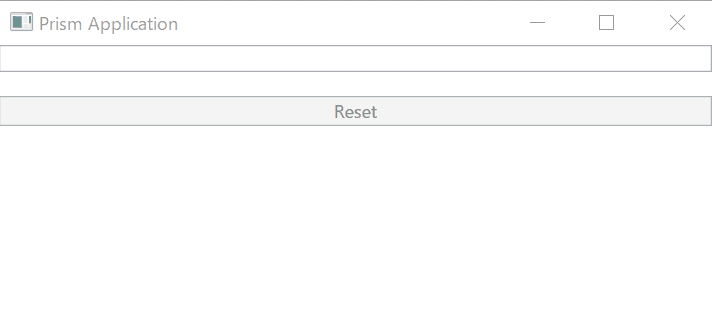

# Work with other MVVM Framework

ReactiveProperty doesn't provide base classes for ViewModel and other layers.
It means you can use ReactiveProperty with other MVVM Frameworks like Prism, MVVM Light Toolkit and others.

In this section, we explain how to use ReactiveProperty with Prism.

Let's start!

## Create a Prism project

Prism provides Prism Template Pack extension for Visual Stduio.
After installed the extension, you can create an app from Project Templates.


When using ReactiveProperty with Prism, you can replace DelegateCommand to ReactiveCommand, and you can also use all other ReactiveProperty features with Prism.

I created a Prism Blank App(WPF) as PrismSampleApp and Prism Module (WPF) as PrismSampleModule.
And add PrismSampleModule reference to PrismSampleApp, then edit App.xaml.cs to add the module, like below:

```cs
public partial class App
{
    protected override Window CreateShell()
    {
        return Container.Resolve<MainWindow>();
    }

    protected override void RegisterTypes(IContainerRegistry containerRegistry)
    {

    }

    protected override void ConfigureModuleCatalog(IModuleCatalog moduleCatalog)
    {
        moduleCatalog.AddModule<PrismSampleModuleModule>();
    }
}
```

At next, edit PrismSampleModuleModule.cs file to add a view for Navigation, and to show ViewA to Shell.

```cs
using PrismSampleModule.Views;
using Prism.Ioc;
using Prism.Modularity;
using Prism.Regions;

namespace PrismSampleModule
{
    public class PrismSampleModuleModule : IModule
    {
        private readonly IRegionManager _regionManager;

        public PrismSampleModuleModule(IRegionManager regionManager)
        {
            _regionManager = regionManager;
        }

        public void OnInitialized(IContainerProvider containerProvider)
        {
            _regionManager.RequestNavigate("ContentRegion", "ViewA");
        }

        public void RegisterTypes(IContainerRegistry containerRegistry)
        {
            containerRegistry.RegisterForNavigation<ViewA>();
        }
    }
}
```

## Using ReactiveProperty

Add ReactiveProperty reference to all projects using NuGet. And please feel free use classes of ReactiveProperty.

In this case, I used ReactiveProperty features at ViewAViewModel.cs like below:

```cs
using Prism.Mvvm;
using Reactive.Bindings;
using System;
using System.Linq;
using System.Reactive.Linq;

namespace PrismSampleModule.ViewModels
{
    public class ViewAViewModel : BindableBase
    {
        public ReactiveProperty<string> Input { get; }
        public ReadOnlyReactiveProperty<string> Output { get; }

        public ReactiveCommand ResetCommand { get; }

        public ViewAViewModel()
        {
            Input = new ReactiveProperty<string>("");
            Output = Input.Delay(TimeSpan.FromSeconds(1))
                .Select(x => x.ToUpper())
                .ToReadOnlyReactiveProperty();

            ResetCommand = Input.Select(x => !string.IsNullOrWhiteSpace(x))
                .ToReactiveCommand()
                .WithSubscribe(() => Input.Value = "");
        }
    }
}
```

And next, edit `ViewA.xaml`.

```xml
<UserControl x:Class="PrismSampleModule.Views.ViewA"
             xmlns="http://schemas.microsoft.com/winfx/2006/xaml/presentation"
             xmlns:x="http://schemas.microsoft.com/winfx/2006/xaml"
             xmlns:local="clr-namespace:PrismSampleModule.Views"
             xmlns:mc="http://schemas.openxmlformats.org/markup-compatibility/2006" 
             xmlns:viewModels="clr-namespace:PrismSampleModule.ViewModels"
             xmlns:d="http://schemas.microsoft.com/expression/blend/2008"
             mc:Ignorable="d" 
             d:DesignHeight="300" d:DesignWidth="300"
             xmlns:prism="http://prismlibrary.com/"
             d:DataContext="{d:DesignInstance Type=viewModels:ViewAViewModel, IsDesignTimeCreatable=False}"
             prism:ViewModelLocator.AutoWireViewModel="True" >
    <StackPanel>
        <TextBox Text="{Binding Input.Value, UpdateSourceTrigger=PropertyChanged}" />
        <TextBlock Text="{Binding Output.Value}" />
        <Button Content="Reset" Command="{Binding ResetCommand}" />
    </StackPanel>
</UserControl>
```

It works fine. :)



## Wrap up

ReactiveProperty doesn't provide base classes.
So, as explaining in this section, you can use ReactiveProperty and other MVVM Frameworks together.