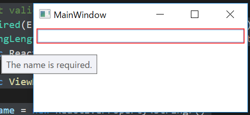
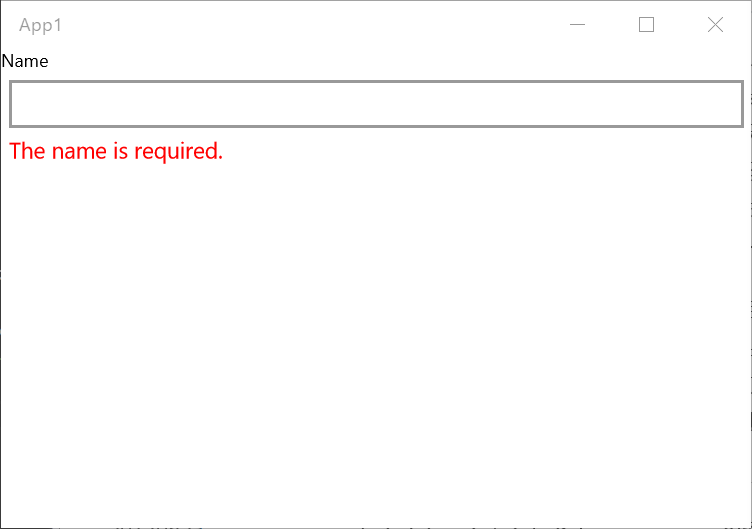
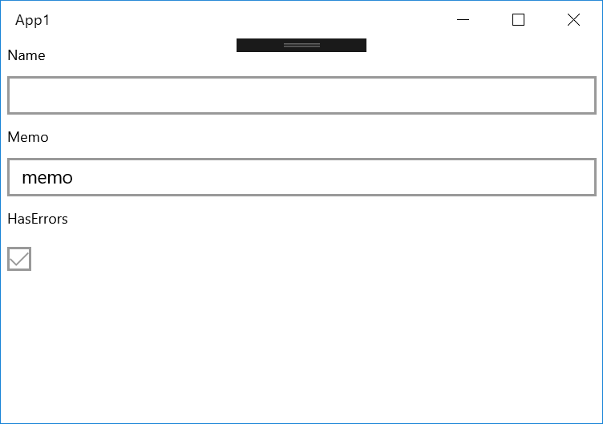
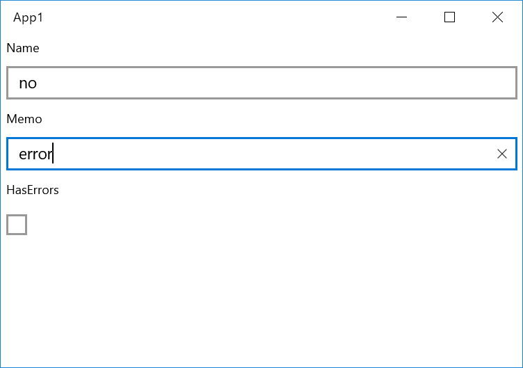

# ReactiveProperty

`ReactiveProperty` is the core class of this library.
This has following features.

- Implements the `INotifyPropertyChanged` interface.
    - The value property raise the `PropertyChanged` event.
- Implements the `IObservable<T>` interface.

Yes, The value property can bind to XAML control's property.
And the class call the `IObserver<T>`#OnNext method when the value is set.

A sample code is as below.

```csharp
using Reactive.Bindings;
using System;

namespace ReactivePropertyEduApp
{
    class Program
    {
        static void Main(string[] args)
        {
            // create from defualt constructor(default value is null)
            var name = new ReactiveProperty<string>();
            // setup the event handler and the onNext callback.
            name.PropertyChanged += (_, e) => Console.WriteLine($"PropertyChanged: {e.PropertyName}");
            name.Subscribe(x => Console.WriteLine($"OnNext: {x}"));

            // update the value property.
            name.Value = "neuecc";
            name.Value = "xin9le";
            name.Value = "okazuki";
        }
    }
}
```

The output of this program is below.

```
OnNext:
OnNext: neuecc
PropertyChanged: Value
OnNext: xin9le
PropertyChanged: Value
OnNext: okazuki
PropertyChanged: Value
```

What's different between `PropertyChanged` and `onNext` callback?
The `onNext` callback is called when subscribed. The `PropertyChanged` isn't called when the event handler is added. And the `onNext` callback's argument is the property value, the `PropertyChanged` argument doesn't have the property value.

The `PropertyChanged` event was provided for data binding. In the normal case, you should use Reactive Extensions methods.

## Use with XAML platform

The `ReactiveProperty` class is designed for XAML platform which is like WPF, UWP, and Xamarin.Forms.
This class can be used a ViewModel layer. 

In the case that you don't use the `ReactiveProperty`, a ViewModel class wrote below. 

```csharp
public class MainPageViewModel : INotifyPropertyChanged
{
    public event PropertyChangedEventHandler PropertyChanged;

    private string _name;
    public string Name
    {
        get => _name;
        set
        {
            _name = value;
            PropertyChanged?.Invoke(this, new PropertyChangedEventArgs(nameof(Name)));
        }
    }

    // Other properties are defined similar codes.
}
```

And those properties bind in the XAML code.

```xml
<!-- In the WPF -->
<TextBox Text="{Binding Name}" />

<!-- In the UWP(Runtime data binding) -->
<TextBox Text="{Binding Name}" />

<!-- In the UWP(Compile time data binding) -->
<TextBox Text="{x:Bind ViewModel.Name, Mode=TwoWay}" />

<!-- In the Xamarin.Forms -->
<Entry Text="{Binding Name}" />
```

In the case that you use the `ReactiveProperty`, a ViewModel code becomes very simple!

```csharp
// The INotifyPropertyChanged interface must implement when using the WPF.
// Because, if you don't implement this, then memory leak occurred.
public class MainPageViewModel
{
    public ReactiveProperty<string> Name { get; } = new ReactiveProperty<string>();

    // Other properties are defined similar codes.
}
```

When binding in the XAML code, you must add the `.Value` in binding path.
This is the only limitation of this library.

```xml
<!-- In the WPF -->
<TextBox Text="{Binding Name.Value}" />

<!-- In the UWP(Runtime data binding) -->
<TextBox Text="{Binding Name.Value}" />

<!-- In the UWP(Compile time data binding) -->
<TextBox Text="{x:Bind ViewModel.Name.Value, Mode=TwoWay}" />

<!-- In the Xamarin.Forms -->
<Entry Text="{Binding Name.Value}" />
```

> We forget the `.Value` sometimes. If you have a ReSharper license, then you can use this plugin.
> [ReactiveProperty XAML Binding Corrector](https://resharper-plugins.jetbrains.com/packages/ReSharper.RpCorrector/)
> Highlight the missing of ReactiveProperty ".Value" in XAML.

## How to create a `ReactiveProperty` instance

The `ReactiveProperty` class can create from many methods.

### Create from the constructor

The simplest way is using the constructor.

```csharp
// create with the default value.
var name = new ReactiveProperty<string>();
Console.WriteLine(name.Value); // -> empty output

// create with the initial value.
var name = new ReactiveProperty<string>("okazuki");
Console.WriteLine(name.Value); // -> okazuki
```

### Create from `IObservable<T>`

This can created from `IObservable<T>`.
Just calls `ToReactiveProperty` method.

```csharp
IObservable<long> observableInstance = Observable.Interval(TimeSpan.FromSeconds(1));

// Convert to ReactiveProperty from IObservable.
ReactiveProperty<long> counter = observableInstance.ToReactiveProperty();
```

#### Create from `ReactiveProperty`

`ReactiveProperty` implements the `IObservable` interface.
This means that `ReactiveProperty` can be created from `ReactiveProperty`.

```csharp
var name = new ReactiveProperty<string>("");

var formalName = name.Select(x => $"Dear {x}")
    .ToReactiveProperty();
```

All `IObservable` instances can become `ReactiveProperty`. 

## Validation

The `ReactiveProperty` class implements `INotifyDataErrorInfo` interface.

### Set custom validation logic

You can set custom validation logic using the `SetValidateNotifyError` method.

```csharp
var name = new ReactiveProperty<string>()
    .SetValidateNotifyError(x => string.IsNullOrWhiteSpace(x) ? "Error message" : null);
```

In the correct value case, validation logic should return null.
In invalid value case, logic should return an error message.

### Work with DataAnnotations

This class can work together with the DataAnnotations.
You can set validation attribute using the `SetValidateAttribute` method.

```csharp
class ViewModel
{
    // Set validation attributes
    [Required(ErrorMessage = "The name is required.")]
    [StringLength(100, ErrorMessage = "The name length should be lower than 30.")]
    public ReactiveProperty<string> Name { get; }

    public ViewModel()
    {
        Name = new ReactiveProperty<string>()
            // Set validation attributes into the ReactiveProperty.
            .SetValidateAttribute(() => Name);
    }
}
```

WPF is integrated with `INotifyDataErrorInfo` interface. See below.



### Handling validation errors

Another platform can't display error messages from the `INofityDataErrorInfo` interface.
`ReactiveProperty` class have some properties for handling validation errors.

A first property is `ObserveErrorChanged`.
This type is `IObservable<IEnumerable>`. You can convert to an error message from `IEnumerable`. See below.

```csharp
class ViewModel
{
    // Set validation attributes
    [Required(ErrorMessage = "The name is required.")]
    [StringLength(100, ErrorMessage = "The name length should be lower than 30.")]
    public ReactiveProperty<string> Name { get; }

    public ReadOnlyReactiveProperty<string> NameErrorMessage { get; }

    public ViewModel()
    {
        Name = new ReactiveProperty<string>()
            // Set validation attributes into the ReactiveProperty.
            .SetValidateAttribute(() => Name);

        // Handling an error message
        NameErrorMessage = Name.ObserveErrorChanged
            .Select(x => x?.OfType<string>()?.FirstOrDefault())
            .ToReadOnlyReactiveProperty();
    }
}
```

Bind `NameErrorMessage.Value` property to a text control. An error message can be displayed.

In the case of UWP, see below.

```csharp
public sealed partial class MainPage : Page
{
    private ViewModel ViewModel { get; } = new ViewModel();
    public MainPage()
    {
        this.InitializeComponent();
    }
}
```

```xml
<Page x:Class="App1.MainPage"
      xmlns="http://schemas.microsoft.com/winfx/2006/xaml/presentation"
      xmlns:x="http://schemas.microsoft.com/winfx/2006/xaml"
      xmlns:local="using:App1"
      xmlns:d="http://schemas.microsoft.com/expression/blend/2008"
      xmlns:mc="http://schemas.openxmlformats.org/markup-compatibility/2006"
      mc:Ignorable="d">
    <StackPanel Background="{ThemeResource ApplicationPageBackgroundThemeBrush}">
        <TextBlock Text="Name"
                   Style="{ThemeResource CaptionTextBlockStyle}" />
        <TextBox Text="{x:Bind ViewModel.Name.Value, Mode=TwoWay, UpdateSourceTrigger=PropertyChanged}"
                 Margin="5" />
        <TextBlock Text="{x:Bind ViewModel.NameErrorMessage.Value, Mode=OneWay}"
                   Foreground="Red"
                   Margin="5,0"
                   Style="{ThemeResource BodyTextBlockStyle}" />
    </StackPanel>
</Page>
```



ReactiveProperty v7.0.0 or later, there is `ObserveValidationErrorMessage` extension method instead of `ObserveErrorChanged.Select(x => x?.OfType<string>()?.FirstOrDefault())`. The above code is as below:

```csharp
class ViewModel
{
    // Set validation attributes
    [Required(ErrorMessage = "The name is required.")]
    [StringLength(100, ErrorMessage = "The name length should be lower than 30.")]
    public ReactiveProperty<string> Name { get; }

    public ReadOnlyReactiveProperty<string> NameErrorMessage { get; }

    public ViewModel()
    {
        Name = new ReactiveProperty<string>()
            // Set validation attributes into the ReactiveProperty.
            .SetValidateAttribute(() => Name);

        // Handling an error message
        NameErrorMessage = Name.ObserveValidationErrorMessage()
            .ToReadOnlyReactiveProperty();
    }
}
```

Next property is `ObserveHasErrors`. `ObserveHasErrors` property type is `IObservable<bool>`.
In the popular input form case, combining `ObserveHasErrors` property values is very useful.

This sample program creates the `HasErrors` property that is of type `ReactiveProperty<bool>` that combine two `ReactiveProperty`'s `ObserveHasErrors` properties.

```csharp
public class ViewModel
{
    // Set validation attributes
    [Required(ErrorMessage = "The name is required.")]
    [StringLength(100, ErrorMessage = "The name length should be lower than 30.")]
    public ReactiveProperty<string> Name { get; }

    [Required(ErrorMessage = "The memo is required.")]
    public ReactiveProperty<string> Memo { get; }

    public ReadOnlyReactiveProperty<bool> HasErrors { get; }

    public ViewModel()
    {
        Name = new ReactiveProperty<string>()
            .SetValidateAttribute(() => Name);

        Memo = new ReactiveProperty<string>()
            .SetValidateAttribute(() => Memo);

        // You can combine some ObserveHasErrors values.
        HasErrors = new[]
            {
                Name.ObserveHasErrors,
                Memo.ObserveHasErrors,
            }.CombineLatest(x => x.Any(y => y))
            .ToReadOnlyReactiveProperty();
    }
}
```

```xml
<Page x:Class="App1.MainPage"
      xmlns="http://schemas.microsoft.com/winfx/2006/xaml/presentation"
      xmlns:x="http://schemas.microsoft.com/winfx/2006/xaml"
      xmlns:local="using:App1"
      xmlns:d="http://schemas.microsoft.com/expression/blend/2008"
      xmlns:mc="http://schemas.openxmlformats.org/markup-compatibility/2006"
      mc:Ignorable="d">
    <StackPanel Background="{ThemeResource ApplicationPageBackgroundThemeBrush}">
        <TextBlock Text="Name"
                   Style="{ThemeResource CaptionTextBlockStyle}" 
                   Margin="5" />
        <TextBox Text="{x:Bind ViewModel.Name.Value, Mode=TwoWay, UpdateSourceTrigger=PropertyChanged}"
                 Margin="5" />
        <TextBlock Text="Memo"
                   Style="{ThemeResource CaptionTextBlockStyle}"
                   Margin="5" />
        <TextBox Text="{x:Bind ViewModel.Memo.Value, Mode=TwoWay, UpdateSourceTrigger=PropertyChanged}"
                 Margin="5" />
        <TextBlock Text="HasErrors"
                   Style="{ThemeResource CaptionTextBlockStyle}"
                   Margin="5" />
        <CheckBox IsChecked="{x:Bind ViewModel.HasErrors.Value, Mode=OneWay}"
                  IsEnabled="False"
                  Margin="5" />
    </StackPanel>
</Page>
```





The last property is `HasErrors`. It is a just `bool` property.

```csharp
public class ViewModel
{
    // Set validation attributes
    [Required(ErrorMessage = "The name is required.")]
    [StringLength(100, ErrorMessage = "The name length should be lower than 30.")]
    public ReactiveProperty<string> Name { get; }

    public ViewModel()
    {
        Name = new ReactiveProperty<string>()
            .SetValidateAttribute(() => Name);
    }

    public void DoSomething()
    {
        if (Name.HasErrors)
        {
            // invalid value case
        }
        else
        {
            // valid value case
        }
    }
}
```

### Don't need an initial validation error

In default behavior, `ReactiveProperty` reports errors when validation logic is set.
If you don't need initial validation errors, then you can skip the error.
Just call the `Skip` method.

```csharp
class ViewModel
{
    // Set validation attributes
    [Required(ErrorMessage = "The name is required.")]
    [StringLength(100, ErrorMessage = "The name length should be lower than 30.")]
    public ReactiveProperty<string> Name { get; }

    public ReadOnlyReactiveProperty<string> NameErrorMessage { get; }

    public ViewModel()
    {
        Name = new ReactiveProperty<string>()
            .SetValidateAttribute(() => Name);

        // Handling an error message
        NameErrorMessage = Name.ObserveErrorChanged
            .Skip(1) // Skip the first error.
            .Select(x => x?.OfType<string>()?.FirstOrDefault())
            .ToReadOnlyReactiveProperty();
    }
}
```

Or set `IgnoreInitialValidationError` flag in the constructor:

```csharp
class ViewModel
{
    // Set validation attributes
    [Required(ErrorMessage = "The name is required.")]
    [StringLength(100, ErrorMessage = "The name length should be lower than 30.")]
    public ReactiveProperty<string> Name { get; }

    public ReadOnlyReactiveProperty<string> NameErrorMessage { get; }

    public ViewModel()
    {
        // Add IgnoreInitialValidationError flag
        Name = new ReactiveProperty<string>(mode: ReactivePropertyMode.Default | ReactivePropertyMode.IgnoreInitialValidationError)
            .SetValidateAttribute(() => Name);

        // Handling an error message
        NameErrorMessage = Name.ObserveErrorChanged
            .Select(x => x?.OfType<string>()?.FirstOrDefault())
            .ToReadOnlyReactiveProperty();
    }
}
```

What's different between `Skip` and `IgnoreInitialValidationError`?
In the `IgnoreInitialValidationError` case, the `ReactiveProperty` class doesn't report an error of initial value.
In the `Skip` case, it just ignores the error event.

This difference is important on the supported platform of `INotifyDataErrorInfo` like WPF.
`Skip` approach will be fed back to the UI by a red border.
`IgnoreInitialValidationError` approach does not feed back to the UI.

## The mode of `ReactiveProperty`

`ReactiveProperty` class calls the `OnNext` callback when `Subscribe` method called.

```csharp
var x = new ReactiveProperty<string>("initial value");
x.Subscribe(x => Console.WriteLine(x)); // -> initial value
```

You can change this behavior when a `ReactiveProperty` instance is created.
the constructor and `ToReactiveProperty` methods have `ReactivePropertyMode` arguments.
They can be set to the following values.

- `ReactivePropertyMode.None`
    - ReactiveProperty doesn't call the `OnNext` callback when `Subscribe` method is call. And calls the `OnNext` callback if the same value is set.
- `ReactivePropertyMode.DistinctUntilChanged`
    - This doesn't call `OnNext` callback if same value set.
- `ReactivePropertyMode.RaiseLatestValueOnSubscribe`
    - This calls `OnNext` callback when `Subscribe` method call.
- `ReactivePropertyMode.Default`
    - It is default value. It is same as `ReactivePropertyMode.DistinctUntilChanged | ReactivePropertyMode.RaiseLatestValueOnSubscribe`.
- `ReactivePropertyMode.IgnoreInitialValidationError`
    - Ignore initial validation error.

If you don't need this behavior, then you can set `ReactivePropertyMode.None` value.

```csharp
var rp = new ReactiveProperty<string>("initial value", mode: ReactivePropertyMode.None);
rp.Subscribe(x => Console.WriteLine(x)); // -> don't output value
rp.Value = "initial value"; // -> initial value
```

## `ForceNotify`

If want to push the value forcibly, then can use the `ForceNotify` method.
This method pushes the value to subscribers, and raise a `PropertyChanged` event.

```csharp
var rp = new ReactiveProperty<string>("value");
rp.Subscribe(x => Console.WriteLine(x));
rp.PropertyChanged += (_, e) => Console.WriteLine($"{e.PropertyName} changed");

rp.ForceNotify();
```

Output is as below.

```
value                  # first subscribe
value                  # by the ForceNotify method
Value changed          # by the ForceNotify method
```

## Change comparer logic

Can change comparer logic by the equalityComparer argument of constructor and factory methods.

For example, ignore case comparer:

```csharp
class IgnoreCaseComparer : EqualityComparer<string>
{
    public override bool Equals(string x, string y)
        => x?.ToLower() == y?.ToLower();

    public override int GetHashCode(string obj)
        => (obj?.ToLower()).GetHashCode();
}

// Constructor
var rp = new ReactiveProperty<string>(equalityComparer: new IgnoreCaseComparer());
rp.Value = "Hello world"; // change to "Hello world" from null
rp.Value = "HELLO WORLD"; // don't change
rp.Value = "Hello japan"; // change to "Hello japan" from "Hello world"

// Factory method
var source = new Subject<string>();
var rp = source.ToReactiveProperty(equalityComparer: new IgnoreCaseComparer());
source.OnNext("Hello world"); // change to "Hello world" from null
source.OnNext("HELLO WORLD"); // don't change
source.OnNext("Hello japan"); // change to "Hello japan" from "Hello world"
```


## `ReadOnlyReactiveProperty` class

If you never set `Value` property, then you can use `ReadOnlyReactiveProperty` class.
This class can't set the property, and other behavior is same ReactiveProperty class.
`ReadOnlyReactiveProperty` class is created from `ToReadOnlyReactiveProperty` extension method.

See below.

```csharp
public class ViewModel
{
    public ReactiveProperty<string> Input { get; }

    // Output never set value.
    public ReadOnlyReactiveProperty<string> Output { get; }

    public ViewModel()
    {
        Input = new ReactiveProperty<string>("");
        Output = Input
            .Delay(TimeSpan.FromSeconds(1))
            .Select(x => x.ToUpper())
            .ToReadOnlyReactiveProperty(); // convert to ReadOnlyReactiveProperty
    }
}
```

## `Unsubscribe`

`ReactiveProperty` class implements the `IDisposable` interface.
When the `Dispose` method called, `ReactiveProperty` class releases all subscriptions.
In other instance's events subscribe, you should call the `Dispose` method at the end of the ViewModel lifecycle.

```csharp
public class ViewModel : IDisposable
{
    public ReadOnlyReactiveProperty<string> Time { get; }

    public ViewModel()
    {
        Time = Observable.Interval(TimeSpan.FromSeconds(1))
            .Select(_ => DateTime.Now.ToString("yyyy/MM/dd HH:mm:ss"))
            .ToReadOnlyReactiveProperty();
    }

    public void Dispose()
    {
        // Unsbscribe
        Time.Dispose();
    }
}
```
