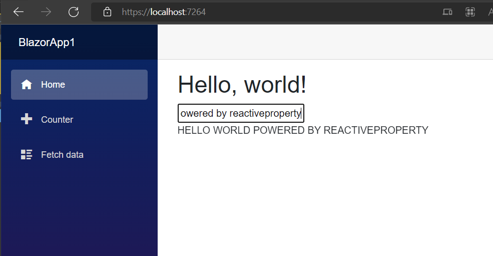

# Getting start for Blazor

Blazor is for development framework for Single Page Application using C#.

See below:

[ASP.NET Core Blazor](https://docs.microsoft.com/en-us/aspnet/core/blazor/)

ReactiveProperty also works both of Blazor Server and Blazor WebAssembly. But Blazor WebAssembly doen't support all operations of Reactive Extensions. For example, `Delay` extension method doesn't work on Blazor WASM.
If you want to use ReactiveProperty on Blazor WASM, then please care to not use unsupported features. 

## Create a project

- Create a Blazor Server or WebAssembly project.
- Install ReactiveProperty.Blazor package from NuGet.

## Edit codes

- Create a class what name is `IndexViewModel`.
- Edit the class like fillowing:

```csharp
using Reactive.Bindings;
using Reactive.Bindings.Extensions;
using System.Reactive.Disposables;
using System.Reactive.Linq;

namespace BlazorApp1;

public class IndexViewModel : IDisposable
{
    private CompositeDisposable _disposable = new();

    public ReactivePropertySlim<string> Input { get; }
    public ReadOnlyReactivePropertySlim<string> Output { get; }

    public IndexViewModel()
    {
        Input = new ReactivePropertySlim<string>("")
            .AddTo(_disposable);
        Output = Input
            .Delay(TimeSpan.FromSeconds(2)) // Important! Delay method doesn't work on Blazor WASM. If you are working on WASM, then please remove this line.
            .Select(x => x.ToUpperInvariant())
            .ToReadOnlyReactivePropertySlim("")
            .AddTo(_disposable);
    }

    public void Dispose() => _disposable.Dispose();
}
```

- Edit Index.razor like below:

```csharp
@page "/"
@using System.Reactive.Disposables
@using Reactive.Bindings.Extensions
@implements IDisposable

<PageTitle>Index</PageTitle>

<h1>Hello, world!</h1>

<input type="text" @bind="_viewModel.Input.Value" />
<br/>
@_viewModel.Output.Value
<br/>

@code {
    private readonly CompositeDisposable _disposable = new();
    private IndexViewModel _viewModel = default!;

    protected override void OnInitialized()
    {
        _viewModel = new IndexViewModel()
            .AddTo(_disposable);

        // Observe changing Output property, and call StateHasChanged on UI thread.
        _viewModel.Output
            .Subscribe(x => InvokeAsync(StateHasChanged))
            .AddTo(_disposable);
    }

    public void Dispose() => _disposable.Dispose();
}
```

- Launch this app

You can see below result:



## Other topics for Blazor

### Dependency Injection

If you want to inject ViewModels to page, then please register ViewModels to DI container on Program.cs like below:

```csharp
builder.Services.AddTransient<IndexViewModel>();
```

And inject to page like `@inject IndexViewModel _viewModel`.


### Integrate validation feature

If you want to use validation feature of ReactiveProperty with Blazor's EditForm component, then you can use `Reactive.Bindings.Components.ReactivePropertiesValidator` component.

`ReactivePropertiesValidator` can be used same as `DataAnnotationsValidator` component like below:

```csharp
<EditForm Model="_validationViewModel" OnInvalidSubmit="InvalidSubmit" OnValidSubmit="ValidSubmit">
    <ReactivePropertiesValidator /> @* needs @using Reactive.Bindings.Components *@

    <ValidationSummary />

    <div class="mb-3">
        <label for="firstName">First name</label>
        <InputText @bind-Value="_validationViewModel.FirstName.Value" class="form-control" />
        <ValidationMessage For="() => _validationViewModel.FirstName.Value" />
    </div>
```

Please see Blazor's sample app under Samples/Blazor folder to know more details. The page using it is Pages/Index.razor page of BlazorSample.Shared project.
