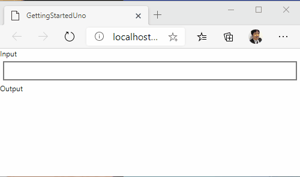

# Getting start for Uno Platform

Uno Platform is a developing platform for cross-platform apps.
Uno builds UWP apps projects as Android apps, iOS apps, WebAssembly apps, Linux apps and macOS apps.

Please install Uno Platform extension to Visual Studio, before this getting start.

## Create a project
- Create a Cross-Platform App (Uno Platform) project.
- Install ReactiveProperty package to all projects from NuGet.
- Install Reactive.Wasm package to YourProjectName.Wasm project.

## Edit codes
- Edit Program.cs in the Wasm project to support Reactive Extensions.

```csharp
using System;
using Windows.UI.Xaml;
using System.Reactive.PlatformServices; // add

namespace GettingStartedUno.Wasm
{
    public class Program
    {
        private static App _app;

        static int Main(string[] args)
        {
#pragma warning disable CS0618 // Type or member is obsolete
            PlatformEnlightenmentProvider.Current.EnableWasm(); // add
#pragma warning restore CS0618 // Type or member is obsolete
            Windows.UI.Xaml.Application.Start(_ => _app = new App());

            return 0;
        }
    }
}
```

- Create a MainPageViewModel.cs file to the Shared project.
- Edit files like following.

MainPageViewModel.cs
```csharp
using Reactive.Bindings;
using System;
using System.Linq;
using System.Reactive.Linq;

namespace GettingStartedUno
{
    public class MainPageViewModel
    {
        public ReactiveProperty<string> Input { get; }
        public ReadOnlyReactiveProperty<string> Output { get; }

        public MainPageViewModel()
        {
            Input = new ReactiveProperty<string>("");
            Output = Input
                .Delay(TimeSpan.FromSeconds(1))
                .Select(x => x.ToUpper())
                .ToReadOnlyReactiveProperty();
        }
    }
}
```

MainPage.xaml.cs
```csharp
using Windows.UI.Xaml.Controls;

// The Blank Page item template is documented at https://go.microsoft.com/fwlink/?LinkId=402352&clcid=0x409

namespace GettingStartedUno
{
    /// <summary>
    /// An empty page that can be used on its own or navigated to within a Frame.
    /// </summary>
    public sealed partial class MainPage : Page
    {
        private MainPageViewModel ViewModel { get; } = new MainPageViewModel();
        public MainPage()
        {
            this.InitializeComponent();
        }
    }
}
```

MainPage.xaml
```xml
<Page x:Class="GettingStartedUno.MainPage"
    xmlns="http://schemas.microsoft.com/winfx/2006/xaml/presentation"
    xmlns:x="http://schemas.microsoft.com/winfx/2006/xaml"
    xmlns:local="using:GettingStartedUno"
    xmlns:d="http://schemas.microsoft.com/expression/blend/2008"
    xmlns:mc="http://schemas.openxmlformats.org/markup-compatibility/2006"
    mc:Ignorable="d">

    <StackPanel Background="{ThemeResource ApplicationPageBackgroundThemeBrush}">
        <TextBlock Text="Input"
                Style="{StaticResource CaptionTextBlockStyle}" />
        <TextBox Text="{x:Bind ViewModel.Input.Value, Mode=TwoWay, UpdateSourceTrigger=PropertyChanged}"
                Margin="5" />
        <TextBlock Text="Output"
                Style="{StaticResource CaptionTextBlockStyle}" />
        <TextBlock Text="{x:Bind ViewModel.Output.Value, Mode=OneWay}"
                Style="{StaticResource BodyTextBlockStyle}"
                Margin="5" />
    </StackPanel>
</Page>
```

## Launch the application

After launching the app, you can see the below apps on each platforms.
The output value was displayed to upper case, after 1sec from the input.

### WebAssembly



### UWP


### Android


### iOS

TBD

