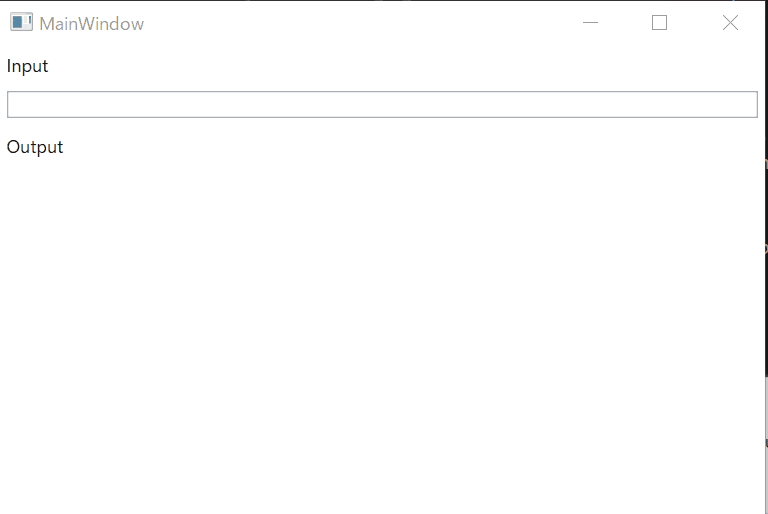

## Create a project
- Create a WPF App (.NET Framework) project.
    - Have to use upper than .NET Framework 4.6.1.
- Install ReactiveProperty from NuGet.

## Edit codes
- Create a MainWindowViewModel.cs file.
- Edit files like following.

MainWindowViewModel.cs
```cs
using Reactive.Bindings;
using System;
using System.ComponentModel;
using System.Linq;
using System.Reactive.Linq;

namespace WpfApp1
{
    class MainWindowViewModel : INotifyPropertyChanged
    {
        public event PropertyChangedEventHandler PropertyChanged;

        public ReactiveProperty<string> Input { get; }
        public ReadOnlyReactiveProperty<string> Output { get; }

        public MainWindowViewModel()
        {
            Input = new ReactiveProperty<string>("");
            Output = Input
                .Delay(TimeSpan.FromSeconds(1))
                .Select(x => x.ToUpper())
                .ToReadOnlyReactiveProperty();
        }
    }
}
```

MainWindow.xaml
```xml
<Window x:Class="WpfApp1.MainWindow"
        xmlns="http://schemas.microsoft.com/winfx/2006/xaml/presentation"
        xmlns:x="http://schemas.microsoft.com/winfx/2006/xaml"
        xmlns:d="http://schemas.microsoft.com/expression/blend/2008"
        xmlns:mc="http://schemas.openxmlformats.org/markup-compatibility/2006"
        xmlns:local="clr-namespace:WpfApp1"
        mc:Ignorable="d"
        Title="MainWindow"
        Height="350"
        Width="525">
    <Window.DataContext>
        <local:MainWindowViewModel />
    </Window.DataContext>
    <StackPanel>
        <Label Content="Input" />
        <TextBox Text="{Binding Input.Value, UpdateSourceTrigger=PropertyChanged}"
                 Margin="5" />
        <Label Content="Output" />
        <TextBlock Text="{Binding Output.Value}"
                   Margin="5" />
    </StackPanel>
</Window>
```

## Launch the application.

After launch the app, You can see the below window.
The output value was displayed to upper case, after 1sec from the input.


