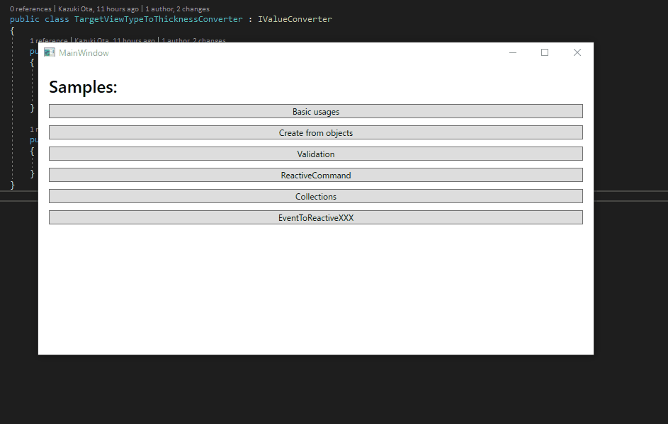

Sample programs:

You can see sample programs opening ReactiveProperty-Samples.sln. There are:
- ReactivePropertySamples 
  There are sample pages for explaining basic features. Please set as a startup project to `BasicSample/ReactivePropertySamples.WPF`, then launch the app. You will see the following:
  

  The ViewModel and Model classes are ReactivePropertySamples.Shared project.

- Reactive.Todo 
  This sample app is created by ReactiveProperty and [Prism](https://prismlibrary.com/index.html). This is a small sample app like [TodoMVC](http://todomvc.com/).

  

  You can launch the app via `WithPrism/Reactive.Todo` project.
