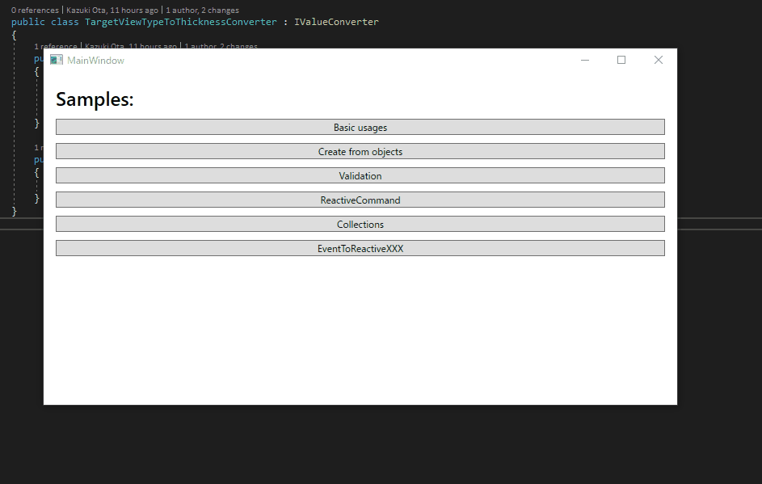
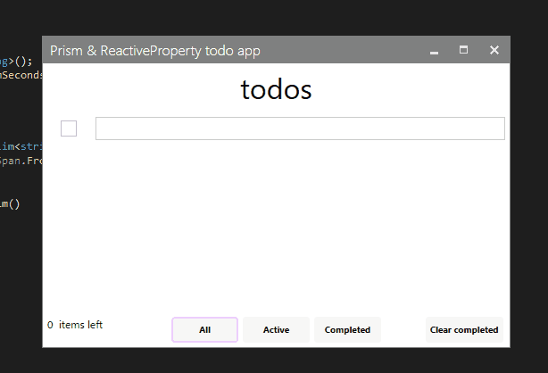

Sample programs:

You can see sample programs by opening ReactiveProperty-Samples.sln. There are:
- ReactivePropertySamples 
  There are sample pages that explain basic features. Set `BasicSample/ReactivePropertySamples.WPF` as the startup project, and then launch the app. You will see the following:
  

  The ViewModel and Model classes are in the ReactivePropertySamples.Shared project.

- Reactive.Todo 
  This sample app is created with ReactiveProperty and [Prism](https://prismlibrary.com/index.html). It is a small sample app similar to [TodoMVC](http://todomvc.com/).

  

  You can launch the app via the `WithPrism/Reactive.Todo` project.
